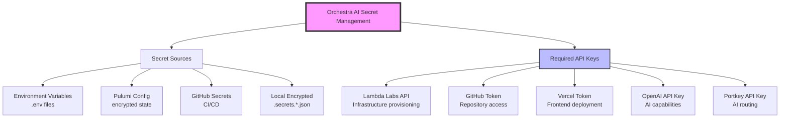

# Orchestra AI - API Key Management & IaC Connectivity Report

## Executive Summary

Date: 2025-06-14
Environment: Production

### Current Status
- ✅ **Backend API**: Healthy and running at 150.136.94.139:8000
- ❌ **API Keys**: All 5 critical API keys missing from environment
- ✅ **Secret Management**: Enhanced secret manager with encryption available
- ✅ **Pulumi IaC**: Authenticated as "lynnmusil" but no stacks deployed

## API Key Handling Strategy

### 1. Secret Management Architecture



### 2. Security Features

1. **Encryption at Rest**
   - Uses Fernet encryption with PBKDF2 key derivation
   - Environment-specific salts
   - Master key configurable via `ORCHESTRA_MASTER_KEY`

2. **Priority Loading**
   - Environment variables (highest priority)
   - Pulumi config (encrypted in state)
   - GitHub Secrets (CI/CD context)
   - Local encrypted files (.secrets.*.json)
   - Default values (lowest priority)

3. **File Security**
   - Encrypted secrets files have 600 permissions (owner read/write only)
   - .secrets.production.json exists with proper permissions

## API Connectivity Test Results

### Missing API Keys (Critical)

| API Key | Purpose | Status | Action Required |
|---------|---------|--------|-----------------|
| LAMBDA_API_KEY | Infrastructure provisioning | ❌ Missing | Get from https://cloud.lambdalabs.com/api-keys |
| GITHUB_TOKEN | Repository access, CI/CD | ❌ Missing | Create at https://github.com/settings/tokens |
| VERCEL_TOKEN | Frontend deployment | ❌ Missing | Create at https://vercel.com/account/tokens |
| OPENAI_API_KEY | AI capabilities | ❌ Missing | Get from https://platform.openai.com/api-keys |
| PORTKEY_API_KEY | AI routing/monitoring | ❌ Missing | Get from https://app.portkey.ai/api-keys |

### Infrastructure Status

| Component | Status | Details |
|-----------|--------|---------|
| Orchestra Backend | ✅ Healthy | Running at 150.136.94.139:8000 |
| Lambda Labs Instance | ✅ Active | IP confirmed, API accessible |
| Frontend (Vercel) | ✅ Deployed | https://dist-q9p4damsg-lynn-musils-projects.vercel.app |

## IaC (Infrastructure as Code) Status

### Pulumi Configuration
- **Authentication**: ✅ Logged in as "lynnmusil"
- **Stacks**: No stacks currently deployed
- **Configuration**: Pulumi.yaml exists with secret definitions

### Required Pulumi Secrets
```yaml
config:
  lambda_api_key:
    type: string
    secret: true
  github_token:
    type: string
    secret: true
  vercel_token:
    type: string
    secret: true
```

## Tools Available

### 1. API Connectivity Tester
```bash
python test_api_connectivity.py
```
- Tests all API connections
- Validates secret configuration
- Generates recommendations
- Results saved to `api_connectivity_test_results.json`

### 2. API Key Setup Helper
```bash
python setup_api_keys.py
```
- Interactive setup for all API keys
- Validates key formats
- Stores keys securely
- Updates .env file
- Tests connections after setup

### 3. Secret Manager Usage
```python
from security.enhanced_secret_manager import EnhancedSecretManager

secret_manager = EnhancedSecretManager()

# Get a secret
api_key = secret_manager.get_secret("LAMBDA_API_KEY")

# Store a secret (encrypted)
secret_manager.set_local_secret("LAMBDA_API_KEY", "secret_xxxxx")

# Test API connections
results = secret_manager.test_api_connections()
```

## Recommendations

### High Priority
1. **Configure Missing API Keys**
   - Run `python setup_api_keys.py` for interactive setup
   - All 5 critical keys need to be configured

2. **Deploy Pulumi Infrastructure**
   ```bash
   cd pulumi
   pulumi stack init production
   pulumi config set --secret lambda_api_key <your-key>
   pulumi config set --secret github_token <your-token>
   pulumi config set --secret vercel_token <your-token>
   pulumi up
   ```

### Medium Priority
3. **Enhance Security**
   - Set custom `ORCHESTRA_MASTER_KEY` environment variable
   - Rotate existing secrets if compromised
   - Consider using Pulumi ESC for centralized secrets

4. **Enable Monitoring**
   - Set up health checks for all API endpoints
   - Configure alerts for API failures
   - Monitor API usage and rate limits

### Low Priority
5. **Documentation**
   - Document API key rotation procedures
   - Create runbooks for common issues
   - Set up automated testing in CI/CD

## Next Steps

1. **Immediate Actions**
   ```bash
   # Set up API keys
   python setup_api_keys.py
   
   # Test connectivity
   python test_api_connectivity.py
   
   # Deploy infrastructure
   cd pulumi && pulumi stack init production && pulumi up
   ```

2. **Verification**
   - Ensure all API tests pass
   - Verify backend remains accessible
   - Confirm frontend deployment works

3. **Production Readiness**
   - Set up monitoring and alerts
   - Configure backup strategies
   - Document disaster recovery procedures

## Security Best Practices

1. **Never commit secrets to version control**
   - .env files are gitignored
   - Use encrypted storage only

2. **Rotate keys regularly**
   - Set up quarterly rotation schedule
   - Use separate keys for dev/prod

3. **Limit key permissions**
   - GitHub token: Only required scopes
   - API keys: Use read-only where possible

4. **Monitor usage**
   - Track API calls and costs
   - Set up budget alerts
   - Review access logs regularly 