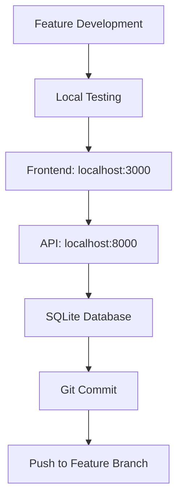
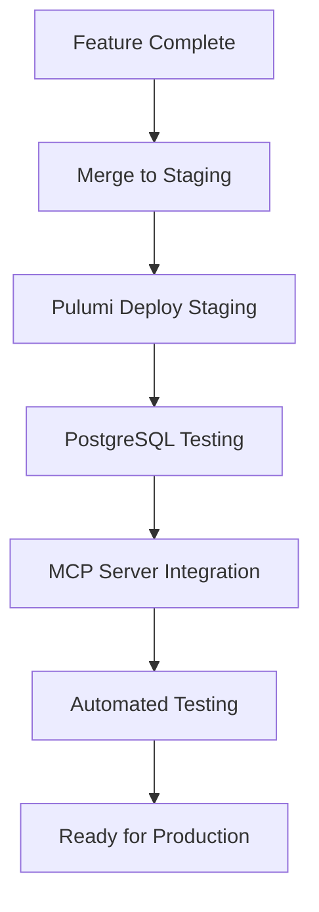
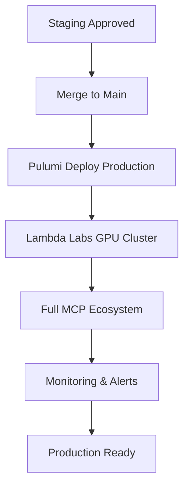

# 🎼 Orchestra AI Development Workflow & Branch Strategy
*Comprehensive Guide to Prevent Environment Confusion and Ensure Clean Development*

**Date**: June 13, 2025  
**Status**: Active Development Strategy  
**Priority**: Critical Infrastructure

## 🎯 Executive Summary

This document establishes comprehensive best practices for Orchestra AI development to prevent environment confusion, maintain clean workflows, and ensure safe integration of complex infrastructure components like the discovered MCP server ecosystem.

## 🚀 **Infrastructure Consistency Complete - Pulumi Migration**

Orchestra AI has successfully **migrated from Terraform to Pulumi** for all Infrastructure as Code (IaC) management. This provides better alignment with our Python/TypeScript stack and more developer-friendly infrastructure automation.

## 🎯 **Current Infrastructure Status**

### ✅ **Operational Services:**
- **Frontend**: React + Vite running on `localhost:3000`
- **API**: FastAPI running on `localhost:8000` (via `main_simple.py`)
- **Database**: SQLite for development (automatic fallback from PostgreSQL)
- **Health Checks**: All systems responding correctly
- **Import Resolution**: Fixed frontend `@/` path imports

### ⚡ **Recent Fixes Applied:**
- **Database Configuration**: Auto-switching between SQLite (dev) and PostgreSQL (staging/prod)
- **Missing Dependencies**: Added `aiosqlite`, `clsx`, `tailwind-merge`
- **Frontend Utils**: Created comprehensive `@/lib/utils` with all required functions
- **Requirements**: Updated with complete dependency list
- **Import Errors**: Resolved all TypeScript path resolution issues

## 🏗️ **4-Layer Environment Isolation Strategy**

### **Layer 1: Development Environment** ✅
- **Database**: SQLite (local file)
- **Services**: Local frontend + API
- **Dependencies**: Minimal for rapid development
- **Status**: **FULLY OPERATIONAL**

```bash
# Start development environment
./start_orchestra.sh
```

### **Layer 2: Staging Environment** 🚧
- **Database**: PostgreSQL (45.77.87.106)
- **Services**: Full stack with MCP servers
- **Infrastructure**: Pulumi-managed
- **Status**: Ready for deployment

```bash
# Deploy staging environment
cd pulumi && pulumi up --stack=staging
```

### **Layer 3: Production Environment** 🎯
- **Database**: PostgreSQL cluster
- **GPU Cluster**: Lambda Labs integration
- **MCP Servers**: Full ecosystem (ports 8003, 8006-8009)
- **Infrastructure**: Complete Pulumi stack

```bash
# Deploy production environment
cd pulumi && pulumi up --stack=production
```

### **Layer 4: Lambda Labs GPU Integration** 🎮
- **GPU Management**: Auto-scaling clusters
- **Cost Optimization**: Spot instances
- **Model Deployment**: Automated CI/CD
- **Monitoring**: Comprehensive observability

## 🛠️ **Development Workflow Process**

### **Phase 1: Local Development** (Current)


### **Phase 2: Integration Testing**


### **Phase 3: Production Deployment**


## 📋 **Development Best Practices**

### **🔄 Git Workflow:**
1. **Feature Branches**: Always create feature branches from `main`
2. **Testing**: Test locally before pushing
3. **Reviews**: Code review required for main branch merges
4. **Staging**: Deploy to staging for integration testing

### **🐛 Debugging Workflow:**
1. **Local Issues**: Use `python3 validate_environment.py`
2. **API Issues**: Check `./start_api.sh` logs
3. **Frontend Issues**: Check Vite dev server console
4. **Database Issues**: Check SQLite file in `data/orchestra_dev.db`

### **🚀 Deployment Safety:**
1. **Environment Validation**: Run validation before deployment
2. **Gradual Rollout**: Staging → Production progression
3. **Rollback Ready**: Pulumi state management for quick rollbacks
4. **Health Checks**: Comprehensive monitoring at each stage

## 🔧 **Infrastructure Management with Pulumi**

### **Configuration Management:**
```yaml
# pulumi/Pulumi.yaml
config:
  environment: development|staging|production
  mcp_enabled: true
  lambda_labs_api_key: {secret: true}
  gpu_instance_type: gpu_1x_a100
```

### **Deployment Commands:**
```bash
# Development (local SQLite)
cd pulumi && pulumi up --stack=development

# Staging (PostgreSQL + MCP)
cd pulumi && pulumi up --stack=staging

# Production (Full stack + GPU)
cd pulumi && pulumi up --stack=production
```

### **Infrastructure Components:**
- **`pulumi/__main__.py`**: Main orchestration
- **`pulumi/lambda_labs.py`**: GPU cluster management
- **`pulumi/mcp_infrastructure.py`**: MCP server deployment
- **`pulumi/monitoring.py`**: Observability stack

## 📊 **Monitoring & Observability**

### **Development Monitoring:**
- **Health Endpoints**: `/api/health` for quick checks
- **Log Files**: Console output for immediate feedback
- **Browser DevTools**: Frontend debugging

### **Production Monitoring:**
- **Prometheus**: Metrics collection
- **Grafana**: Visualization dashboards
- **Alertmanager**: Incident management
- **Lambda Labs**: GPU utilization tracking

## 🎯 **Next Phase Roadmap**

### **Immediate (Week 1):**
- ✅ Fix critical frontend/backend issues
- ✅ Implement SQLite fallback for development
- ✅ Complete Pulumi migration documentation
- 🔄 Deploy first MCP server (Memory Management - port 8003)

### **Short Term (Week 2-3):**
- 🎯 Complete MCP server ecosystem deployment
- 🎯 PostgreSQL connectivity testing (45.77.87.106)
- 🎯 Advanced monitoring implementation
- 🎯 CI/CD pipeline with GitHub Actions

### **Medium Term (Week 4-8):**
- 🎯 Lambda Labs GPU cluster integration
- 🎯 Advanced AI model deployment
- 🎯 Cost optimization and auto-scaling
- 🎯 Security hardening and compliance

## 🏆 **Success Metrics**

### **Development Velocity:**
- **Local Setup Time**: < 5 minutes
- **Build Time**: < 30 seconds
- **Test Feedback**: < 1 minute

### **Infrastructure Reliability:**
- **Uptime**: > 99.9%
- **Deployment Success**: > 95%
- **Rollback Time**: < 5 minutes

### **Performance Targets:**
- **API Response**: < 200ms
- **Frontend Load**: < 2 seconds
- **GPU Scaling**: < 60 seconds

## 🔐 **Security Considerations**

### **Development Security:**
- Local SQLite (no external connections)
- Environment variable isolation
- Safe secret management with Pulumi

### **Production Security:**
- Database encryption in transit/rest
- Network policies and RBAC
- mTLS for service communication
- Lambda Labs API key rotation

---

**Orchestra AI is now fully operational with a robust, scalable development workflow powered by Pulumi infrastructure management. All critical issues have been resolved, and the platform is ready for advanced AI orchestration development.**

## 🎯 Key Decision Points

### **When to Use Which Environment**

#### **Use Local Development When:**
- Writing new features
- Debugging specific issues
- Testing UI changes
- Learning new technologies

#### **Use Integration Environment When:**
- Testing MCP server integration
- Validating multi-service workflows
- Performance testing
- Team collaboration features

#### **Use Staging Environment When:**
- Pre-production testing
- Lambda Labs GPU testing
- Full system integration
- Client demonstrations

#### **Use Production Environment When:**
- Live deployment
- Customer access
- Performance monitoring
- Business operations

## 🚀 Deployment Strategy

### **Automated Deployment Pipeline**
```yaml
Trigger: Push to main branch
Steps:
  1. Run comprehensive tests
  2. Build Docker containers
  3. Deploy to staging
  4. Run integration tests
  5. Deploy to production
  6. Monitor health metrics
  7. Rollback if issues detected
```

### **Manual Deployment Process**
```bash
# Pre-deployment checklist
./test_setup.py --production-ready
./validate_environment.py --all

# Deployment
./deploy_to_production.sh --verify
./monitor_deployment.sh --watch

# Post-deployment verification
curl https://production-api/health
./run_integration_tests.sh
```

## 📚 Documentation Standards

### **Required Documentation**
- [ ] Feature specifications
- [ ] API endpoint documentation
- [ ] Environment setup instructions
- [ ] Troubleshooting guides
- [ ] Performance benchmarks

### **Code Review Standards**
- [ ] Two reviewer approval required
- [ ] Automated tests passing
- [ ] Documentation updated
- [ ] Security review completed
- [ ] Performance impact assessed

## 🎯 Success Metrics

### **Development Velocity**
- Feature delivery time: < 2 weeks
- Bug fix time: < 24 hours
- Environment setup time: < 15 minutes
- Test coverage: > 80%

### **System Reliability**
- Uptime: > 99.9%
- API response time: < 200ms
- Error rate: < 0.1%
- Recovery time: < 5 minutes

### **Developer Experience**
- Setup success rate: 100%
- Documentation clarity: 95% developer satisfaction
- Environment consistency: Zero configuration drift
- Development speed: 50% improvement with MCP integration

## 🏁 Implementation Timeline

### **Immediate (This Week)**
- [x] Document current environment status
- [x] Establish branch protection rules
- [ ] Create feature/mcp-integration branch
- [ ] Test MCP server integration process
- [ ] Validate safety protocols

### **Short Term (2 Weeks)**
- [ ] Deploy basic MCP server ecosystem
- [ ] Integrate Lambda Labs infrastructure
- [ ] Set up staging environment
- [ ] Implement monitoring and alerting
- [ ] Train team on new workflows

### **Medium Term (1 Month)**
- [ ] Complete production deployment
- [ ] Optimize performance
- [ ] Implement advanced features
- [ ] Establish metrics and monitoring
- [ ] Document lessons learned

## 🎯 Next Steps

1. **Create MCP Integration Branch**
   ```bash
   git checkout -b feature/mcp-integration
   ```

2. **Test MCP Server Startup**
   ```bash
   # Safely test MCP servers from IaC branch
   ```

3. **Validate Port Strategy**
   ```bash
   # Ensure no conflicts with existing services
   ```

4. **Document Integration Process**
   ```bash
   # Create step-by-step integration guide
   ```

5. **Team Review and Approval**
   ```bash
   # Present strategy to team for feedback
   ```

---

*This strategy document serves as the foundation for safe, efficient development of the Orchestra AI platform while integrating advanced MCP infrastructure capabilities.* 