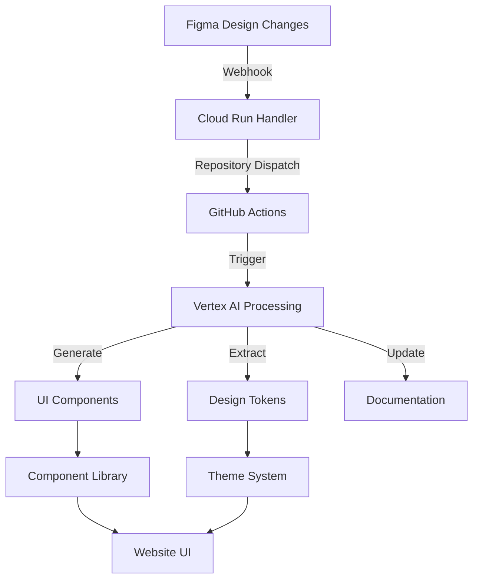

# Enhanced Figma Integration in Production

Deploying the Figma webhook integration to a production environment unlocks several advanced capabilities for connecting Figma with your website UI development process.

## Advanced API & AI Capabilities in Production

### 1. Full Figma API Integration

A production deployment enables comprehensive access to Figma's full API suite:

- **Variables API**: Extract design tokens and variables automatically
- **Component API**: Pull ready-to-use components directly from Figma
- **File API**: Access all design files programmatically 
- **Comments API**: Sync design feedback into development environments
- **Webhook API**: Respond to real-time design changes with higher rate limits

### 2. AI-Powered Design Processing

Production deployment on Google Cloud enables integration with Vertex AI:

- **Automated Component Generation**: AI can analyze Figma designs and generate React/Vue components
- **Design Pattern Recognition**: Detect common UI patterns and suggest optimized implementations
- **Accessibility Analysis**: AI can evaluate designs for accessibility compliance
- **Cross-Platform Adaptation**: Automatically adapt designs for different screen sizes and platforms
- **Design-to-Code Optimization**: Generate optimized code based on design best practices

### 3. Real-time Design System

The webhook integration in production enables a real-time design system:

- **Live Design Token Syncing**: Automatically update CSS variables, theme files, and style tokens
- **Component Library Updates**: Keep your component library in sync with Figma designs
- **Automated Documentation**: Generate and update component documentation
- **Design Drift Detection**: Identify when implementations deviate from designs
- **Design Version Control**: Track changes to designs over time

### 4. Production-Grade Infrastructure Benefits

GCP production deployment provides significant infrastructure advantages:

- **Scalable Processing**: Handle large design files and complex component hierarchies
- **Reliable Webhook Handling**: Higher uptime and reliability for mission-critical design pipelines
- **Secure API Access**: Proper secret management for API keys and credentials
- **Audit Logging**: Track all design changes and their impacts on the codebase
- **Multi-Environment Support**: Separate design pipelines for staging and production

## Implementation Enhancements for Production

To fully leverage these capabilities in production, you can extend the current implementation:

### 1. Enhanced Figma-to-Code Pipeline



### 2. AI-Enhanced Component Generation

Add a Vertex AI pipeline to the GitHub workflow:

```yaml
- name: Process with Vertex AI
  run: |
    gcloud ai-platform predict \
      --model=figma-component-generator \
      --json-request=figma-export.json \
      --region=us-central1
```

### 3. Advanced Design Token Integration

Extract and transform design tokens from Figma Variables:

```javascript
// Automated token extraction
const designSystem = {
  extractTokens: async (figmaFileKey) => {
    const variables = await figma.variables.get(figmaFileKey);
    return transformToDesignTokens(variables);
  },
  
  applyToUI: (tokens) => {
    // Generate CSS, Styled Components, CSS-in-JS, etc.
    generateStyleFiles(tokens);
  }
};
```

## Getting Started with Production Deployment

To deploy this enhanced integration:

1. Set up GCP project with Vertex AI enabled
2. Deploy the webhook handler to Cloud Run:
   ```bash
   ./scripts/deploy_webhook_to_cloud_run.sh
   ```
3. Configure Figma webhook to point to your production URL
4. Set up GitHub secrets for Figma and GCP credentials
5. Extend the GitHub workflow for AI processing

## Conclusion

A production deployment significantly enhances your Figma-to-UI capabilities by providing:

- Reliable, scalable infrastructure for design processing
- AI-powered component and style generation
- Real-time design system synchronization
- Advanced Figma API integration

These capabilities create a truly connected design-to-code pipeline that can dramatically accelerate your UI development process while maintaining design fidelity and consistency.
