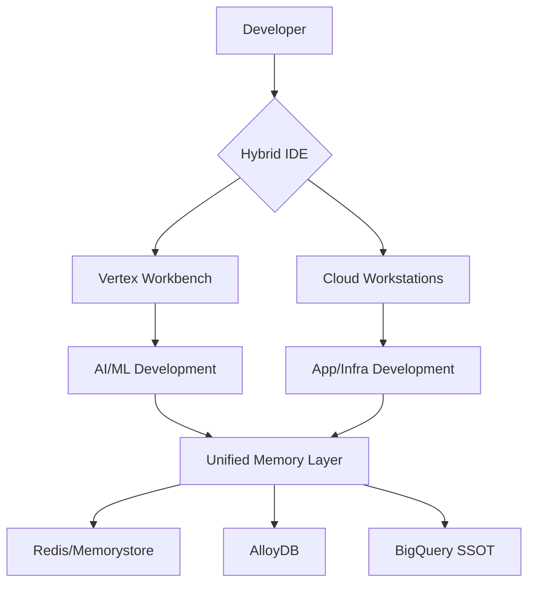

# GCP Migration Plan for AGI Baby Cherry Project

This document outlines the detailed plan for the GCP migration of the AGI Baby Cherry project (104944497835), focusing on memory sync automation and Hybrid IDE configuration as per the revised architecture priorities.

## Overview

The plan addresses two critical components of the migration:
1. **Memory Sync Automation**: Updating the Redis to AlloyDB sync worker to meet specified requirements.
2. **Hybrid IDE Configuration**: Setting up Cloud Workstations with specific software and resource configurations for a hybrid development environment.

## Architecture Priorities Visualization

## 1. Memory Sync Automation (Redis to AlloyDB Sync Worker)

**Objective**: Update the existing `RedisAlloyDBSyncWorker` to fully align with the specified requirements for syncing Redis HNSW index to AlloyDB.

**Steps**:
- **Update Debounce Interval**: Modify the `debounce_interval` parameter in `agent/core/redis_alloydb_sync.py` from 0.3 seconds (300ms) to 0.5 seconds (500ms) as requested. This will be done by changing the default value in the constructor and updating the environment variable setting in the `if __name__ == "__main__":` block.
- **Verify Existing Features**: Confirm that version-based conflict resolution and CRC32 checksum validation are already implemented as seen in the code (lines 172-176 for version conflict resolution and line 155 for checksum computation). No changes are needed for these features.
- **Authentication**: The environment variable approach for the service account `vertex-agent@agi-baby-cherry.iam.gserviceaccount.com` is sufficient, as confirmed by the user. No explicit reference will be added to the sync worker script. The authentication is managed at a higher level through environment configurations and scripts.

## 2. Hybrid IDE Configuration (Cloud Workstation Setup)

**Objective**: Create a Terraform configuration for Cloud Workstations to support a hybrid development environment with specific software and resource requirements.

**Steps**:
- **Create New Terraform File**: Develop a new Terraform configuration file named `cloud_workstation_config.tf` in the `infra` directory. This file will define a Cloud Workstation resource with the following specifications:
  - **Preinstalled Software**: Include JetBrains IDE and JupyterLab by specifying a custom image or startup script for installation.
  - **Auto-Mount GCS Bucket**: Configure the workstation to auto-mount `gs://agi-baby-cherry-bucket/repos` for repository access, using appropriate IAM permissions and mount configurations.
  - **GPU Quota Management**: Set up GPU resources with quota management to support AI workloads, specifying an accelerator type like NVIDIA Tesla T4 or V100 based on availability and project quotas.
  - **Persistent Storage**: Allocate a 500GB SSD for agent memory persistence, ensuring data durability across sessions.
  - **Network Policies**: Incorporate network policies as an additional requirement specified by the user, ensuring secure connectivity and isolation by configuring VPC and subnet settings, and potentially firewall rules to restrict access.
- **Service Account Integration**: Use the existing service account `vertex-agent@agi-baby-cherry.iam.gserviceaccount.com` for the workstation, granting necessary permissions for AI Platform, Storage, and Compute services as seen in other configurations.
- **Labels and Metadata**: Add appropriate labels for environment tracking (e.g., `env=prod`) and metadata for Terraform management.

## 3. Validation and Testing

**Objective**: Ensure the changes and new configurations work as intended within the GCP environment.

**Steps**:
- **Test Sync Worker**: After updating the debounce interval, run a test of the `redis_alloydb_sync.py` script in a development environment to confirm the sync process operates with the new timing without overwhelming the database.
- **Terraform Plan and Apply**: Execute `terraform plan` and `terraform apply` for the new `cloud_workstation_config.tf` to validate the configuration syntax and ensure resources can be provisioned as expected. Check for any quota or permission issues during this process.
- **Documentation**: Update relevant documentation (e.g., `VERTEX_WORKBENCH_README.md` or a new `CLOUD_WORKSTATION_README.md`) to reflect the new setup and provide instructions for developers on accessing and using the Cloud Workstations.

## 4. Deployment Strategy

**Objective**: Implement the changes in a controlled manner to minimize disruption.

**Steps**:
- **Staged Rollout for Sync Worker**: Deploy the updated sync worker script to a subset of instances first, monitoring for any performance issues due to the increased debounce interval before full deployment.
- **Incremental Workstation Deployment**: Provision a small number of Cloud Workstations initially to verify the setup with a pilot group of developers, then scale up based on feedback and resource availability.

## Conclusion

This plan ensures alignment with the critical AI prompts for migration provided, focusing on memory sync automation and Hybrid IDE configuration. It has been developed with input from the project team and is ready for implementation.