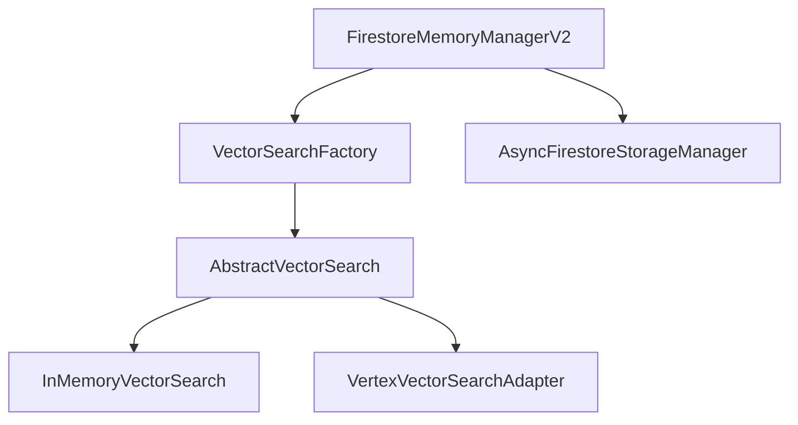

# Memory Management Consolidation Plan

## Phase 1: Connection Pooling and Batch Size Optimization (Completed)

- [x] Implemented connection pooling in AsyncFirestoreStorageManager
- [x] Made batch sizes configurable through constructor parameters
- [x] Optimized the semantic search method to use pagination for large result sets
- [x] Updated the FirestoreMemoryAdapter to use the V2 implementation
- [x] Added deprecation notices to guide users toward the V2 implementation
- [x] Enhanced test suite to cover the new features

## Phase 2: Vector Search Integration

### Architecture

We've designed a pluggable vector search architecture that allows for different backend implementations:

### Implementation Steps

1. **Create Base Interface**
   - [x] Define AbstractVectorSearch interface
   - [x] Define common methods for vector search implementations

2. **Implement Vector Search Backends**
   - [x] Update InMemoryVectorSearch to implement AbstractVectorSearch
   - [x] Create VertexVectorSearchAdapter implementing AbstractVectorSearch

3. **Create Factory**
   - [x] Implement VectorSearchFactory for creating vector search implementations
   - [x] Support different configuration options

4. **Update FirestoreMemoryManagerV2**
   - [ ] Add vector search provider and config parameters to constructor
   - [ ] Initialize vector search provider in initialize method
   - [ ] Update semantic_search method to use vector search implementation
   - [ ] Update add_memory_item to store embeddings in vector search
   - [ ] Update health_check to include vector search status

5. **Create Migration Utility**
   - [ ] Create script to migrate existing embeddings to Vector Search
   - [ ] Support incremental migration to avoid downtime

6. **Update Documentation**
   - [ ] Document new vector search capabilities
   - [ ] Provide examples of using different vector search backends
   - [ ] Document migration process

### Technical Considerations

- **Connection Management**: Ensure proper connection pooling for Vector Search client
- **Error Handling**: Implement graceful degradation when Vector Search is unavailable
- **Performance**: Optimize for batch operations and minimize latency
- **Compatibility**: Maintain backward compatibility during transition

## Phase 3: Memory Manager Factory Consolidation

1. **Design Unified Factory**
   - [ ] Create MemoryManagerFactory class
   - [ ] Implement builder pattern for complex configurations
   - [ ] Support dependency injection for testing

2. **Configuration System**
   - [ ] Design hierarchical configuration system using Pydantic models
   - [ ] Support environment variable overrides
   - [ ] Implement configuration validation

3. **Feature Detection**
   - [ ] Create capability discovery system
   - [ ] Implement graceful degradation
   - [ ] Add runtime feature toggles

4. **Telemetry Integration**
   - [ ] Integrate with OpenTelemetry
   - [ ] Add structured logging
   - [ ] Implement custom metrics

## Phase 4: Complete Deprecation

1. **Deprecation Timeline**
   - [ ] Announce deprecation with clear timeline
   - [ ] Add runtime warnings
   - [ ] Create migration guides

2. **Codebase Cleanup**
   - [ ] Remove deprecated code paths
   - [ ] Update import references
   - [ ] Remove compatibility layers

3. **Documentation Updates**
   - [ ] Update all documentation
   - [ ] Create architecture diagrams
   - [ ] Document performance characteristics

4. **Validation and Benchmarking**
   - [ ] Implement comprehensive integration tests
   - [ ] Create performance benchmarks
   - [ ] Document performance improvements

## Next Steps

The immediate next steps are to complete Phase 2 by updating the FirestoreMemoryManagerV2 class to use our new vector search implementations. This involves:

1. Adding vector search provider and config parameters to the constructor
2. Initializing the vector search provider in the initialize method
3. Updating the semantic_search method to use the vector search implementation
4. Updating add_memory_item to store embeddings in vector search
5. Updating health_check to include vector search status

Once these changes are implemented, we can proceed with creating the migration utility and updating the documentation.
