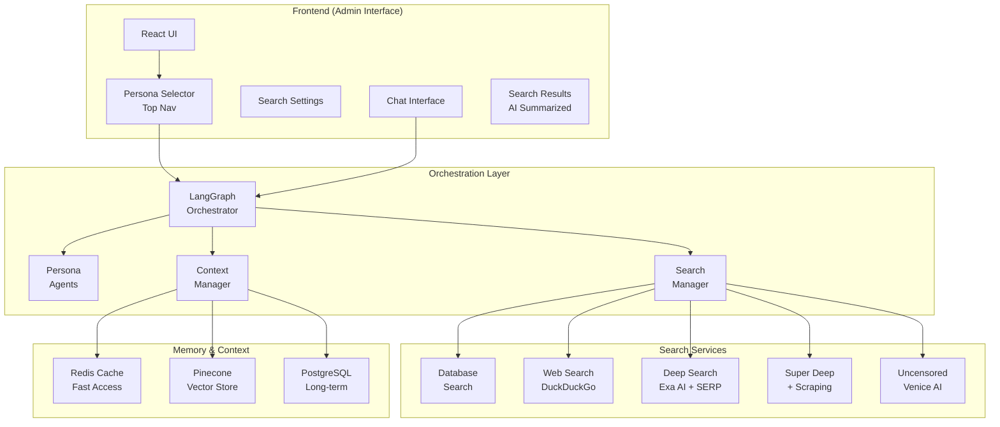

# Orchestra AI Implementation Plan - Phase 1: Search & Chat Foundation

## Overview
Based on your requirements, we'll build a dynamic, flexible, and deeply contextual system using LangGraph as the orchestration layer. The focus is on search/chat integration first, with creative features tabled for Phase 2.

## Architecture Design

### Core Components



## Phase 1 Implementation Steps

### 1. LangGraph Foundation (Week 1)

#### 1.1 Core Orchestrator Setup
```python
# File: src/orchestration/langgraph_orchestrator.py

from langgraph.graph import Graph, Node
from langgraph.prebuilt import create_react_agent
from langchain_openai import ChatOpenAI
import os

class OrchestraOrchestrator:
    def __init__(self):
        self.graph = Graph()
        
        # Initialize base LLM via OpenRouter
        self.llm = ChatOpenAI(
            base_url="https://openrouter.ai/api/v1",
            api_key=os.getenv("OPENROUTER_API_KEY"),
            model="anthropic/claude-3-opus"  # Dynamic selection
        )
        
        # Define nodes
        self.graph.add_node("persona_router", self.route_by_persona)
        self.graph.add_node("search_orchestrator", self.orchestrate_search)
        self.graph.add_node("context_manager", self.manage_context)
        self.graph.add_node("response_generator", self.generate_response)
        
        # Define edges
        self.graph.add_edge("persona_router", "search_orchestrator")
        self.graph.add_edge("search_orchestrator", "context_manager")
        self.graph.add_edge("context_manager", "response_generator")
```

#### 1.2 Persona Agents with Domain Prompts
```python
# File: src/orchestration/persona_agents.py

PERSONA_PROMPTS = {
    "cherry": {
        "base": "You are Cherry, a creative AI assistant.",
        "domain_context": """
        User preferences and leanings: {user_preferences}
        Focus areas: Creative content, personal interests, uncensored exploration
        Search emphasis: Broad, creative, alternative perspectives
        """,
        "search_weights": {
            "creativity": 0.8,
            "accuracy": 0.5,
            "alternatives": 0.9
        }
    },
    "sophia": {
        "base": "You are Sophia, a strategic business AI assistant.",
        "domain_context": """
        Business focus: Apartment rental, property technology, debt collection
        Pay Ready clients: {pay_ready_clients}
        Pay Ready competitors: {pay_ready_competitors}
        Search emphasis: Business intelligence, market analysis, financial technology
        """,
        "search_weights": {
            "business_relevance": 0.9,
            "financial_data": 0.8,
            "market_intelligence": 0.7
        }
    },
    "karen": {
        "base": "You are Karen, an operational healthcare AI assistant.",
        "domain_context": """
        Clinical focus: Clinical trials, pharmaceutical approvals, healthcare operations
        ParagonRX specialties: {paragonrx_specialties}
        Tracked trials: {tracked_trials}
        Search emphasis: Clinical accuracy, regulatory compliance, operational efficiency
        """,
        "search_weights": {
            "clinical_accuracy": 0.95,
            "regulatory": 0.9,
            "operational": 0.8
        }
    }
}
```

### 2. Search Integration (Week 1-2)

#### 2.1 Search Strategy Implementation
```python
# File: src/search/unified_search_manager.py

class UnifiedSearchManager:
    def __init__(self):
        self.search_modes = {
            "normal": {
                "providers": ["database", "duckduckgo"],
                "blend_ratio": {"database": 0.6, "web": 0.4},
                "max_time": 5
            },
            "deep": {
                "providers": ["database", "duckduckgo", "exa_ai", "serp"],
                "blend_ratio": {"database": 0.4, "web": 0.6},
                "max_time": 15,
                "strategy": "parallel_comprehensive"
            },
            "deeper": {
                "providers": ["database", "exa_ai", "serp", "apify", "zenrows"],
                "blend_ratio": {"database": 0.3, "web": 0.7},
                "max_time": 30,
                "includes_scraping": True
            },
            "uncensored": {
                "providers": ["venice_ai", "database"],
                "blend_ratio": {"uncensored": 0.8, "database": 0.2},
                "max_time": 20
            }
        }
```

#### 2.2 Smart Blending Algorithm
```python
# File: src/search/result_blender.py

class SearchResultBlender:
    def __init__(self, redis_client, pinecone_index):
        self.redis = redis_client
        self.pinecone = pinecone_index
        
    async def blend_results(self, results_by_source, query, persona, blend_ratio):
        # 1. Deduplicate using vector similarity
        embeddings = await self.get_embeddings(results_by_source)
        unique_results = self.deduplicate_by_similarity(embeddings)
        
        # 2. Apply persona-specific ranking
        ranked_results = self.apply_persona_ranking(unique_results, persona)
        
        # 3. Apply blend ratio with smart defaults
        blended = self.apply_blend_ratio(ranked_results, blend_ratio)
        
        # 4. Generate AI summary
        summary = await self.generate_summary(blended, query, persona)
        
        return {
            "summary": summary,
            "results": blended,
            "sources_used": list(results_by_source.keys()),
            "blend_ratio_applied": blend_ratio
        }
```

### 3. Frontend Updates (Week 2)

#### 3.1 Persona Dropdown in Top Nav
```jsx
// File: modern-admin/src/components/TopNav.jsx

const TopNav = ({ activePersona, onPersonaChange }) => {
  return (
    <div className="fixed top-0 left-0 right-0 h-16 bg-gray-900 border-b border-gray-800 z-50">
      <div className="flex items-center justify-between h-full px-6">
        {/* Logo and Title */}
        <div className="flex items-center space-x-4">
          <h1 className="text-xl font-bold">Orchestra AI</h1>
        </div>
        
        {/* Persona Selector */}
        <div className="flex items-center space-x-4">
          <select
            value={activePersona}
            onChange={(e) => onPersonaChange(e.target.value)}
            className="bg-gray-800 border border-gray-700 rounded-lg px-4 py-2 text-white"
          >
            <option value="cherry">🍒 Cherry (Personal)</option>
            <option value="sophia">💼 Sophia (Pay Ready)</option>
            <option value="karen">🏥 Karen (ParagonRX)</option>
          </select>
          
          <button className="p-2 hover:bg-gray-800 rounded-lg">
            <Settings className="w-5 h-5" />
          </button>
        </div>
      </div>
    </div>
  )
}
```

#### 3.2 Unified Search Settings Page
```jsx
// File: modern-admin/src/pages/SearchSettings.jsx

const SearchSettings = () => {
  const [settings, setSettings] = useState({
    defaultBlendRatio: { database: 0.5, web: 0.5 },
    searchModePreferences: {
      cherry: { default: "normal", allowUncensored: true },
      sophia: { default: "deep", businessFocus: true },
      karen: { default: "deep", clinicalFocus: true }
    },
    domainData: {
      sophia: {
        payReadyClients: [],
        payReadyCompetitors: [],
        industryKeywords: []
      },
      karen: {
        trackedTrials: [],
        specialties: [],
        regulatoryAlerts: []
      },
      cherry: {
        interests: [],
        preferences: []
      }
    }
  });

  return (
    <div className="max-w-4xl mx-auto p-6">
      <h1 className="text-2xl font-bold mb-6">Search Configuration</h1>
      
      {/* Wizard Mode Toggle */}
      <div className="mb-8">
        <button className="bg-blue-600 px-4 py-2 rounded-lg">
          Launch Configuration Wizard
        </button>
      </div>
      
      {/* Blend Ratio Settings */}
      <section className="mb-8">
        <h2 className="text-xl font-semibold mb-4">Search Blend Preferences</h2>
        <BlendRatioSlider 
          value={settings.defaultBlendRatio}
          onChange={(ratio) => updateSettings({defaultBlendRatio: ratio})}
        />
      </section>
      
      {/* Per-Persona Settings */}
      <section>
        <h2 className="text-xl font-semibold mb-4">Persona-Specific Settings</h2>
        <PersonaDomainManager settings={settings.domainData} />
      </section>
    </div>
  );
};
```

### 4. Context & Memory Management (Week 2-3)

#### 4.1 Large Context Window Management
```python
# File: src/memory/context_manager.py

class EnhancedContextManager:
    def __init__(self):
        self.redis = redis.Redis(host=REDIS_HOST)
        self.pinecone = pinecone.Index("orchestra-context")
        self.max_context_tokens = 100000  # Large context window
        
    async def maintain_conversation_context(self, session_id, new_message):
        # 1. Retrieve existing context from Redis (fast)
        context = await self.redis.get(f"context:{session_id}")
        
        # 2. Add new message with vector embedding
        embedding = await self.embed_message(new_message)
        
        # 3. Store in Pinecone for semantic retrieval
        self.pinecone.upsert([{
            "id": f"{session_id}:{timestamp}",
            "values": embedding,
            "metadata": {
                "session_id": session_id,
                "persona": new_message.persona,
                "timestamp": timestamp,
                "content": new_message.content
            }
        }])
        
        # 4. Intelligently prune context if exceeding limits
        if self.count_tokens(context) > self.max_context_tokens:
            context = await self.intelligent_context_pruning(context)
        
        # 5. Update Redis cache
        await self.redis.set(f"context:{session_id}", context, ex=3600)
        
        return context
```

### 5. API Integration Updates (Week 3)

#### 5.1 Backend API Enhancements
```python
# File: src/routes/search_v2.py

@router.post("/api/search/v2")
async def unified_search(request: SearchRequest):
    # 1. Initialize LangGraph orchestrator
    orchestrator = OrchestraOrchestrator()
    
    # 2. Load persona context
    persona_context = await load_persona_context(
        request.persona,
        request.user_id
    )
    
    # 3. Execute search through orchestrator
    result = await orchestrator.execute({
        "query": request.query,
        "persona": request.persona,
        "search_mode": request.search_mode,
        "blend_ratio": request.blend_ratio,
        "context": persona_context
    })
    
    # 4. Cache results
    await cache_search_results(result)
    
    return result
```

## Implementation Timeline

### Week 1: Foundation
- [ ] Set up LangGraph orchestrator on Lambda Labs GPU instance
- [ ] Implement persona agents with domain prompts
- [ ] Create base search manager
- [ ] Update frontend with persona dropdown

### Week 2: Search Integration
- [ ] Implement unified search with blending
- [ ] Add search settings page
- [ ] Integrate Venice AI for uncensored mode
- [ ] Create AI summary generation

### Week 3: Context & Polish
- [ ] Implement Redis + Pinecone context management
- [ ] Add configuration wizard
- [ ] Optimize search performance
- [ ] Deploy and test on production

## Configuration Files Needed

### 1. LangGraph Configuration
```yaml
# langgraph_config.yaml
orchestrator:
  default_model: "anthropic/claude-3-opus"
  fallback_models:
    - "openai/gpt-4-turbo"
    - "anthropic/claude-3-sonnet"
  
search:
  parallel_execution: true
  timeout_seconds: 30
  max_retries: 3
  
memory:
  redis_ttl: 3600
  pinecone_index: "orchestra-context"
  max_context_tokens: 100000
```

### 2. Search Provider Configuration
```yaml
# search_providers.yaml
providers:
  venice_ai:
    endpoint: "https://api.venice.ai/v1/search"
    api_key_env: "VENICE_AI_API_KEY"
    uncensored: true
    
  exa_ai:
    endpoint: "https://api.exa.ai/search"
    api_key_env: "EXA_AI_API_KEY"
    semantic_search: true
    
  serp:
    endpoint: "https://serpapi.com/search"
    api_key_env: "SERP_API_KEY"
    engines: ["google", "bing"]
```

## Next Steps

1. **Immediate Actions**:
   - Review and approve this plan
   - Set up development environment on Lambda Labs
   - Begin LangGraph orchestrator implementation

2. **Infrastructure Setup**:
   - Configure Redis for large context windows
   - Set up Pinecone vector database
   - Ensure all API keys are in Pulumi secrets

3. **Testing Strategy**:
   - Unit tests for each component
   - Integration tests for search blending
   - Load tests for context management

Would you like me to proceed with implementing this plan? I can start with the LangGraph orchestrator setup and the frontend persona dropdown. 