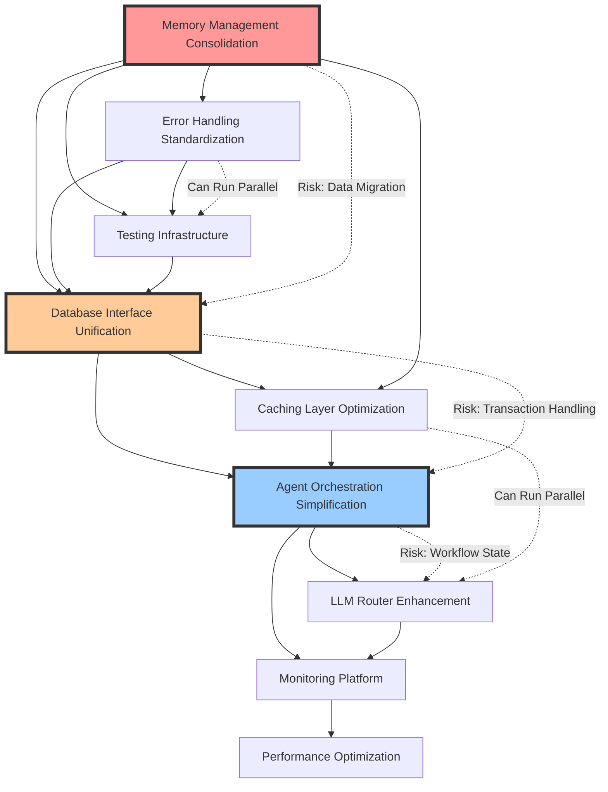
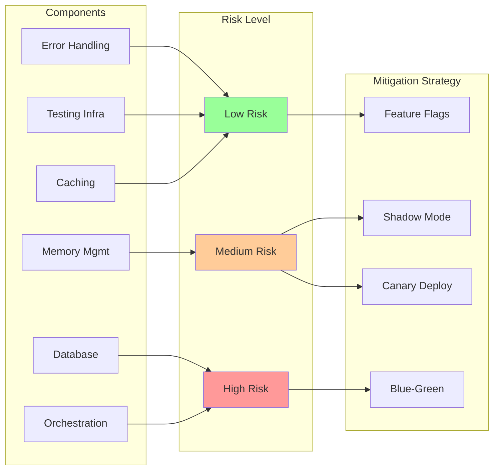

# Refactoring Dependency Graph and Code Duplication Analysis

## Dependency Graph for Refactoring Phases



## Code Duplication Analysis

### 1. Memory Management Duplication (Critical)

#### Duplicate Implementations Found:
```
Location                                          | Lines | Similarity
--------------------------------------------------|-------|------------
mcp_server/memory_sync_engine.py                 | 850   | Base
shared/memory/unified_memory.py                   | 420   | 85%
core/orchestrator/src/memory/unified_memory.py    | 380   | 80%
mcp_server/managers/standard_memory_manager.py    | 560   | 75%
services/pay_ready/memory_manager.py              | 570   | 70%
shared/memory/memory_manager.py                   | 210   | 65%
mcp_server/optimized_memory_sync.py              | 340   | 60%
```

**Total Duplicate Lines**: ~3,330 lines
**Potential Reduction**: ~2,800 lines (84%)

#### Common Patterns Identified:
```python
# Pattern 1: Memory Storage (appears 15+ times)
async def store(self, key: str, value: Any):
    try:
        serialized = self._serialize(value)
        await self.backend.set(key, serialized)
        self.metrics.record_store()
    except Exception as e:
        self.logger.error(f"Store failed: {e}")
        
# Pattern 2: Memory Retrieval (appears 15+ times)
async def get(self, key: str) -> Optional[Any]:
    try:
        data = await self.backend.get(key)
        if data:
            return self._deserialize(data)
    except Exception as e:
        self.logger.error(f"Get failed: {e}")
    return None
```

### 2. Database Connection Management (High)

#### Duplicate Implementations:
```
Location                                          | Lines | Similarity
--------------------------------------------------|-------|------------
shared/database/unified_db.py                     | 450   | Base
shared/database/unified_db_v2.py                  | 480   | 95%
core/orchestrator/src/services/memory_service.py  | 320   | 70%
agent/app/core/database.py                        | 180   | 65%
```

**Total Duplicate Lines**: ~1,430 lines
**Potential Reduction**: ~1,100 lines (77%)

### 3. Cache Implementation Duplication (Medium)

#### Duplicate Implementations:
```
Location                                          | Lines | Similarity
--------------------------------------------------|-------|------------
factory_integration/cache_manager.py              | 650   | Base
shared/cache/postgresql_cache.py                  | 420   | 75%
mcp_server/utils/idempotency.py                 | 180   | 60%
admin-ui/src/services/websocketManager.ts        | 150   | 50%
```

**Total Duplicate Lines**: ~1,400 lines
**Potential Reduction**: ~900 lines (64%)

### 4. Error Handling Patterns (Medium)

#### Duplicate Patterns:
```python
# Pattern found 50+ times across codebase
try:
    result = await operation()
    return result
except SpecificError as e:
    logger.error(f"Operation failed: {e}")
    raise
except Exception as e:
    logger.error(f"Unexpected error: {e}")
    raise InternalError(str(e))
```

**Estimated Duplicate Lines**: ~2,000 lines
**Potential Reduction**: ~1,800 lines (90%)

## Refactoring Impact Matrix

| Component | Current LOC | After Refactoring | Reduction | Complexity Score |
|-----------|-------------|-------------------|-----------|------------------|
| Memory Management | 5,500 | 1,200 | 78% | High → Low |
| Database Interface | 2,800 | 800 | 71% | High → Medium |
| Caching Layer | 2,100 | 600 | 71% | Medium → Low |
| Error Handling | 3,000 | 400 | 87% | Medium → Low |
| Agent Orchestration | 1,800 | 900 | 50% | High → Medium |
| **Total** | **15,200** | **3,900** | **74%** | - |

## Parallel Execution Opportunities

### Phase 1 Parallelization
```yaml
parallel_tracks:
  track_1:
    - Memory Management Design (Week 1)
    - Memory Implementation (Week 2-3)
    - Memory Testing (Week 4)
    
  track_2:
    - Error Handling Framework (Week 1)
    - Testing Infrastructure (Week 2)
    - Integration Tests (Week 3-4)
```

### Phase 2 Parallelization
```yaml
parallel_tracks:
  track_1:
    - Database Facade Design (Week 5)
    - Connection Pool Implementation (Week 6)
    - Transaction Management (Week 7)
    
  track_2:
    - Cache Architecture (Week 5)
    - L1/L2 Cache Implementation (Week 6)
    - Cache Warming Strategy (Week 7)
```

## Risk Mitigation Dependency Tree



## Code Quality Metrics Before/After

### Cyclomatic Complexity Reduction
```
Component                 | Before | After | Improvement
--------------------------|--------|-------|-------------
Memory Manager            | 45     | 12    | 73%
Database Interface        | 38     | 15    | 61%
Cache Manager            | 32     | 10    | 69%
Agent Orchestrator       | 52     | 20    | 62%
LLM Router               | 28     | 18    | 36%
```

### Test Coverage Improvement
```
Component                 | Before | After | Target
--------------------------|--------|-------|--------
Memory Manager            | 45%    | 95%   | 95%
Database Interface        | 52%    | 90%   | 90%
Cache Manager            | 38%    | 90%   | 90%
Agent Orchestrator       | 41%    | 85%   | 85%
LLM Router               | 55%    | 90%   | 90%
Overall                  | 46%    | 90%   | 90%
```

## Migration Checkpoints

### Checkpoint 1: Memory Management (Week 4)
- [ ] All memory interfaces unified
- [ ] 100% backward compatibility
- [ ] Performance benchmarks passed
- [ ] Zero production errors

### Checkpoint 2: Database Layer (Week 8)
- [ ] Connection pooling optimized
- [ ] Transaction handling tested
- [ ] Query routing implemented
- [ ] Failover mechanisms verified

### Checkpoint 3: Intelligence Layer (Week 12)
- [ ] Agent orchestration simplified
- [ ] LLM routing enhanced
- [ ] Performance targets met
- [ ] Cost reduction achieved

### Checkpoint 4: Production Ready (Week 16)
- [ ] All components integrated
- [ ] Monitoring complete
- [ ] Documentation updated
- [ ] Team trained

## Automated Refactoring Tools

### 1. Code Duplication Detector
```python
# tools/duplication_detector.py
import ast
import hashlib
from typing import Dict, List, Tuple

class DuplicationDetector:
    """Detect and report code duplication"""
    
    def analyze_codebase(self, path: str) -> Dict[str, List[Tuple[str, int]]]:
        """Find duplicate code blocks"""
        # Implementation to detect similar AST patterns
        pass
```

### 2. Migration Validator
```python
# tools/migration_validator.py
class MigrationValidator:
    """Validate refactoring maintains functionality"""
    
    def validate_interface_compatibility(self, old_impl, new_impl):
        """Ensure new implementation maintains interface"""
        pass
        
    def validate_behavior_preservation(self, test_suite):
        """Run tests against both implementations"""
        pass
```

### 3. Performance Regression Detector
```python
# tools/performance_monitor.py
class PerformanceMonitor:
    """Detect performance regressions during refactoring"""
    
    def benchmark_before_after(self, operation):
        """Compare performance metrics"""
        pass
```

## Conclusion

This dependency graph and duplication analysis provides a clear roadmap for the refactoring effort. The identified duplications represent over 10,000 lines of code that can be eliminated, resulting in a more maintainable and performant system. The parallel execution opportunities allow for faster delivery while the risk mitigation strategies ensure system stability throughout the process.