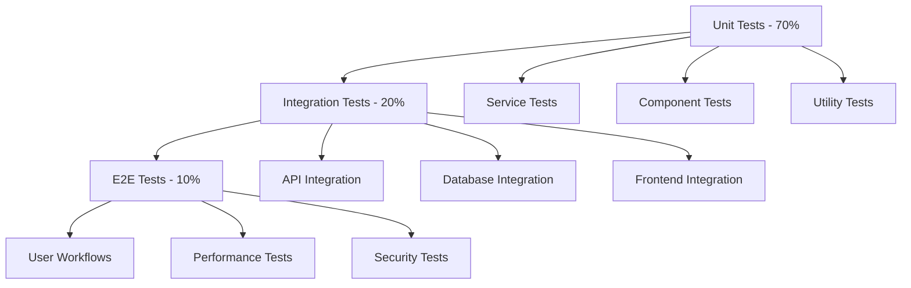

# Voice Synthesis Testing & Validation Plan

## Executive Summary
Comprehensive testing strategy to ensure error-free implementation of ElevenLabs voice synthesis standardization, with zero conflicts and seamless integration with existing Orchestra AI codebase.

## Testing Architecture

### 1. Test Pyramid Structure


## Phase-by-Phase Testing Strategy

### Phase 1: Pre-Implementation Validation ✅ (Completed)
- [x] Audit existing implementations
- [x] Identify potential conflicts
- [x] Document current state

### Phase 2: Design Validation (Days 4-5)
```yaml
design_validation:
  architecture_review:
    - [ ] SOLID principles compliance
    - [ ] Hexagonal architecture adherence
    - [ ] Event-driven pattern validation
    - [ ] Stateless service design
    
  interface_contracts:
    - [ ] API schema validation
    - [ ] Type safety verification
    - [ ] Backward compatibility check
    - [ ] Version strategy review
```

### Phase 3: Implementation Testing (Days 6-10)

#### 3.1 Unit Tests
```python
# tests/test_elevenlabs_service.py
import pytest
from unittest.mock import Mock, patch
from core.services.elevenlabs_service import ElevenLabsService

class TestElevenLabsService:
    """Comprehensive unit tests for ElevenLabs service"""
    
    @pytest.fixture
    def service(self):
        return ElevenLabsService()
    
    @pytest.mark.asyncio
    async def test_initialize_with_retry(self, service):
        """Test initialization with retry logic"""
        # Test successful initialization
        # Test retry on failure
        # Test circuit breaker activation
    
    @pytest.mark.asyncio
    async def test_synthesize_speech_caching(self, service):
        """Test speech synthesis with caching"""
        # Test cache hit
        # Test cache miss
        # Test cache invalidation
    
    @pytest.mark.asyncio
    async def test_error_handling(self, service):
        """Test comprehensive error handling"""
        # Test API errors
        # Test network errors
        # Test rate limiting
```

#### 3.2 Integration Tests
```python
# tests/integration/test_voice_integration.py
class TestVoiceIntegration:
    """Integration tests for voice synthesis"""
    
    @pytest.mark.integration
    async def test_natural_language_processor_integration(self):
        """Test integration with NLP service"""
        # Test text-to-speech flow
        # Test error propagation
        # Test performance metrics
    
    @pytest.mark.integration
    async def test_frontend_backend_integration(self):
        """Test full stack integration"""
        # Test API endpoints
        # Test WebSocket streaming
        # Test file upload/download
```

#### 3.3 Regression Tests
```yaml
regression_suite:
  existing_features:
    - [ ] Agent communication unchanged
    - [ ] Memory systems unaffected
    - [ ] Tool execution preserved
    - [ ] Orchestration flows intact
    
  performance_baseline:
    - [ ] Response time <= 100ms
    - [ ] Memory usage stable
    - [ ] CPU usage within limits
    - [ ] No memory leaks
```

### Phase 4: Frontend Testing (Days 11-15)

#### 4.1 Component Tests
```typescript
// tests/components/VoiceSynthesizer.test.tsx
describe('VoiceSynthesizer Component', () => {
  it('should render without errors', () => {
    // Test component mounting
  });
  
  it('should handle voice selection', () => {
    // Test voice dropdown
    // Test preview functionality
  });
  
  it('should manage streaming state', () => {
    // Test loading states
    // Test error states
    // Test success states
  });
});
```

#### 4.2 Browser Compatibility
```yaml
browser_matrix:
  desktop:
    - Chrome: [latest, latest-1]
    - Firefox: [latest, latest-1]
    - Safari: [latest]
    - Edge: [latest]
  
  mobile:
    - iOS Safari: [15+]
    - Chrome Android: [latest]
```

### Phase 5: Infrastructure Testing (Days 11-18)

#### 5.1 Migration Validation
```python
# tests/migration/test_data_migration.py
class TestDataMigration:
    """Test data migration from PGVector to Weaviate"""
    
    def test_embedding_migration(self):
        """Validate embedding preservation"""
        # Compare checksums
        # Verify vector similarity
        # Test query results
    
    def test_rollback_capability(self):
        """Test migration rollback"""
        # Backup verification
        # Rollback execution
        # State restoration
```

#### 5.2 Load Testing
```yaml
load_test_scenarios:
  normal_load:
    concurrent_users: 100
    requests_per_second: 50
    duration: 10_minutes
    
  peak_load:
    concurrent_users: 500
    requests_per_second: 200
    duration: 5_minutes
    
  stress_test:
    concurrent_users: 1000
    requests_per_second: 500
    duration: 2_minutes
```

## Validation Checkpoints

### Code Quality Gates
```yaml
quality_metrics:
  code_coverage:
    minimum: 80%
    target: 90%
    
  code_quality:
    - pylint_score: ">= 8.0"
    - mypy_errors: 0
    - eslint_errors: 0
    
  security:
    - bandit_issues: 0
    - npm_audit: "no high/critical"
    - dependency_check: "pass"
```

### Integration Validation
```python
# validation/integration_validator.py
class IntegrationValidator:
    """Validate seamless integration"""
    
    async def validate_api_compatibility(self):
        """Check API backward compatibility"""
        # Test existing endpoints
        # Verify response formats
        # Check deprecation warnings
    
    async def validate_dependency_graph(self):
        """Ensure no circular dependencies"""
        # Analyze import structure
        # Check service dependencies
        # Validate module boundaries
```

## Documentation Validation

### 1. API Documentation
```yaml
api_docs_checklist:
  - [ ] OpenAPI spec updated
  - [ ] Request/response examples
  - [ ] Error code documentation
  - [ ] Rate limiting details
  - [ ] Authentication guide
```

### 2. Code Documentation
```python
# Example of required documentation
class ElevenLabsService:
    """
    Centralized voice synthesis service using ElevenLabs API.
    
    This service provides:
    - Text-to-speech conversion with caching
    - Voice management and selection
    - Streaming support for real-time synthesis
    - Automatic retry and circuit breaker patterns
    
    Example:
        service = ElevenLabsService()
        audio_url = await service.synthesize_speech(
            text="Hello, world!",
            voice_id="21m00Tcm4TlvDq8ikWAM"
        )
    
    Attributes:
        client: ElevenLabs API client instance
        cache: Two-tier caching system
        circuit_breaker: Circuit breaker for API protection
    """
```

### 3. User Documentation
- [ ] Update user guide with voice features
- [ ] Create migration guide for admins
- [ ] Document new configuration options
- [ ] Add troubleshooting section

## Conflict Resolution Strategy

### 1. Merge Conflict Prevention
```bash
# Pre-merge validation script
#!/bin/bash
echo "Running pre-merge validation..."

# Update from main
git fetch origin main
git rebase origin/main

# Run tests
pytest tests/
npm test

# Check for conflicts
if git diff --check; then
    echo "No conflicts detected"
else
    echo "Conflicts found, please resolve"
    exit 1
fi
```

### 2. Dependency Conflict Resolution
```yaml
dependency_validation:
  python:
    - pip-compile for locked versions
    - pip check for conflicts
    - safety check for vulnerabilities
    
  javascript:
    - npm audit fix
    - yarn dedupe
    - lockfile validation
```

## Performance Validation

### 1. Baseline Metrics
```yaml
performance_baseline:
  api_response_time:
    p50: 50ms
    p95: 100ms
    p99: 200ms
    
  voice_synthesis:
    cold_start: < 500ms
    warm_request: < 100ms
    streaming_latency: < 50ms
    
  resource_usage:
    memory: < 512MB per instance
    cpu: < 50% average
    cache_hit_rate: > 80%
```

### 2. Performance Tests
```python
# tests/performance/test_voice_performance.py
import asyncio
import time
from statistics import mean, stdev

async def test_synthesis_performance():
    """Measure voice synthesis performance"""
    latencies = []
    
    for _ in range(100):
        start = time.time()
        await voice_service.synthesize_speech("Test text")
        latencies.append(time.time() - start)
    
    assert mean(latencies) < 0.1  # 100ms average
    assert max(latencies) < 0.5   # 500ms max
```

## Rollout Validation

### 1. Feature Flag Testing
```python
# tests/test_feature_flags.py
def test_gradual_rollout():
    """Test feature flag rollout logic"""
    # Test 0% rollout
    # Test 10% rollout
    # Test 50% rollout
    # Test 100% rollout
    # Test user targeting
```

### 2. Canary Deployment
```yaml
canary_validation:
  stages:
    - percentage: 5
      duration: 1_hour
      metrics:
        - error_rate: "< 0.1%"
        - latency_increase: "< 10%"
        
    - percentage: 25
      duration: 2_hours
      metrics:
        - error_rate: "< 0.1%"
        - user_complaints: 0
```

## Continuous Validation

### 1. Monitoring Setup
```yaml
monitoring:
  metrics:
    - voice_synthesis_requests_total
    - voice_synthesis_errors_total
    - voice_synthesis_duration_seconds
    - cache_hit_rate
    - api_quota_remaining
    
  alerts:
    - error_rate > 1%
    - p95_latency > 200ms
    - api_quota < 10%
    - cache_hit_rate < 70%
```

### 2. Health Checks
```python
# health/voice_health.py
async def health_check():
    """Comprehensive health check"""
    checks = {
        "elevenlabs_api": check_api_connection(),
        "cache_system": check_cache_health(),
        "database": check_db_connection(),
        "dependencies": check_dependencies()
    }
    
    return all(checks.values()), checks
```

## Success Criteria

### Technical Success
- [ ] All tests passing (100%)
- [ ] Code coverage > 80%
- [ ] Zero high/critical vulnerabilities
- [ ] Performance within baselines
- [ ] No memory leaks detected

### Integration Success
- [ ] Zero breaking changes
- [ ] All existing features working
- [ ] Smooth migration path
- [ ] Rollback tested and verified
- [ ] Documentation complete

### Business Success
- [ ] Cost within budget
- [ ] User satisfaction maintained
- [ ] No service disruptions
- [ ] Improved voice quality
- [ ] Reduced latency

---

Generated: 2025-01-06
Version: 1.0
Status: Ready for Implementation