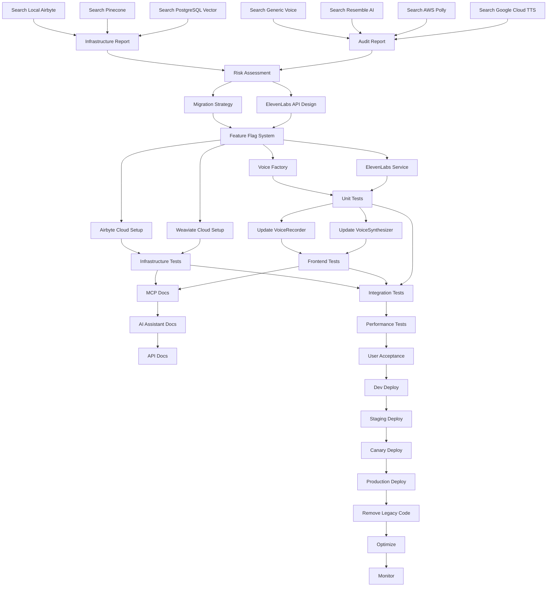

# Voice Synthesis Standardization Workflow Graph

## Dependency Graph



## Parallel Execution Opportunities

### Can Execute in Parallel:
1. **Phase 1**: All search tasks (A1-A4, B1-B3)
2. **Phase 3-5**: Core services, Frontend, and Infrastructure
3. **Phase 6**: Documentation updates across different systems

### Sequential Dependencies:
1. Audit must complete before Design
2. Design must complete before Implementation
3. All implementation must complete before Testing
4. Testing must complete before Rollout

## Checkpoint Strategy

### Phase Checkpoints:
- **CP1**: After Audit Report (Day 3)
- **CP2**: After Design Approval (Day 5)
- **CP3**: After Core Implementation (Day 10)
- **CP4**: After Frontend/Infrastructure (Day 18)
- **CP5**: After Testing (Day 25)
- **CP6**: After Each Rollout Stage (Days 26-30)

### Rollback Points:
- Each checkpoint includes state snapshot
- Git tags for code versions
- Database backups before migrations
- Configuration snapshots

## Agent Assignments

### Code Agent Tasks:
- Implement ElevenLabs service
- Update frontend components
- Write unit tests
- Remove legacy code

### Research Agent Tasks:
- Audit codebase for references
- Research ElevenLabs best practices
- Document API differences
- Performance benchmarking

### Debug Agent Tasks:
- Test integrations
- Troubleshoot issues
- Validate error handling
- Monitor rollout

### Architect Agent Tasks:
- Design service architecture
- Plan migration strategy
- Review implementation
- Optimize performance

## Context Management

### MCP Context Keys:
```yaml
voice_synthesis_audit:
  google_tts_files: 118  # Mainly in node_modules and documentation
  aws_polly_files: 7     # Only in planning documents
  resemble_files: 93     # Already migrated but package still present
  
infrastructure_audit:
  postgres_vector_refs: 148  # Active use in multiple components
  pinecone_refs: "Found"     # Marked as deprecated
  airbyte_local_refs: 0      # No local Airbyte found
  
migration_state:
  current_phase: 1
  completed_tasks:
    - "Search Google Cloud TTS references"
    - "Search AWS Polly references"
    - "Search Resemble AI references"
    - "Search generic voice patterns"
    - "Search infrastructure references"
    - "Generate audit report"
  blocked_tasks: []
  rollback_points: []
  
elevenlabs_config:
  api_key: encrypted
  voice_mappings: {}
  feature_flags: {}

audit_summary:
  total_voice_refs: 504
  total_infra_refs: 148
  files_affected: "~50-60"
  risk_level: "Medium"
  migration_ready: true
```

## Performance Metrics

### Task Execution Times:
- Codebase search: ~30 min per pattern
- Service implementation: 2-3 days
- Testing suite: 1 day per phase
- Documentation: 4 hours per system
- Deployment: 2 hours per environment

### Resource Requirements:
- Development: 2-3 engineers
- Testing: 1 QA engineer
- DevOps: 1 engineer
- Documentation: 1 technical writer

## Risk Mitigation Workflow

```mermaid
graph LR
    R1[Identify Risk] --> R2{Severity?}
    R2 -->|High| R3[Immediate Action]
    R2 -->|Medium| R4[Plan Mitigation]
    R2 -->|Low| R5[Monitor]
    
    R3 --> R6[Update Plan]
    R4 --> R6
    R5 --> R7[Log Risk]
    
    R6 --> R8[Communicate]
    R7 --> R8