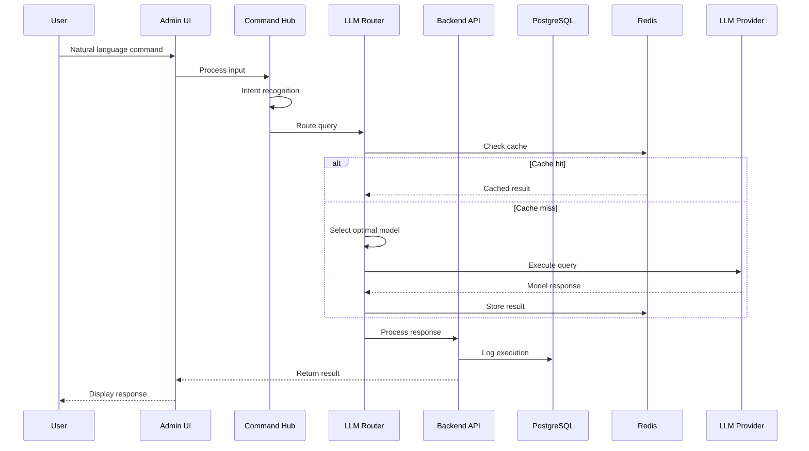
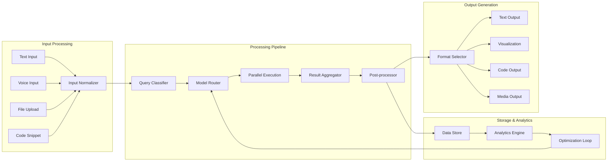
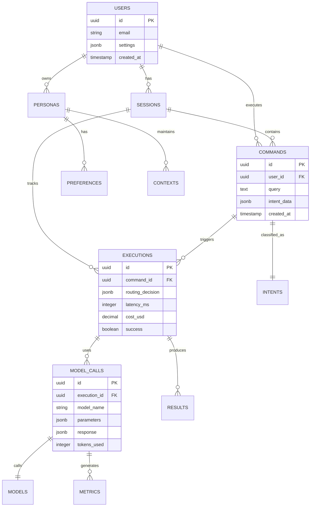
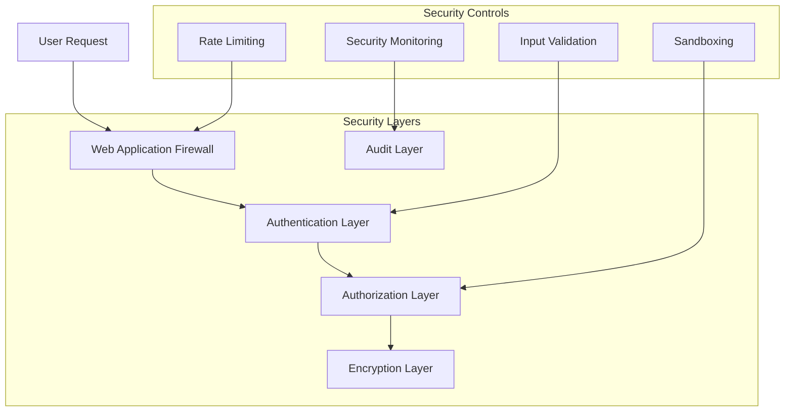
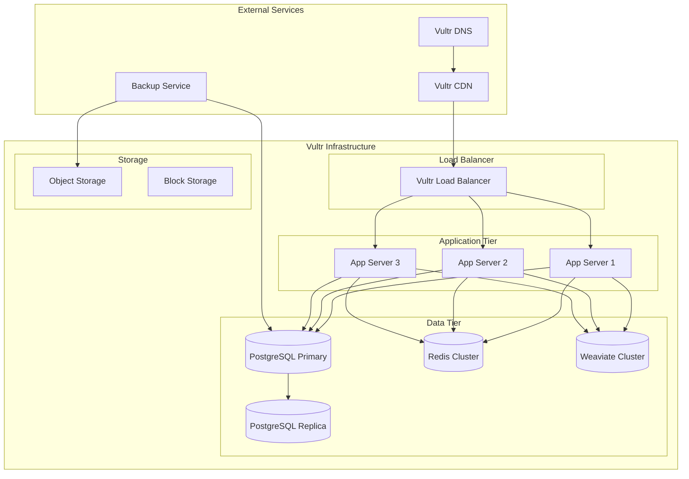
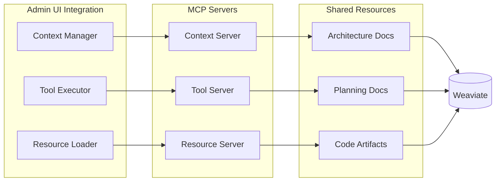
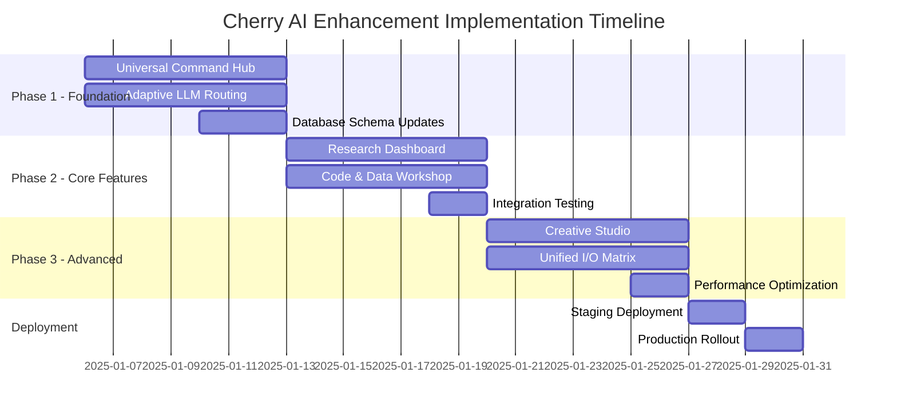

# Cherry AI Admin Interface - Architecture Diagram

## System Architecture Overview

```mermaid
graph TB
    subgraph "Frontend Layer"
        UC[Universal Command Hub]
        RD[Research Dashboard]
        CS[Creative Studio]
        CW[Code Workshop]
        UM[Unified I/O Matrix]
        
        UC --> CMD[Command Palette]
        UC --> NLP[NLP Processor]
        UC --> VOICE[Voice Interface]
        
        RD --> INSIGHTS[Multi-Model Insights]
        RD --> GRAPH[Source Network Graph]
        RD --> CONSENSUS[Consensus Builder]
        
        CS --> CANVAS[Creative Canvas]
        CS --> VERSION[Version Control]
        CS --> COLLAB[Collaboration]
        
        CW --> EDITOR[Code Editor]
        CW --> EXEC[Live Execution]
        CW --> PIPELINE[Data Pipeline]
    end
    
    subgraph "Routing Layer"
        ROUTER[Adaptive LLM Router]
        ROUTER --> COST[Cost Optimizer]
        ROUTER --> PERF[Performance Monitor]
        ROUTER --> ML[ML Optimizer]
    end
    
    subgraph "Backend Services"
        API[FastAPI Backend]
        WS[WebSocket Server]
        QUEUE[Redis Streams]
        
        API --> AUTH[Auth Service]
        API --> ORCH[Orchestration Service]
        API --> AGENT[Agent Service]
    end
    
    subgraph "Data Layer"
        PG[(PostgreSQL)]
        REDIS[(Redis Cache)]
        WEAVIATE[(Weaviate Vector DB)]
        
        PG --> PART[Partitioned Tables]
        PG --> INDEX[Optimized Indexes]
        
        WEAVIATE --> EMBED[Embeddings]
        WEAVIATE --> SEARCH[Semantic Search]
    end
    
    subgraph "External Services"
        LLM1[OpenAI GPT-4]
        LLM2[Anthropic Claude]
        LLM3[Google Gemini]
        LLM4[Open Models]
        
        MCP[MCP Servers]
        VULTR[Vultr Infrastructure]
    end
    
    %% Connections
    UC --> ROUTER
    RD --> ROUTER
    CS --> ROUTER
    CW --> ROUTER
    UM --> ROUTER
    
    ROUTER --> API
    ROUTER --> WS
    
    API --> PG
    API --> REDIS
    API --> WEAVIATE
    
    ROUTER --> LLM1
    ROUTER --> LLM2
    ROUTER --> LLM3
    ROUTER --> LLM4
    
    API --> MCP
    API --> VULTR
```

## Component Interaction Flow

## Data Flow Architecture

## Database Schema Design

## Performance Optimization Strategy

```mermaid
graph TD
    subgraph "Caching Layers"
        L1[Browser Cache]
        L2[CDN Cache]
        L3[Redis Cache]
        L4[PostgreSQL Cache]
        
        L1 --> L2
        L2 --> L3
        L3 --> L4
    end
    
    subgraph "Query Optimization"
        Q1[Query Analysis]
        Q2[Index Selection]
        Q3[Partition Pruning]
        Q4[Parallel Execution]
        
        Q1 --> Q2
        Q2 --> Q3
        Q3 --> Q4
    end
    
    subgraph "Model Optimization"
        M1[Load Balancing]
        M2[Request Batching]
        M3[Result Caching]
        M4[Fallback Strategy]
        
        M1 --> M2
        M2 --> M3
        M3 --> M4
    end
```

## Security Architecture

## Deployment Architecture (Vultr)

## MCP Integration Points

## Implementation Phases

## Key Architecture Decisions

1. **Hot-Swappable Modules**: All UI components implement standardized interfaces for runtime replacement
2. **Event-Driven Communication**: Components communicate via Redux-style events for loose coupling
3. **Caching Strategy**: Multi-layer caching with intelligent invalidation
4. **Database Partitioning**: Time-based partitioning for analytics tables
5. **Vector Search**: Weaviate for semantic search across all artifacts
6. **MCP Integration**: Context sharing for all architectural decisions
7. **Vultr Optimization**: Leveraging Vultr's global infrastructure for low latency