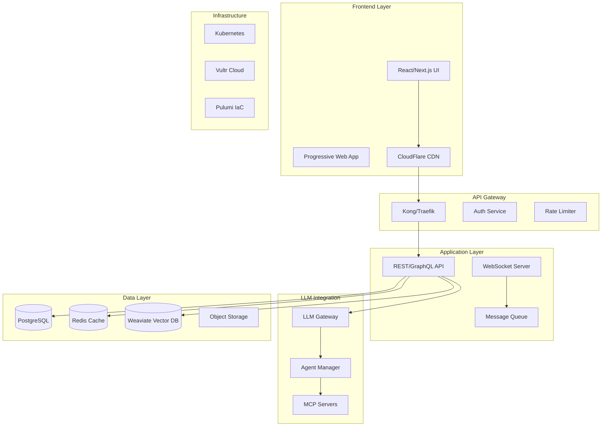

# Comprehensive Web Application Implementation Guide

## Table of Contents

1. [Architecture Overview](#architecture-overview)
2. [Frontend Architecture & UI/UX Design](#frontend-architecture--uiux-design)
3. [Backend Infrastructure with Vultr & Pulumi](#backend-infrastructure-with-vultr--pulumi)
4. [File Structure & Organization](#file-structure--organization)
5. [LLM Integration Architecture](#llm-integration-architecture)
6. [Agent & Persona Management](#agent--persona-management)
7. [Real-time Monitoring & Observability](#real-time-monitoring--observability)
8. [Automated Deployment Workflows](#automated-deployment-workflows)
9. [Cache & CDN Configuration](#cache--cdn-configuration)
10. [Build Optimization & Asset Management](#build-optimization--asset-management)
11. [Environment Configuration](#environment-configuration)
12. [CI/CD Pipelines](#cicd-pipelines)
13. [Error Handling & Stability](#error-handling--stability)
14. [Performance Optimization](#performance-optimization)
15. [Database Schema & API Design](#database-schema--api-design)
16. [Authentication & Authorization](#authentication--authorization)
17. [Microservices Architecture](#microservices-architecture)
18. [Containerization & coordination](#containerization--coordination)
19. [Testing Frameworks & QA](#testing-frameworks--qa)
20. [Documentation Standards](#documentation-standards)
21. [Troubleshooting Guide](#troubleshooting-guide)

---

## Architecture Overview

### System Architecture Diagram



---

## Frontend Architecture & UI/UX Design

### 1. Technology Stack

```typescript
// frontend/tech-stack.ts
export const frontendStack = {
  framework: 'Next.js 14',
  ui: {
    library: 'React 18',
    styling: 'Tailwind CSS + CSS Modules',
    components: 'Radix UI + Custom Components',
    animations: 'Framer Motion',
    icons: 'Lucide React'
  },
  state: {
    client: 'Zustand',
    server: 'TanStack Query',
    forms: 'React Hook Form + Zod'
  },
  routing: 'Next.js App Router',
  testing: 'Jest + React Testing Library + Playwright'
};
```

### 2. Page Architecture

```typescript
// frontend/src/app/layout.tsx
import { Metadata } from 'next';
import { Inter } from 'next/font/google';
import { Providers } from '@/components/providers';
import { Navigation } from '@/components/navigation';
import { Analytics } from '@/components/analytics';
import './globals.css';

const inter = Inter({ subsets: ['latin'] });

export const metadata: Metadata = {
  title: 'cherry_ai - AI Workflow Platform',
  description: 'Modern AI-powered workflow coordination',
};

export default function RootLayout({
  children,
}: {
  children: React.ReactNode;
}) {
  return (
    <html lang="en" suppressHydrationWarning>
      <body className={inter.className}>
        <Providers>
          <Navigation />
          <main className="min-h-screen bg-background">
            {children}
          </main>
          <Analytics />
        </Providers>
      </body>
    </html>
  );
}
```

### 3. Component Architecture

```typescript
// frontend/src/components/ui/button.tsx
import * as React from 'react';
import { Slot } from '@radix-ui/react-slot';
import { cva, type VariantProps } from 'class-variance-authority';
import { cn } from '@/lib/utils';

const buttonVariants = cva(
  'inline-flex items-center justify-center rounded-md text-sm font-medium transition-colors focus-visible:outline-none focus-visible:ring-2 focus-visible:ring-ring focus-visible:ring-offset-2 disabled:opacity-50 disabled:pointer-events-none ring-offset-background',
  {
    variants: {
      variant: {
        default: 'bg-primary text-primary-foreground hover:bg-primary/90',
        destructive: 'bg-destructive text-destructive-foreground hover:bg-destructive/90',
        outline: 'border border-input hover:bg-accent hover:text-accent-foreground',
        secondary: 'bg-secondary text-secondary-foreground hover:bg-secondary/80',
        ghost: 'hover:bg-accent hover:text-accent-foreground',
        link: 'underline-offset-4 hover:underline text-primary',
      },
      size: {
        default: 'h-10 py-2 px-4',
        sm: 'h-9 px-3 rounded-md',
        lg: 'h-11 px-8 rounded-md',
        icon: 'h-10 w-10',
      },
    },
    defaultVariants: {
      variant: 'default',
      size: 'default',
    },
  }
);

export interface ButtonProps
  extends React.ButtonHTMLAttributes<HTMLButtonElement>,
    VariantProps<typeof buttonVariants> {
  asChild?: boolean;
}

const Button = React.forwardRef<HTMLButtonElement, ButtonProps>(
  ({ className, variant, size, asChild = false, ...props }, ref) => {
    const Comp = asChild ? Slot : 'button';
    return (
      <Comp
        className={cn(buttonVariants({ variant, size, className }))}
        ref={ref}
        {...props}
      />
    );
  }
);
Button.displayName = 'Button';

export { Button, buttonVariants };
```

### 4. Design System

```typescript
// frontend/src/styles/design-tokens.ts
export const designTokens = {
  colors: {
    primary: {
      50: '#eff6ff',
      500: '#3b82f6',
      900: '#1e3a8a',
    },
    gray: {
      50: '#f9fafb',
      500: '#6b7280',
      900: '#111827',
    },
  },
  spacing: {
    xs: '0.5rem',
    sm: '1rem',
    md: '1.5rem',
    lg: '2rem',
    xl: '3rem',
  },
  typography: {
    fontFamily: {
      sans: ['Inter', 'system-ui', 'sans-serif'],
      mono: ['JetBrains Mono', 'monospace'],
    },
    fontSize: {
      xs: '0.75rem',
      sm: '0.875rem',
      base: '1rem',
      lg: '1.125rem',
      xl: '1.25rem',
      '2xl': '1.5rem',
      '3xl': '1.875rem',
      '4xl': '2.25rem',
    },
  },
  animation: {
    duration: {
      fast: '150ms',
      normal: '300ms',
      slow: '500ms',
    },
    easing: {
      default: 'cubic-bezier(0.4, 0, 0.2, 1)',
      in: 'cubic-bezier(0.4, 0, 1, 1)',
      out: 'cubic-bezier(0, 0, 0.2, 1)',
    },
  },
};
```

---

## Backend Infrastructure with Vultr & Pulumi

### 1. Pulumi Infrastructure Definition

```typescript
// infrastructure/pulumi/index.ts
import * as pulumi from "@pulumi/pulumi";
import * as vultr from "@ediri/vultr";
import * as k8s from "@pulumi/kubernetes";
import * as docker from "@pulumi/docker";

// Configuration
const config = new pulumi.Config();
const environment = config.require("environment");
const region = config.get("region") || "ewr";

// VPC Network
const vpc = new vultr.Vpc("cherry_ai-vpc", {
    region: region,
    v4Subnet: "10.0.0.0",
    v4SubnetMask: 16,
    description: `cherry_ai VPC - ${environment}`,
});

// Kubernetes Cluster
const cluster = new vultr.Kubernetes("cherry_ai-k8s", {
    region: region,
    version: "v1.28.2+1",
    label: `cherry_ai-${environment}`,
    nodePools: [{
        nodeQuantity: 3,
        plan: "vc2-4c-8gb",
        label: "worker-pool",
        autoScaler: true,
        minNodes: 3,
        maxNodes: 10,
    }],
    enableFirewall: true,
});

// Database Instance
const database = new vultr.Database("cherry_ai-db", {
    databaseEngine: "pg",
    databaseEngineVersion: "15",
    region: region,
    plan: "vultr-dbaas-hobbyist-cc-1-25-1",
    label: `cherry_ai-db-${environment}`,
    tag: environment,
    maintenanceDow: "sunday",
    maintenanceTime: "03:00",
    trustedIps: [vpc.v4Subnet],
});

// Redis Instance
const redis = new vultr.Database("cherry_ai-redis", {
    databaseEngine: "redis",
    databaseEngineVersion: "7",
    region: region,
    plan: "vultr-dbaas-hobbyist-cc-1-25-1",
    label: `cherry_ai-redis-${environment}`,
    tag: environment,
    redisEvictionPolicy: "allkeys-lru",
});

// Object Storage
const objectStore = new vultr.ObjectStorage("cherry_ai-storage", {
    clusterId: 2, // NYC cluster
    label: `cherry_ai-storage-${environment}`,
});

// Load Balancer
const loadBalancer = new vultr.LoadBalancer("cherry_ai-lb", {
    region: region,
    label: `cherry_ai-lb-${environment}`,
    balancingAlgorithm: "roundrobin",
    forwardingRules: [{
        frontendProtocol: "https",
        frontendPort: 443,
        backendProtocol: "http",
        backendPort: 80,
    }],
    healthCheck: {
        protocol: "http",
        port: 80,
        path: "/health",
        checkInterval: 10,
        responseTimeout: 5,
        unhealthyThreshold: 3,
        healthyThreshold: 3,
    },
    ssl: {
        certificate: config.requireSecret("sslCertificate"),
        privateKey: config.requireSecret("sslPrivateKey"),
    },
});

// Export outputs
export const kubeconfig = cluster.kubeConfig;
export const dbConnectionString = database.connectionString;
export const redisConnectionString = redis.connectionString;
export const storageEndpoint = objectStore.s3Hostname;
export const loadBalancerIp = loadBalancer.ipv4;
```

### 2. Kubernetes Deployment

```yaml
# infrastructure/k8s/deployment.yaml
apiVersion: apps/v1
kind: Deployment
metadata:
  name: cherry_ai-api
  namespace: cherry_ai
spec:
  replicas: 3
  selector:
    matchLabels:
      app: cherry_ai-api
  template:
    metadata:
      labels:
        app: cherry_ai-api
    spec:
      containers:
      - name: api
        image: cherry_ai/api:latest
        ports:
        - containerPort: 8000
        env:
        - name: DATABASE_URL
          valueFrom:
            secretKeyRef:
              name: cherry_ai-secrets
              key: database-url
        - name: REDIS_URL
          valueFrom:
            secretKeyRef:
              name: cherry_ai-secrets
              key: redis-url
        resources:
          requests:
            memory: "512Mi"
            cpu: "500m"
          limits:
            memory: "1Gi"
            cpu: "1000m"
        livenessProbe:
          httpGet:
            path: /health
            port: 8000
          initialDelaySeconds: 30
          periodSeconds: 10
        readinessProbe:
          httpGet:
            path: /ready
            port: 8000
          initialDelaySeconds: 5
          periodSeconds: 5
---
apiVersion: v1
kind: Service
metadata:
  name: cherry_ai-api
  namespace: cherry_ai
spec:
  selector:
    app: cherry_ai-api
  ports:
  - port: 80
    targetPort: 8000
  type: ClusterIP
---
apiVersion: networking.k8s.io/v1
kind: Ingress
metadata:
  name: cherry_ai-ingress
  namespace: cherry_ai
  annotations:
    kubernetes.io/ingress.class: nginx
    cert-manager.io/cluster-issuer: letsencrypt-prod
spec:
  tls:
  - hosts:
    - api.cherry_ai.example.com
    secretName: cherry_ai-tls
  rules:
  - host: api.cherry_ai.example.com
    http:
      paths:
      - path: /
        pathType: Prefix
        backend:
          service:
            name: cherry_ai-api
            port:
              number: 80
```

---

## File Structure & Organization

```bash
cherry_ai/
├── .github/                    # GitHub Actions workflows
│   ├── workflows/
│   │   ├── ci.yml
│   │   ├── deploy.yml
│   │   └── security.yml
│   └── dependabot.yml
├── apps/                       # Application packages
│   ├── web/                   # Next.js frontend
│   │   ├── src/
│   │   │   ├── app/          # App router pages
│   │   │   ├── components/   # React components
│   │   │   ├── hooks/        # Custom hooks
│   │   │   ├── lib/          # Utilities
│   │   │   ├── services/     # API clients
│   │   │   └── styles/       # Global styles
│   │   ├── public/           # Static assets
│   │   ├── tests/            # Frontend tests
│   │   └── package.json
│   ├── api/                   # Backend API
│   │   ├── src/
│   │   │   ├── controllers/  # Request handlers
│   │   │   ├── services/     # Business logic
│   │   │   ├── models/       # Data models
│   │   │   ├── middleware/   # Express middleware
│   │   │   ├── utils/        # Utilities
│   │   │   └── index.ts      # Entry point
│   │   ├── tests/            # API tests
│   │   └── package.json
│   └── admin/                 # Admin dashboard
├── packages/                   # Shared packages
│   ├── ui/                    # UI component library
│   ├── config/                # Shared configuration
│   ├── types/                 # TypeScript types
│   └── utils/                 # Shared utilities
├── services/                   # Microservices
│   ├── auth/                  # Authentication service
│   ├── llm-gateway/           # LLM integration service
│   ├── agent-manager/         # Agent management service
│   └── notification/          # Notification service
├── infrastructure/             # Infrastructure as Code
│   ├── pulumi/                # Pulumi definitions
│   ├── k8s/                   # Kubernetes manifests
│   ├── docker/                # Dockerfiles
│   └── scripts/               # Deployment scripts
├── docs/                       # Documentation
│   ├── api/                   # API documentation
│   ├── architecture/          # Architecture docs
│   └── guides/                # User guides
├── tests/                      # E2E tests
│   ├── cypress/               # Cypress tests
│   └── playwright/            # Playwright tests
├── scripts/                    # Build & utility scripts
├── .env.example               # Environment variables template
├── docker-compose.yml         # Local development
├── turbo.json                 # Turborepo config
└── package.json               # Root package.json
```

---

## LLM Integration Architecture

### 1. LLM Gateway Service

```typescript
// services/llm-gateway/src/index.ts
import { FastifyInstance } from 'fastify';
import { OpenAI } from 'openai';
import { Anthropic } from '@anthropic-ai/sdk';
import { CircuitBreaker } from 'opossum';
import { Redis } from 'ioredis';
import { Logger } from 'pino';

interface LLMProvider {
  name: string;
  client: any;
  models: string[];
  rateLimit: number;
  priority: number;
}

export class LLMGateway {
  private providers: Map<string, LLMProvider>;
  private circuitBreakers: Map<string, CircuitBreaker>;
  private cache: Redis;
  private logger: Logger;

  constructor(config: LLMGatewayConfig) {
    this.providers = new Map();
    this.circuitBreakers = new Map();
    this.cache = new Redis(config.redis);
    this.logger = config.logger;

    // Initialize providers
    this.initializeProviders(config.providers);
  }

  private initializeProviders(providersConfig: ProviderConfig[]) {
    for (const config of providersConfig) {
      const provider = this.createProvider(config);
      this.providers.set(config.name, provider);
      
      // Create circuit breaker for each provider
      const breaker = new CircuitBreaker(
        this.callProvider.bind(this, config.name),
        {
          timeout: 30000,
          errorThresholdPercentage: 50,
          resetTimeout: 30000,
        }
      );
      
      this.circuitBreakers.set(config.name, breaker);
    }
  }

  async complete(request: CompletionRequest): Promise<CompletionResponse> {
    // Check cache first
    const cacheKey = this.getCacheKey(request);
    const cached = await this.cache.get(cacheKey);
    if (cached) {
      return JSON.parse(cached);
    }

    // Try providers in priority order
    const sortedProviders = Array.from(this.providers.values())
      .sort((a, b) => b.priority - a.priority);

    for (const provider of sortedProviders) {
      const breaker = this.circuitBreakers.get(provider.name);
      
      try {
        const response = await breaker.fire(request);
        
        // Cache successful response
        await this.cache.setex(
          cacheKey,
          3600,
          JSON.stringify(response)
        );
        
        return response;
      } catch (error) {
        this.logger.error({
          provider: provider.name,
          error: error.message,
        }, 'Provider failed');
        
        // Continue to next provider
        continue;
      }
    }

    throw new Error('All LLM providers failed');
  }

  private async callProvider(
    providerName: string,
    request: CompletionRequest
  ): Promise<CompletionResponse> {
    const provider = this.providers.get(providerName);
    
    switch (provider.name) {
      case 'openai':
        return this.callOpenAI(provider.client, request);
      case 'anthropic':
        return this.callAnthropic(provider.client, request);
      default:
        throw new Error(`Unknown provider: ${provider.name}`);
    }
  }

  private async callOpenAI(
    client: OpenAI,
    request: CompletionRequest
  ): Promise<CompletionResponse> {
    const response = await client.chat.completions.create({
      model: request.model || 'gpt-4-turbo-preview',
      messages: request.messages,
      temperature: request.temperature || 0.7,
      max_tokens: request.maxTokens || 2000,
      stream: request.stream || false,
    });

    return {
      id: response.id,
      content: response.choices[0].message.content,
      model: response.model,
      usage: response.usage,
      provider: 'openai',
    };
  }

  private async callAnthropic(
    client: Anthropic,
    request: CompletionRequest
  ): Promise<CompletionResponse> {
    const response = await client.messages.create({
      model: request.model || 'claude-3-opus-20240229',
      messages: request.messages,
      max_tokens: request.maxTokens || 2000,
      temperature: request.temperature || 0.7,
    });

    return {
      id: response.id,
      content: response.content[0].text,
      model: response.model,
      usage: {
        prompt_tokens: response.usage.input_tokens,
        completion_tokens: response.usage.output_tokens,
        total_tokens: response.usage.input_tokens + response.usage.output_tokens,
      },
      provider: 'anthropic',
    };
  }

  private getCacheKey(request: CompletionRequest): string {
    const hash = crypto
      .createHash('sha256')
      .update(JSON.stringify(request))
      .digest('hex');
    
    return `llm:completion:${hash}`;
  }
}
```

### 2. Conversation Management

```typescript
// services/llm-gateway/src/conversation.ts
import { v4 as uuidv4 } from 'uuid';
import { Redis } from 'ioredis';
import { EventEmitter } from 'events';

export interface Message {
  id: string;
  role: 'user' | 'assistant' | 'system';
  content: string;
  timestamp: Date;
  metadata?: Record<string, any>;
}

export interface Conversation {
  id: string;
  userId: string;
  messages: Message[];
  context: Record<string, any>;
  createdAt: Date;
  updatedAt: Date;
}

export class ConversationManager extends EventEmitter {
  private redis: Redis;
  private ttl: number;

  constructor(redis: Redis, ttl: number = 86400) {
    super();
    this.redis = redis;
    this.ttl = ttl;
  }

  async createConversation(userId: string): Promise<Conversation> {
    const conversation: Conversation = {
      id: uuidv4(),
      userId,
      messages: [],
      context: {},
      createdAt: new Date(),
      updatedAt: new Date(),
    };

    await this.saveConversation(conversation);
    this.emit('conversation:created', conversation);
    
    return conversation;
  }

  async addMessage(
    conversationId: string,
    message: Omit<Message, 'id' | 'timestamp'>
  ): Promise<Message> {
    const conversation = await this.getConversation(conversationId);
    if (!conversation) {
      throw new Error('Conversation not found');
    }

    const newMessage: Message = {
      ...message,
      id: uuidv4(),
      timestamp: new Date(),
    };

    conversation.messages.push(newMessage);
    conversation.updatedAt = new Date();

    await this.saveConversation(conversation);
    this.emit('message:added', { conversation, message: newMessage });

    return newMessage;
  }

  async getConversation(id: string): Promise<Conversation | null> {
    const data = await this.redis.get(`conversation:${id}`);
    if (!data) return null;

    return JSON.parse(data);
  }

  async getUserConversations(userId: string): Promise<Conversation[]> {
    const keys = await this.redis.keys(`conversation:*`);
    const conversations: Conversation[] = [];

    for (const key of keys) {
      const data = await this.redis.get(key);
      if (data) {
        const conversation = JSON.parse(data);
        if (conversation.userId === userId) {
          conversations.push(conversation);
        }
      }
    }

    return conversations.sort(
      (a, b) => b.updatedAt.getTime() - a.updatedAt.getTime()
    );
  }

  async updateContext(
    conversationId: string,
    context: Record<string, any>
  ): Promise<void> {
    const conversation = await this.getConversation(conversationId);
    if (!conversation) {
      throw new Error('Conversation not found');
    }

    conversation.context = { ...conversation.context, ...context };
    conversation.updatedAt = new Date();

    await this.saveConversation(conversation);
    this.emit('context:updated', { conversation, context });
  }

  private async saveConversation(conversation: Conversation): Promise<void> {
    await this.redis.setex(
      `conversation:${conversation.id}`,
      this.ttl,
      JSON.stringify(conversation)
    );
  }

  async summarizeConversation(conversationId: string): Promise<string> {
    const conversation = await this.getConversation(conversationId);
    if (!conversation) {
      throw new Error('Conversation not found');
    }

    // Extract key points from the conversation
    const summary = conversation.messages
      .filter(m => m.role === 'assistant')
      .map(m => m.content)
      .join('\n\n');

    return summary;
  }
}
```

---

## Agent & Persona Management

### 1. Agent System Architecture

```typescript
// services/agent-manager/src/agent.ts
import { EventEmitter } from 'events';
import { v4 as uuidv4 } from 'uuid';
import { Logger } from 'pino';

export interface AgentCapability {
  name: string;
  description: string;
  inputSchema: Record<string, any>;
  outputSchema: Record<string, any>;
  handler: (input: any) => Promise<any>;
}

export interface AgentConfig {
  id: string;
  name: string;
  description: string;
  persona: string;
  capabilities: AgentCapability[];
  systemPrompt: string;
  temperature: number;
  maxTokens: number;
  model: string;
}

export interface AgentState {
  status: 'idle' | 'busy' | 'error';
  currentTask?: string;
  lastActivity: Date;
  metrics: {
    tasksCompleted: number;
    averageResponseTime: number;
    errorRate: number;
  };
}

export class Agent extends EventEmitter {
  private config: AgentConfig;
  private state: AgentState;
  private logger: Logger;
  private llmGateway: LLMGateway;

  constructor(
    config: AgentConfig,
    llmGateway: LLMGateway,
    logger: Logger
  ) {
    super();
    this.config = config;
    this.llmGateway = llmGateway;
    this.logger = logger.child({ agent: config.id });
    
    this.state = {
      status: 'idle',
      lastActivity: new Date(),
      metrics: {
        tasksCompleted: 0,
        averageResponseTime: 0,
        errorRate: 0,
      },
    };
  }

  async execute(task: AgentTask): Promise<AgentResult> {
    this.state.status = 'busy';
    this.state.currentTask = task.id;
    this.emit('task:started', task);

    const startTime = Date.now();

    try {
      // Prepare context with agent persona and capabilities
      const context = this.prepareContext(task);
      
      // Execute task through LLM
      const response = await this.llmGateway.complete({
        messages: [
          { role: 'system', content: this.config.systemPrompt },
          { role: 'system', content: context },
          { role: 'user', content: task.prompt },
        ],
        model: this.config.model,
        temperature: this.config.temperature,
        maxTokens: this.config.maxTokens,
      });

      // Process response and execute capabilities if needed
      const result = await this.processResponse(response, task);

      // Update metrics
      this.updateMetrics(startTime, true);

      this.state.status = 'idle';
      this.emit('task:completed', { task, result });

      return result;
    } catch (error) {
      this.logger.error({ error, task }, 'Task execution failed');
      
      this.updateMetrics(startTime, false);
      this.state.status = 'error';
      
      this.emit('task:failed', { task, error });
      throw error;
    }
  }

  private prepareContext(task: AgentTask): string {
    const capabilities = this.config.capabilities
      .map(cap => `- ${cap.name}: ${cap.description}`)
      .join('\n');

    return `
You are ${this.config.name}, ${this.config.description}.
Your persona: ${this.config.persona}

Available capabilities:
${capabilities}

Task context:
${JSON.stringify(task.context, null, 2)}
    `.trim();
  }

  private async processResponse(
    response: CompletionResponse,
    task: AgentTask