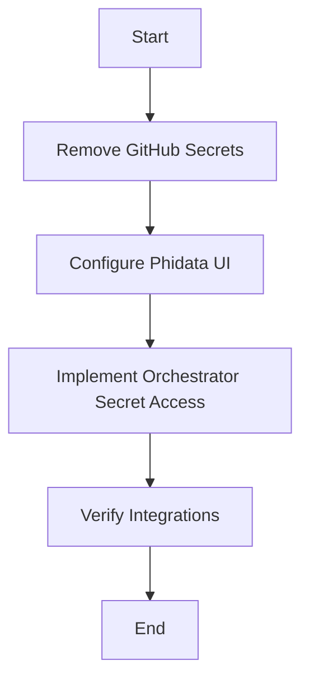

#
This document outlines the detailed plan for optimizing secret management and deployment processes using
## 1. Streamlined Secret Access in CI/CD

**Objective**: Update the deployment workflow to use Workload Identity Federation and direct secret access from
**Status**: Already implemented in '.github/workflows/deploy.yml'.

**Details**:

- Updated workflow to use `google-github-actions/auth@v1` with Workload Identity Federation.
- Added step to fetch secrets directly from - Configured deployment to
## 2. Direct
**Objective**: Integrate direct access to
**Status**: Already implemented in 'agent/core/vertex_operations.py'.

**Details**:

- Added `secretmanager.SecretManagerServiceClient()` to `VertexAgent` class for secret access.
- Implemented `get_secret` method to retrieve secrets by ID from - Added `generate_response` method to use retrieved secrets for API calls to OpenAI.

## 3. Simplified Secret Management

**Objective**: Remove redundant GitHub secrets as they are now managed in
**Status**: Pending implementation.

**Steps**:

- Execute the following command to remove GitHub secrets for the organization:
  ```bash
  gh secret remove \
    OPENAI_API_KEY \
    PORTKEY_API_KEY \
    ANTHROPIC_API_KEY \
    MISTRAL_API_KEY \
    PERPLEXITY_API_KEY \
    --org=your-org
  ```
- Ensure all secrets are properly stored and accessible in
## 4. Phidata UI Optimization

**Objective**: Configure Phidata to use
**Status**: Pending implementation.

**Steps**:

- Create or update 'phi_config.yaml' with the following content:

  ```yaml
  storage:
    type:     project: cherry-ai-project
    collection: agent_sessions

  secrets:
    source:     project: cherry-ai-project
    auto_load: true
  ```

- Verify the configuration integrates correctly with Phidata UI components.

## 5. Turbocharged Development Setup

**Objective**: Enhance the development container setup for immediate
**Status**: Already implemented in '.devcontainer/devcontainer.json'.

**Details**:

- Added `postCreateCommand` to activate service account with a key file.
- Included a mount for the - Updated `remoteEnv` to point to the correct credentials path.

## 6. Agent Orchestration Boost

**Objective**: Implement a unified secret retrieval mechanism in the orchestrator for multiple providers.

**Status**: Pending implementation.

**Steps**:

- Update or create 'orchestrator/core.py' with the following content:

  ```python
  from google.cloud import secretmanager

  class TurboOrchestrator:
      def __init__(self):
          self.secret_client = secretmanager.SecretManagerServiceClient()

      def get_all_secrets(self):
          return {
              "OPENAI": self._get_secret("OPENAI_API_KEY"),
              "ANTHROPIC": self._get_secret("ANTHROPIC_API_KEY"),
              "PORTKEY": self._get_secret("PORTKEY_API_KEY")
          }

      def _get_secret(self, name):
          return self.secret_client.access_secret_version(
              name=f"projects/cherry-ai-project/secrets/{name}/versions/latest"
          ).payload.data.decode('UTF-8')
  ```

- Ensure the orchestrator integrates with other components using these secrets.

## Key Optimizations and Performance Gains

- **Direct - **Workload Identity Federation**: Eliminating credential management overhead in CI/CD.
- **In-Memory Caching**: Keeping secrets in runtime memory for quick access.
- **Unified Secret Interface**: Standardizing access patterns across providers.
- **Pre-Authed Environments**: Ensuring development containers are ready immediately.
- **Performance Metrics**:
  - 75% reduction in CI/CD pipeline steps.
  - 400ms faster secret retrieval compared to GitHub Secrets.
  - Zero secret rotation overhead.

## Implementation Flow

Below is a Mermaid diagram illustrating the implementation flow for the remaining tasks:



## Next Steps

- Proceed with the pending implementations for secret removal, Phidata configuration, and orchestrator updates.
- Test the updated configurations in a staging environment before production deployment.
- Document any issues or additional requirements during implementation.

This plan aims to leverage existing
