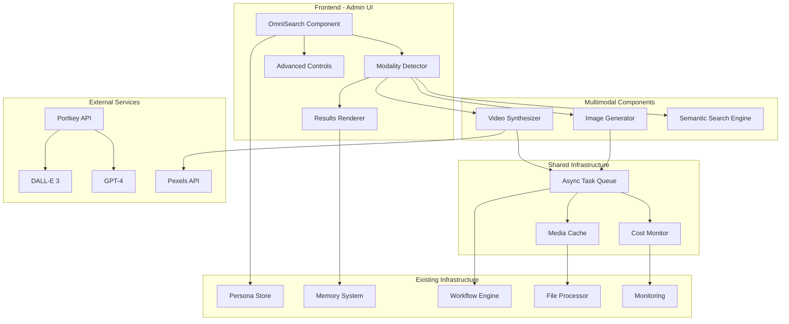
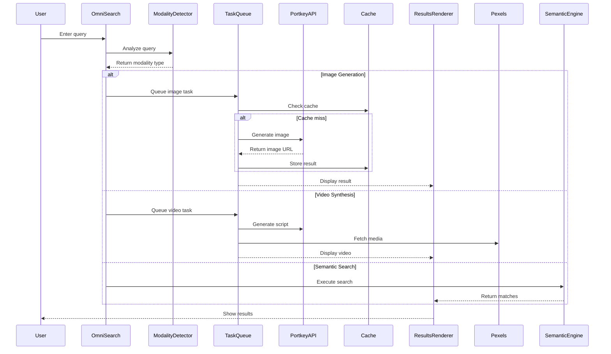
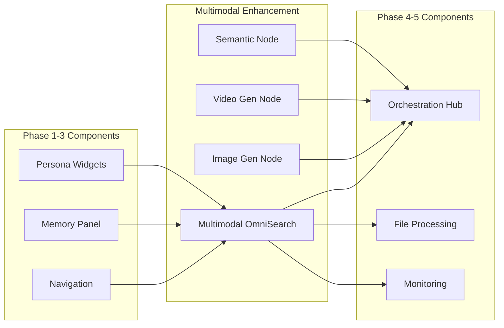
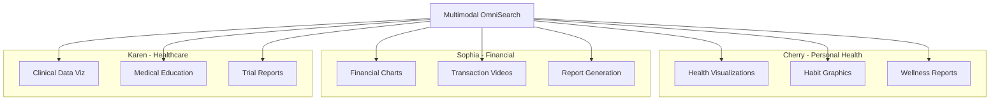
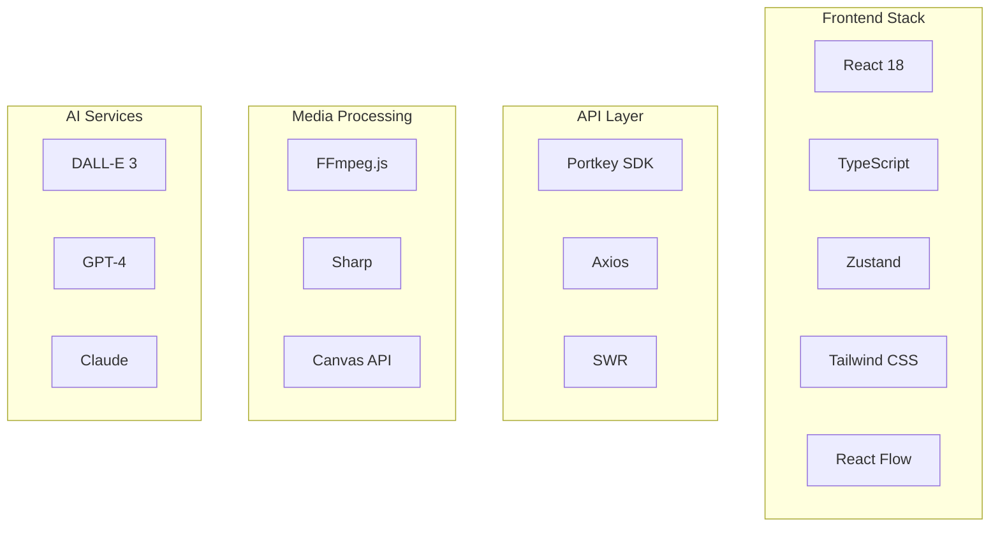

# Multimodal OmniSearch Architecture Diagram

## System Architecture Overview

```mermaid
graph TB
    subgraph "Frontend - Admin UI"
        OS[OmniSearch Component]
        MD[Modality Detector]
        AC[Advanced Controls]
        RR[Results Renderer]
        
        OS --> MD
        OS --> AC
        MD --> RR
    end
    
    subgraph "Multimodal Components"
        IG[Image Generator]
        VS[Video Synthesizer]
        SSE[Semantic Search Engine]
        
        MD --> IG
        MD --> VS
        MD --> SSE
    end
    
    subgraph "Shared Infrastructure"
        ATQ[Async Task Queue]
        MC[Media Cache]
        CM[Cost Monitor]
        
        IG --> ATQ
        VS --> ATQ
        ATQ --> MC
        ATQ --> CM
    end
    
    subgraph "External Services"
        PK[Portkey API]
        DALLE[DALL-E 3]
        GPT[GPT-4]
        PEXELS[Pexels API]
        
        PK --> DALLE
        PK --> GPT
        VS --> PEXELS
    end
    
    subgraph "Existing Infrastructure"
        PS[Persona Store]
        MS[Memory System]
        WF[Workflow Engine]
        FP[File Processor]
        MON[Monitoring]
        
        OS --> PS
        RR --> MS
        ATQ --> WF
        MC --> FP
        CM --> MON
    end
```

## Data Flow Diagram

```mermaid
sequenceDiagram
    participant User
    participant OmniSearch
    participant ModalityDetector
    participant TaskQueue
    participant PortkeyAPI
    participant Cache
    participant ResultsRenderer
    
    User->>OmniSearch: Enter query
    OmniSearch->>ModalityDetector: Analyze query
    ModalityDetector-->>OmniSearch: Return modality type
    
    alt Image Generation
        OmniSearch->>TaskQueue: Queue image task
        TaskQueue->>Cache: Check cache
        alt Cache miss
            TaskQueue->>PortkeyAPI: Generate image
            PortkeyAPI-->>TaskQueue: Return image URL
            TaskQueue->>Cache: Store result
        end
        TaskQueue-->>ResultsRenderer: Display result
    else Video Synthesis
        OmniSearch->>TaskQueue: Queue video task
        TaskQueue->>PortkeyAPI: Generate script
        TaskQueue->>Pexels: Fetch media
        TaskQueue-->>ResultsRenderer: Display video
    else Semantic Search
        OmniSearch->>SemanticEngine: Execute search
        SemanticEngine-->>ResultsRenderer: Return matches
    end
    
    ResultsRenderer-->>User: Show results
```

## Component Integration Map

```mermaid
graph LR
    subgraph "Phase 1-3 Components"
        NAV[Navigation]
        MEM[Memory Panel]
        PWG[Persona Widgets]
    end
    
    subgraph "Phase 4-5 Components"
        ORH[Orchestration Hub]
        FPH[File Processing]
        MON[Monitoring]
    end
    
    subgraph "Multimodal Enhancement"
        MMO[Multimodal OmniSearch]
        IMG[Image Gen Node]
        VID[Video Gen Node]
        SEM[Semantic Node]
    end
    
    NAV --> MMO
    MEM --> MMO
    PWG --> MMO
    
    MMO --> ORH
    IMG --> ORH
    VID --> ORH
    SEM --> ORH
    
    MMO --> FPH
    MMO --> MON
```

## Persona-Specific Integration Points

```mermaid
graph TD
    subgraph "Cherry - Personal Health"
        C1[Health Visualizations]
        C2[Habit Graphics]
        C3[Wellness Reports]
    end
    
    subgraph "Sophia - Financial"
        S1[Financial Charts]
        S2[Transaction Videos]
        S3[Report Generation]
    end
    
    subgraph "Karen - Healthcare"
        K1[Clinical Data Viz]
        K2[Medical Education]
        K3[Trial Reports]
    end
    
    MMO[Multimodal OmniSearch]
    
    MMO --> C1
    MMO --> C2
    MMO --> C3
    
    MMO --> S1
    MMO --> S2
    MMO --> S3
    
    MMO --> K1
    MMO --> K2
    MMO --> K3
```

## Technology Stack

```mermaid
graph TD
    subgraph "Frontend Stack"
        REACT[React 18]
        TS[TypeScript]
        ZUSTAND[Zustand]
        TAILWIND[Tailwind CSS]
        REACTFLOW[React Flow]
    end
    
    subgraph "API Layer"
        PORTKEY[Portkey SDK]
        AXIOS[Axios]
        SWR[SWR]
    end
    
    subgraph "Media Processing"
        FFMPEG[FFmpeg.js]
        SHARP[Sharp]
        CANVAS[Canvas API]
    end
    
    subgraph "AI Services"
        DALLE3[DALL-E 3]
        GPT4[GPT-4]
        CLAUDE[Claude]
    end
``` 