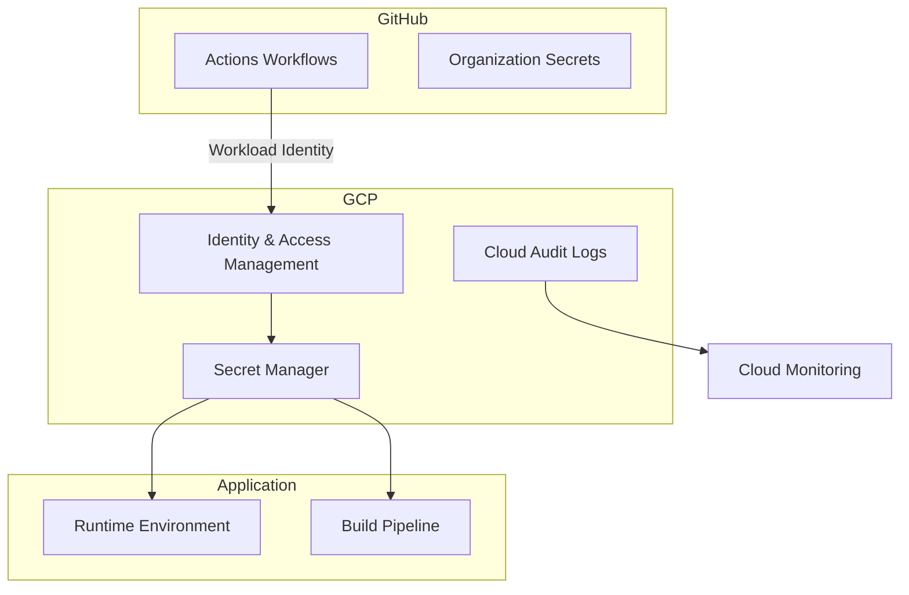
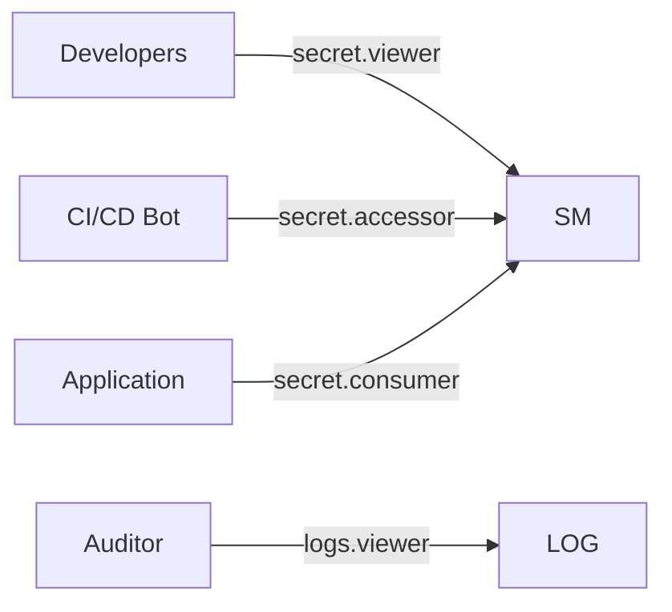

# Secret Management Design Specification

## 1. Architecture Overview



## 2. Implementation Phases

### Phase 1: Secret Centralization
- Migrate all secrets to GCP Secret Manager
- Environment-specific naming convention:
  - `dev/{service}-{secret}`
  - `prod/{service}-{secret}`
- Update initialization scripts to use Secret Manager API

### Phase 2: Least Privilege Access


### Phase 3: Automated Rotation
- Weekly rotation for sensitive credentials
- Integration with GCP Scheduler and Cloud Functions
- Zero-downtime validation process

## 3. Security Controls

### IAM Roles Configuration
```yaml
# terraform/iam.tf
resource "google_secret_manager_secret_iam_member" "ci_access" {
  project = var.project_id
  secret_id = google_secret_manager_secret.api_key.id
  role = "roles/secretmanager.secretAccessor"
  member = "serviceAccount:${var.ci_service_account}"
}
```

### Audit Logging
```python
# monitoring/audit_check.py
def check_secret_access():
    logs_client = logging_v2.Client()
    entries = logs_client.list_entries(
        filter_='resource.type="secretmanager"'
    )
    return generate_compliance_report(entries)
```

## 4. Rollout Plan

1. **Staging Environment**:
   - Migrate non-critical secrets first
   - Validate rotation workflow

2. **Production Cutover**:
   - Parallel run with old system for 72hrs
   - Automated secret synchronization

3. **Emergency Procedures**:
   - Manual override capabilities
   - Rollback to previous secret versions