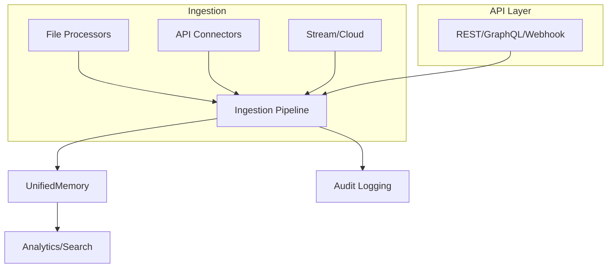

# Orchestra AI Data Ingestion Guide

---

## Overview

This guide covers the advanced, modular data ingestion and processing system for Orchestra AI. It details architecture, onboarding, API usage, extensibility, and troubleshooting.

---

## Architecture Diagram



---

## Key Components

- **Modular Processors:** CSV, JSON, XML, PDF, Parquet, Avro, etc.
- **API Connectors:** REST, GraphQL, WebSocket, gRPC, custom.
- **Ingestion Pipeline:** Orchestrates routing, enrichment, validation, monitoring.
- **UnifiedMemory:** Multi-tier storage (cache, vector, persistent, cloud).
- **API Layer:** RESTful and GraphQL endpoints, webhooks, event triggers.
- **Background Tasks:** Async ingestion, progress tracking, cancellation.
- **Audit Logging:** End-to-end validation, error reporting, compliance.

---

## Onboarding & Usage

### 1. **Setup**

- Ensure all dependencies are installed via `bootstrap.sh`.
- Configure storage adapters and processors in `shared/data_ingestion/`.
- Initialize and register processors in the ingestion pipeline.

### 2. **API Usage**

- **File Ingestion:**
  `POST /ingest/file` with file upload and source_type (e.g., csv, jsonl).
- **Directory Ingestion:**
  `POST /ingest/directory` with directory path and source_type.
- **API Ingestion:**
  `POST /ingest/api` with API URL and type (rest, graphql, etc.).
- **Webhook/Event:**
  `POST /ingest/webhook` for event-driven triggers.
- **Progress Tracking:**
  `GET /ingest/progress/{task_id}`
- **Cancellation:**
  `POST /ingest/cancel/{task_id}`

### 3. **Extending Processors**

- Add new file or API processors by subclassing `BaseProcessor` or `BaseAPIConnector`.
- Register new processors in the pipeline for dynamic routing.

---

## Live Examples

```bash
# Ingest a CSV file
curl -F "file=@data.csv" -F "source_type=csv" http://localhost:8000/ingest/file

# Ingest from REST API
curl -X POST -H "Content-Type: application/json" \
  -d '{"api_url": "https://api.example.com/data", "api_type": "rest"}' \
  http://localhost:8000/ingest/api
```

---

## Troubleshooting & FAQ

- **File not ingested?**
  Check file format, processor registration, and logs.
- **API errors?**
  Validate endpoint, credentials, and throttling settings.
- **Performance issues?**
  Tune batch size, enable async processing, and monitor resource usage.
- **Extending formats?**
  See `shared/data_ingestion/file_processors.py` and `api_connectors.py` for templates.

---

## Security, Compliance, and Data Governance

- All ingestion is validated and logged.
- Role-based access control and audit trails are enforced.
- Sensitive data is handled via secure storage and encrypted transit.

---

## Further Reading

- See `ARCHITECTURE.md` for full system diagrams.
- See `README.md` for project overview and quickstart.
- Explore `shared/data_ingestion/` for processor and pipeline code.

---
