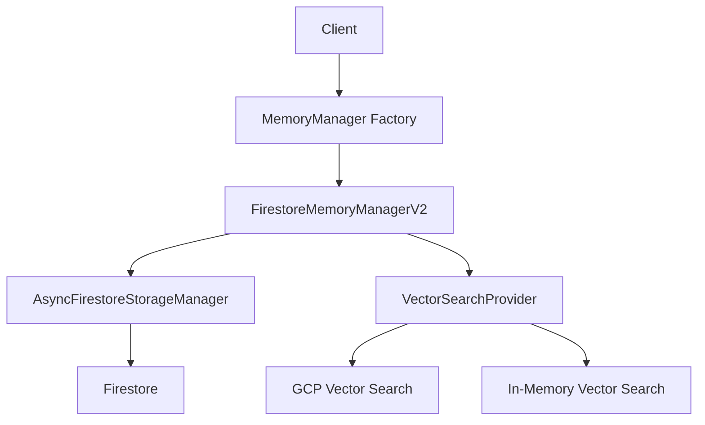

# Memory Architecture

This document provides an overview of the memory architecture in the AI Orchestra project.

## Overview

The AI Orchestra memory system provides persistent storage and retrieval of memory items, including conversation history, agent data, and semantic search capabilities. The system is designed to be scalable, performant, and resilient.



## Components

### MemoryManager Factory

The `MemoryManager` class in `packages/shared/src/memory/memory_manager.py` serves as a factory for creating concrete memory manager implementations. It provides a unified interface for memory operations and delegates to the appropriate backend implementation.

### FirestoreMemoryManagerV2

The `FirestoreMemoryManagerV2` class in `packages/shared/src/storage/firestore/v2/adapter.py` is the main implementation of the memory manager interface. It provides:

- Storage and retrieval of memory items
- Conversation history management
- Semantic search capabilities
- Health checks and monitoring

### AsyncFirestoreStorageManager

The `AsyncFirestoreStorageManager` class in `packages/shared/src/storage/firestore/v2/async_core.py` provides asynchronous access to Firestore. It includes:

- Connection pooling for better performance
- Batch operations for efficient data access
- Error handling and retries
- Health checks and monitoring

### VectorSearchProvider

The `VectorSearchProvider` protocol in `packages/shared/src/storage/vector/vector_search.py` defines the interface for vector search providers. Implementations include:

- `InMemoryVectorSearch`: A simple in-memory implementation for testing and development
- `GCPVectorSearch`: An implementation using Google Cloud Vertex AI Vector Search (coming soon)

## Data Flow

1. Client code calls methods on the `MemoryManager` factory
2. The factory delegates to the appropriate concrete implementation (e.g., `FirestoreMemoryManagerV2`)
3. The concrete implementation uses `AsyncFirestoreStorageManager` for Firestore operations
4. For semantic search, the concrete implementation uses a `VectorSearchProvider`

## Configuration

The memory system can be configured through the `MemoryManager` factory:

```python
memory_manager = MemoryManager(
    memory_backend_type="firestore_v2",  # Use V2 implementation
    project_id="your-project-id",
    credentials_path="/path/to/credentials.json",
    connection_pool_size=10,  # Connection pool size
    batch_size=100,  # Batch size for operations
)
```

## Error Handling

The memory system uses a standardized exception hierarchy defined in `packages/shared/src/storage/exceptions.py`:

- `StorageError`: Base class for all storage-related exceptions
- `ConnectionError`: Raised when a connection to a storage backend fails
- `ValidationError`: Raised when data validation fails
- `OperationError`: Raised when a storage operation fails
- `NotFoundError`: Raised when a requested item is not found
- `DuplicateError`: Raised when attempting to create a duplicate item

## Health Checks

The memory system provides detailed health checks through the `health_check` method:

```python
health = await memory_manager.health_check()
```

The health check returns a dictionary with:

- `status`: Overall status ("healthy", "degraded", or "unhealthy")
- `firestore`: Boolean indicating Firestore health
- `redis`: Boolean indicating Redis health (if applicable)
- `error_count`: Number of errors encountered
- `details`: Additional details about the health check
- `timestamp`: Timestamp of the health check
- `version`: Version of the memory manager implementation

## Performance Considerations

The memory system is designed for high performance:

- Connection pooling reduces connection overhead
- Batch operations reduce network round-trips
- Pagination reduces memory usage for large result sets
- Vector search optimizations improve semantic search performance

## Future Enhancements

Planned enhancements to the memory system include:

- Full integration with GCP Vector Search for improved semantic search performance
- Enhanced caching strategies for frequently accessed data
- Support for additional storage backends
- Advanced memory management features like summarization and forgetting