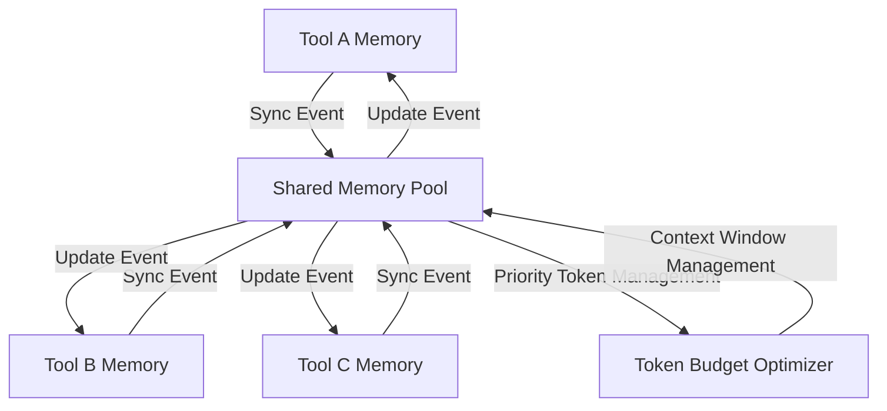
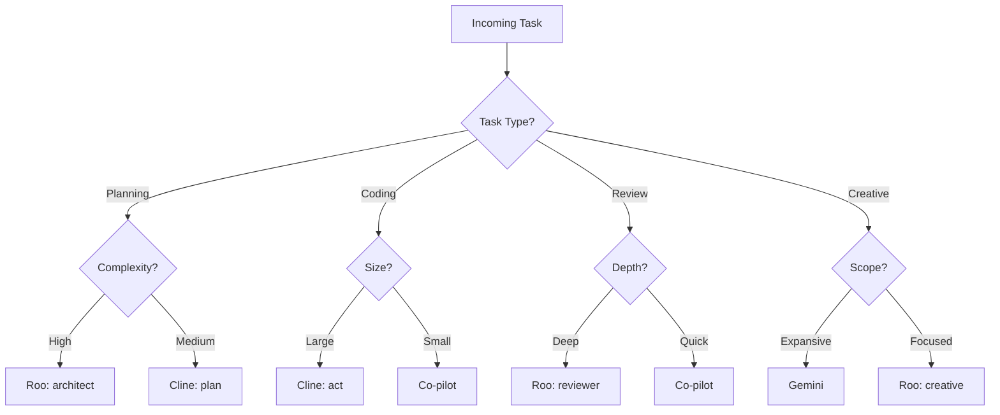
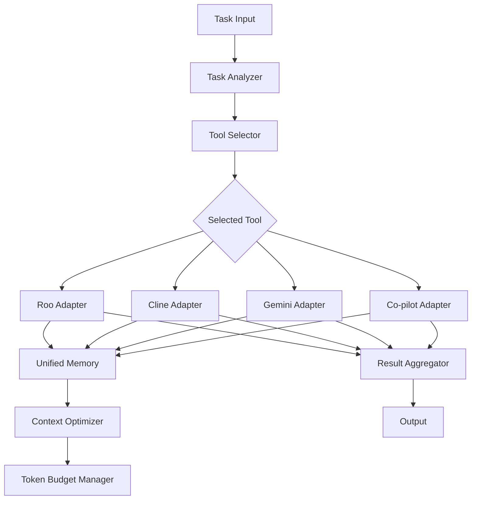

# Strategic Analysis: Multi-Tool AI Integration Framework

This strategic analysis outlines a comprehensive approach for integrating multiple AI tools (Roo, Cline.bot, Gemini, and Co-pilot) into a unified Model Context Protocol (MCP) framework. The analysis includes comparative strengths and weaknesses, memory sharing strategies, task distribution frameworks, recommended architecture, and a phased implementation plan.

## Table of Contents

1. [Comparative Analysis of AI Tools](#1-comparative-analysis-of-ai-tools)
2. [Memory Sharing and Context Synchronization Strategy](#2-memory-sharing-and-context-synchronization-strategy)
3. [Task Distribution Framework](#3-task-distribution-framework)
4. [Integration Architecture](#4-integration-architecture)
5. [Phased Implementation Plan](#5-phased-implementation-plan)
6. [Conclusion](#6-conclusion)

## 1. Comparative Analysis of AI Tools

### Roo

**Strengths:**

- Advanced workflow orchestration capabilities with multi-step subtask management
- Rich mode system (architect, code, reviewer, creative, strategy, debug, orchestrator)
- Strong contextual awareness through sophisticated MemoryBank implementation
- Native support for subtask decomposition and workflow management
- Specialized modes for different stages of development lifecycle

**Limitations:**

- Mode-specific implementations may limit flexibility for certain tasks
- Highly specialized workflow paradigm requires adaptation for cross-tool usage
- More complex than simpler tools, potentially increasing integration overhead
- Memory system may need adaptation for cross-tool synchronization

### Cline.bot

**Strengths:**

- Clean separation between planning and execution modes
- Strong integration with CLI systems for terminal operations
- MCP-aware workflow architecture from the ground up
- Efficient context optimization capabilities and token management
- Streamlined design with focused functionality

**Limitations:**

- Simpler mode system compared to Roo (primarily plan/act)
- Requires additional adaptation layers for full workflow integration
- Less specialized for certain task types that need domain-specific modes
- Relatively new system with evolving implementation

### Gemini

**Strengths:**

- Massive context window (up to 2M tokens) for extensive memory retention
- Powerful analytical capabilities for complex reasoning tasks
- JSON-based memory format for structured data handling
- Model versatility (gemini-pro vs. specialized variants)
- Strong performance on tasks requiring deep contextual understanding

**Limitations:**

- External API integration adds latency compared to local tools
- Requires API key management and usage monitoring
- Currently disabled in the configuration
- Limited control over internal workings compared to open-source tools

### Co-pilot

**Strengths:**

- Deep IDE integration for seamless development workflows
- Real-time coding assistance with minimal latency
- Low-friction developer experience during coding tasks
- Familiar to developers working in code-centric environments
- Specialized for code completion and generation tasks

**Limitations:**

- More limited context window than Gemini
- Currently disabled in configuration
- Less workflow-oriented than Roo/Cline
- More focused on code generation than holistic problem-solving

## 2. Memory Sharing and Context Synchronization Strategy

### Current Architecture Analysis

The existing MCP framework implements a tiered memory approach with:

- Cross-tool memory mapping via shared keys
- Scope-based memory management (session, global, user, project)
- Tool-specific adapters for consistent memory interfaces
- Keyspace partitioning with tool-specific prefixes

Key components from the current implementation:

- `UnifiedMemoryManager` provides a consistent interface across tools
- Memory scope implementation allows for different visibility levels
- Shared key mapping facilitates cross-tool memory access
- Tool-specific adapters handle the conversion between formats

### Recommended Enhancements

#### 1. Unified Memory Schema

A standardized memory schema ensures consistent representation across all tools:

```json
{
  "memory_type": "shared|tool_specific",
  "scope": "session|user|global|project",
  "priority": 1-10,
  "compression_level": 0-5,
  "ttl_seconds": 86400,
  "content": { ... },
  "metadata": {
    "source_tool": "roo|cline|gemini|copilot",
    "last_modified": "timestamp",
    "access_count": 0,
    "context_relevance": 0-1.0
  }
}
```

This schema provides:

- Clear identification of memory origin and type
- Prioritization metrics for context window management
- Metadata for intelligent pruning and synchronization
- Flexible content structure for different memory types

#### 2. Bi-Directional Synchronization Pattern

A robust synchronization mechanism ensures memory consistency across tools:



Implementation considerations:

- Event-based synchronization triggered by memory modifications
- Optimistic concurrency control for conflict resolution
- Prioritized synchronization for frequently accessed memories
- Incremental sync for bandwidth and performance optimization

#### 3. Intelligent Context Window Management

Effective context window management is critical for optimizing tool performance:

- **Token Budgeting**: Implement dynamic token allocation based on:

  - Tool-specific context window limits
  - Task priority and complexity
  - Memory access patterns
  - Data importance/recency

- **Hierarchical Storage**:

  - Hot Memory: Frequently accessed, high-priority content (in all tools)
  - Warm Memory: Recent but not critical content (in tools with medium context)
  - Cold Memory: Historical content (primarily in Gemini's large context window)

- **Compression Strategies**:

  - Semantic compression for conceptual information
  - Summary generation for lengthy contexts
  - Reference pointers to full content in cold storage
  - Progressive compression based on access patterns

- **Adaptive Pruning**:
  - Relevance-based token budgeting
  - LRU (Least Recently Used) with priority weighting
  - Concept-aware summarization for older memories
  - Preservation of critical decision points and rationales

## 3. Task Distribution Framework

### Task Specialization Matrix

| Task Type                | Primary Tool       | Secondary Tool | Justification                                                     |
| ------------------------ | ------------------ | -------------- | ----------------------------------------------------------------- |
| High-level planning      | Roo (architect)    | Cline (plan)   | Roo's architect mode excels at system-level planning              |
| Code generation          | Cline (act)        | Co-pilot       | Cline's execution focus with Co-pilot's code suggestions          |
| Code review              | Roo (reviewer)     | Gemini         | Roo's specialized review mode with Gemini's analytical depth      |
| Data analysis            | Gemini             | Roo (strategy) | Gemini's large context window with Roo's strategic thinking       |
| Debugging                | Cline (act)        | Co-pilot       | Cline's execution focus with IDE integration                      |
| Creative tasks           | Roo (creative)     | Gemini         | Roo's creative mode with Gemini's broad knowledge                 |
| System integration       | Roo (orchestrator) | Cline (plan)   | Roo's orchestration with Cline's planning capabilities            |
| Documentation            | Gemini             | Roo (reviewer) | Gemini's context retention with Roo's critical assessment         |
| Refactoring              | Co-pilot           | Cline (act)    | Co-pilot's code understanding with Cline's execution capabilities |
| Performance optimization | Cline (act)        | Gemini         | Cline's focused execution with Gemini's analytical capabilities   |

### Decision Flow for Tool Selection

The following decision tree illustrates the routing logic for incoming tasks:



### Task Routing Implementation

The task routing system should implement:

1. **Task Analysis**:

   - Parse incoming task requests
   - Extract key characteristics (type, complexity, scope)
   - Identify required tool capabilities

2. **Tool Selection**:

   - Primary tool selection based on the specialization matrix
   - Secondary tool identification for fallback or specialized subtasks
   - Load balancing based on system utilization

3. **Context Preparation**:

   - Pre-synchronize relevant memory before task handoff
   - Optimize context window for the selected tool
   - Prepare transition points for potential tool switching

4. **Performance Monitoring**:
   - Track task completion metrics by tool
   - Adjust routing rules based on historical performance
   - Identify opportunities for workflow template creation

## 4. Integration Architecture

### Core Components

#### 1. Unified Orchestration Layer

The central orchestration layer coordinates all cross-tool activities:

- **Enhanced Mode Manager**:

  - Extend the current `UnifiedModeManager` for cross-tool workflows
  - Implement dynamic tool selection based on the task specialization matrix
  - Add real-time performance monitoring and task routing adaptation
  - Support advanced workflow transitions between tools

- **Task Decomposition Engine**:

  - Break complex tasks into tool-appropriate subtasks
  - Manage dependencies between subtasks
  - Track completion status and aggregate results
  - Handle error recovery and alternative execution paths

- **Monitoring and Analytics**:
  - Track tool performance metrics
  - Analyze task completion patterns
  - Identify optimization opportunities
  - Provide insights for continuous improvement

#### 2. Enhanced Memory Synchronization Engine

A sophisticated memory system ensures consistent context across tools:

- **Bi-directional Sync Manager**:

  - Implement event-based synchronization
  - Resolve conflicts with optimistic concurrency control
  - Support partial and incremental synchronization
  - Manage synchronization frequency and priority

- **Context Window Optimizer**:

  - Dynamically manage token budgets for each tool
  - Implement tiered storage with hot/warm/cold partitioning
  - Apply adaptive compression strategies
  - Maintain relevance scoring for context prioritization

- **Memory Security Layer**:
  - Enforce scope-based access controls
  - Manage credential and sensitive information handling
  - Implement encryption for persistent storage
  - Support secure cross-tool memory sharing

#### 3. Cross-Tool Workflow Engine

The workflow engine coordinates complex multi-tool tasks:



- **Workflow Template System**:

  - Pre-defined workflows for common task patterns
  - Tool-specific step definitions
  - Conditional branching based on subtask results
  - Dynamic adaptation based on execution results

- **Result Aggregation**:
  - Collect and normalize outputs from different tools
  - Resolve conflicts in overlapping results
  - Generate unified summaries
  - Maintain provenance for traceability

#### 4. MCP Server Architecture

The MCP server infrastructure provides the foundation for the integration:

- **Core Orchestration Server**:

  - Central coordination point
  - Tool-specific adapters
  - API for client applications
  - Administrative interface

- **Memory Synchronization Service**:

  - Persistent storage backend
  - Synchronization event handling
  - Conflict resolution
  - Pruning and optimization

- **Context Optimization Service**:

  - Token budget management
  - Compression engine
  - Relevance scoring
  - Tiered storage management

- **Security and Authentication Layer**:
  - Identity and access management
  - Credential handling
  - Encryption services
  - Audit logging

## 5. Phased Implementation Plan

### Phase 1: Foundation (1-2 Months)

Focus on establishing the core infrastructure and basic integration:

- **Memory Standardization**:

  - Define and implement the unified memory schema
  - Create adapters for each tool's native memory format
  - Implement basic memory retrieval and storage across tools
  - Establish shared key conventions and namespace management

- **Basic Synchronization**:

  - Implement one-way memory sharing from each tool to shared storage
  - Create simple conflict resolution strategies
  - Establish synchronization triggers and events
  - Test basic cross-tool memory access

- **Adapter Development**:

  - Create standardized interfaces for each tool
  - Implement basic mode mapping between tools
  - Develop command translation layers
  - Test simple cross-tool operations

- **Metrics Collection**:
  - Implement telemetry for memory operations
  - Create performance baselines for each tool
  - Establish logging infrastructure
  - Design initial dashboards for system monitoring

### Phase 2: Core Integration (2-3 Months)

Focus on building robust integration and workflow capabilities:

- **Task Routing System**:

  - Implement the task specialization matrix
  - Create the decision tree logic for tool selection
  - Develop task characteristic extraction
  - Test routing with sample workflows

- **Context Optimization**:

  - Build the token budgeting system
  - Implement basic compression strategies
  - Create context window management for each tool
  - Test optimization with various task types

- **Workflow Templates**:

  - Develop templates for common cross-tool scenarios
  - Create workflow execution engine
  - Implement subtask dependency management
  - Test multi-tool workflows with realistic tasks

- **Bi-directional Synchronization**:
  - Enhance memory sync to support bi-directional updates
  - Implement more sophisticated conflict resolution
  - Create event-based synchronization triggers
  - Test concurrent operations across tools

### Phase 3: Advanced Features (3-4 Months)

Focus on sophisticated capabilities and optimizations:

- **Adaptive Task Routing**:

  - Enhance routing with performance history
  - Implement dynamic adjustment of tool selection
  - Create learning mechanisms for improved task matching
  - Test with diverse and complex workflows

- **Intelligent Context Compression**:

  - Implement semantic compression algorithms
  - Create hierarchical storage management
  - Develop adaptive pruning strategies
  - Test with large context windows and complex tasks

- **Conflict Resolution**:

  - Enhance concurrent update handling
  - Implement optimistic concurrency control
  - Create merge strategies for conflicting updates
  - Test with simultaneous multi-tool operations

- **Monitoring and Visualization**:
  - Develop advanced analytics dashboards
  - Create alerting for performance issues
  - Implement detailed operation logging
  - Build visualization tools for memory and workflow states

### Phase 4: Optimization (2 Months)

Focus on refinement, performance tuning, and enterprise readiness:

- **Token Optimization**:

  - Fine-tune token budgeting algorithms
  - Optimize compression strategies
  - Implement predictive token allocation
  - Benchmark against complex real-world tasks

- **Cross-tool Handoffs**:

  - Optimize context transfer between tools
  - Minimize latency during tool switching
  - Enhance result aggregation and normalization
  - Test complex multi-stage workflows

- **Predictive Tool Selection**:

  - Implement ML-based tool selection
  - Create recommendation system for workflow templates
  - Develop performance prediction for task planning
  - Test against historical performance data

- **Memory Synchronization Optimization**:
  - Fine-tune synchronization frequency and triggers
  - Optimize incremental sync strategies
  - Implement intelligent pre-synchronization
  - Benchmark synchronization performance at scale

## 6. Conclusion

The integration of these AI tools through a unified MCP framework presents significant opportunities for leveraging each tool's strengths while mitigating their limitations. By implementing the proposed architecture with a phased approach, we can create a robust orchestration system that optimizes token usage, maintains context coherence, and routes tasks to the most appropriate tool.

Key success factors for this integration include:

1. **Intelligent Memory Management**: The implementation of sophisticated memory sharing strategies and context window management, particularly leveraging Gemini's massive context window as a persistence layer while optimizing for Co-pilot's more constrained environment.

2. **Adaptive Task Routing**: Creating a system that learns from execution patterns and dynamically selects the optimal tool for each task type, with appropriate fallbacks and subtask delegation.

3. **Unified Workflow Management**: Developing a cohesive workflow system that can span multiple tools while maintaining context and providing a seamless experience.

4. **Performance Optimization**: Continuously refining token usage, memory compression, and synchronization strategies to maximize the efficiency of the integrated system.

The phased implementation approach allows for incremental development and testing, ensuring that each component is robust before building more advanced features. This strategy minimizes risk while creating a path toward a sophisticated multi-tool AI integration framework.
