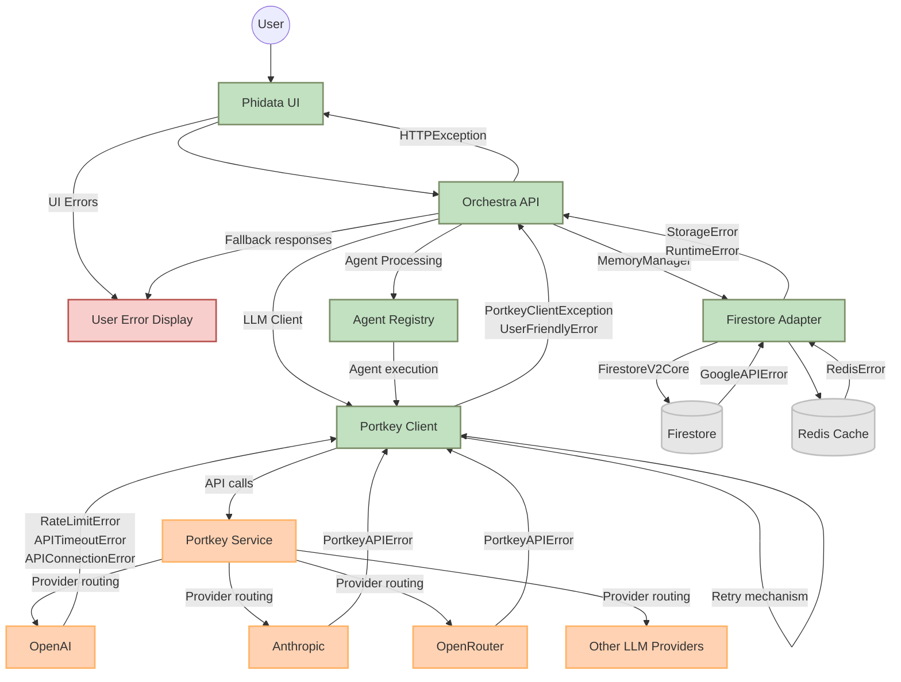

# Error Handling Audit for Orchestra

## Executive Summary

This audit analyzes the error handling patterns across the Orchestra system, focusing on exception flows between Docker services, GCP APIs, and external LLM providers. The analysis reveals several areas requiring improvement, particularly around:

1. Inconsistent error handling across services
2. Unhandled GCP API response codes
3. Inconsistent logging formats
4. Incomplete resource cleanup on failure

## System Architecture Overview

The Orchestra system consists of the following major components:

- **Docker Services**:

  - orchestra-api (main service)
  - phidata-ui (frontend)
  - llm-test-service (LLM provider testing)
  - redis (caching/pubsub)
  - postgres (memory storage)
  - monitoring (prometheus)
  - grafana (metrics visualization)

- **GCP Components**:

  - Firestore (document storage)
  - Secret Manager (credential storage)
  - Vertex AI (embeddings and AI services)

- **External LLM Providers**:
  - Portkey (integration layer for multiple providers)
  - OpenAI
  - Anthropic
  - OpenRouter
  - Various other providers accessible through Portkey

## Error Propagation Diagram



## Identified Issues

### 1. Unhandled API Response Codes in Google Cloud Client Calls

| Service        | API                          | Unhandled Status Codes    | Recommendation                            |
| -------------- | ---------------------------- | ------------------------- | ----------------------------------------- |
| Firestore      | `google.cloud.firestore`     | 429 (Too Many Requests)   | Implement exponential backoff and retry   |
| Firestore      | `google.cloud.firestore`     | 503 (Service Unavailable) | Implement retry with circuit breaker      |
| Secret Manager | `google.cloud.secretmanager` | 404 (Not Found)           | Add explicit handling with fallback       |
| Vertex AI      | `google.cloud.aiplatform`    | 400 (Bad Request)         | Add validation and better error reporting |
| Vertex AI      | `google.cloud.aiplatform`    | 429, 500, 503             | Implement comprehensive retry strategy    |

### 2. Inconsistent Error Logging Format

The codebase exhibits several inconsistent error logging patterns:

1. Different message formats:

   - Some use `f"Error in {operation}: {e}"`
   - Others use `f"{operation} failed: {e}"`
   - Some include operation context, others don't

2. Inconsistent level usage:

   - Some use `logger.error` for all exceptions
   - Others differentiate between `logger.warning` and `logger.error`
   - Lack of clear policy on when to use each level

3. Inconsistent inclusion of stack traces:
   - Some include `exc_info=True`
   - Most don't include stack traces
   - No clear pattern for when stack traces should be included

### 3. Incomplete Resource Cleanup on Failure

| Component                   | Resource Type    | Cleanup Issue                              | Recommendation                             |
| --------------------------- | ---------------- | ------------------------------------------ | ------------------------------------------ |
| Firestore Memory Manager    | Firestore client | No automatic cleanup in exception handlers | Add context managers or try/finally blocks |
| Redis Client                | Redis connection | Inconsistent connection closing            | Implement `__enter__`/`__exit__` protocol  |
| Portkey Client              | API connections  | No explicit cleanup of failed requests     | Add cleanup handlers                       |
| Vertex AI Embedding Service | Model resources  | No release of resources on error           | Implement proper resource cleanup          |

### 4. Exception Handling Inconsistencies

1. **Inconsistent exception wrapping**:

   - Some modules wrap lower-level exceptions in domain-specific ones
   - Others pass through original exceptions
   - Some completely swallow exceptions and return default values

2. **Missing retry logic**:

   - Some API calls have retry decorators
   - Many don't have any retry logic
   - Inconsistent retry parameters across different calls

3. **Inconsistent fallback mechanisms**:
   - Some services provide fallbacks on failure
   - Others simply propagate errors
   - No consistent fallback strategy

## Recommended Error Handling Boilerplate Code

### 1. GCP Client Call Error Handler

```python
def handle_gcp_error(func):
    """Decorator for handling GCP client errors with appropriate responses."""
    @functools.wraps(func)
    async def wrapper(*args, **kwargs):
        try:
            return await func(*args, **kwargs)
        except google.api_core.exceptions.NotFound as e:
            # Handle resource not found (404)
            logger.warning(f"GCP resource not found in {func.__name__}: {e}")
            return None
        except google.api_core.exceptions.FailedPrecondition as e:
            # Handle precondition failures (400 with specific reason)
            logger.error(f"Failed precondition in {func.__name__}: {e}")
            raise PreconditionError(f"Operation precondition failed: {e}") from e
        except google.api_core.exceptions.ResourceExhausted as e:
            # Handle rate limits (429)
            logger.warning(f"Rate limit exceeded in {func.__name__}: {e}")
            raise RateLimitError(f"Rate limit exceeded: {e}") from e
        except google.api_core.exceptions.Unavailable as e:
            # Handle service unavailable (503)
            logger.warning(f"GCP service unavailable in {func.__name__}: {e}")
            raise TemporaryError(f"Service temporarily unavailable: {e}") from e
        except google.api_core.exceptions.DeadlineExceeded as e:
            # Handle timeout (504)
            logger.warning(f"GCP operation timed out in {func.__name__}: {e}")
            raise TimeoutError(f"Operation timed out: {e}") from e
        except google.api_core.exceptions.GoogleAPIError as e:
            # Handle other API errors
            logger.error(f"GCP API error in {func.__name__}: {e}", exc_info=True)
            raise ServiceError(f"GCP service error: {e}") from e
        except Exception as e:
            # Handle unexpected errors
            logger.error(f"Unexpected error in {func.__name__}: {e}", exc_info=True)
            raise UnexpectedError(f"Unexpected error: {e}") from e
    return wrapper
```

### 2. Resource Cleanup Context Manager

```python
class GCPResourceManager:
    """Context manager for managing GCP resources with proper cleanup."""

    def __init__(self, resource, resource_name):
        self.resource = resource
        self.resource_name = resource_name
        self.logger = logging.getLogger(__name__)

    def __enter__(self):
        self.logger.debug(f"Initializing GCP resource: {self.resource_name}")
        return self.resource

    def __exit__(self, exc_type, exc_val, exc_tb):
        try:
            # Check if resource has close, shutdown or cleanup method
            if hasattr(self.resource, 'close') and callable(getattr(self.resource, 'close')):
                self.resource.close()
            elif hasattr(self.resource, 'shutdown') and callable(getattr(self.resource, 'shutdown')):
                self.resource.shutdown()
            elif hasattr(self.resource, 'cleanup') and callable(getattr(self.resource, 'cleanup')):
                self.resource.cleanup()

            self.logger.debug(f"Successfully cleaned up GCP resource: {self.resource_name}")
        except Exception as e:
            self.logger.warning(f"Error cleaning up GCP resource {self.resource_name}: {e}")
            # Don't suppress the original exception
            return False
```

### 3. Standardized Error Logging

```python
class ErrorLogger:
    """Standardized error logging with consistent formatting."""

    def __init__(self, logger_name):
        self.logger = logging.getLogger(logger_name)

    def log_error(self, operation, error, level="error", include_traceback=False):
        """
        Log an error with standardized formatting.

        Args:
            operation: The operation that failed
            error: The exception that occurred
            level: Logging level (debug, info, warning, error, critical)
            include_traceback: Whether to include a stack trace
        """
        error_id = str(uuid.uuid4())[:8]  # Generate short error ID for correlation

        # Standard error message format
        message = f"[{error_id}] Error in {operation}: {error}"

        # Get the logging method based on level
        log_method = getattr(self.logger, level.lower(), self.logger.error)

        # Log with or without traceback
        if include_traceback:
            log_method(message, exc_info=True)
        else:
            log_method(message)

        return error_id  # Return ID for correlation in response
```

### 4. Retry with Circuit Breaker Pattern

```python
class CircuitBreaker:
    """Circuit breaker pattern for preventing repeated failures."""

    # States
    CLOSED = "closed"  # Normal operation, requests go through
    OPEN = "open"      # Failed state, requests are blocked
    HALF_OPEN = "half_open"  # Testing state, limited requests allowed

    def __init__(self, failure_threshold=5, recovery_timeout=30, half_open_max=2):
        self.state = self.CLOSED
        self.failure_count = 0
        self.failure_threshold = failure_threshold
        self.recovery_timeout = recovery_timeout
        self.half_open_max = half_open_max
        self.half_open_count = 0
        self.last_failure_time = None
        self.logger = logging.getLogger(__name__)

    def allow_request(self):
        """Determine if a request should be allowed based on circuit state."""
        now = time.time()

        if self.state == self.OPEN:
            # Check if recovery timeout has elapsed
            if self.last_failure_time and now - self.last_failure_time > self.recovery_timeout:
                self.logger.info("Circuit transitioning from OPEN to HALF_OPEN")
                self.state = self.HALF_OPEN
                self.half_open_count = 0
                return True
            return False

        if self.state == self.HALF_OPEN:
            # Only allow limited requests in half-open state
            if self.half_open_count < self.half_open_max:
                self.half_open_count += 1
                return True
            return False

        # Circuit is CLOSED, always allow
        return True

    def record_success(self):
        """Record successful request, potentially closing circuit."""
        if self.state == self.HALF_OPEN:
            self.logger.info("Successful request in HALF_OPEN state, closing circuit")
            self.state = self.CLOSED
            self.failure_count = 0

    def record_failure(self):
        """Record failed request, potentially opening circuit."""
        self.last_failure_time = time.time()

        if self.state == self.HALF_OPEN:
            self.logger.warning("Request failed in HALF_OPEN state, reopening circuit")
            self.state = self.OPEN
            return

        # Increment failure count
        self.failure_count += 1

        # Check if threshold exceeded
        if self.state == self.CLOSED and self.failure_count >= self.failure_threshold:
            self.logger.warning(f"Failure threshold reached ({self.failure_count}), opening circuit")
            self.state = self.OPEN
```

## Implementation Recommendations

1. **Standardize Error Handling**:

   - Implement consistent error handling across all modules
   - Use standard decorators for common error patterns
   - Define clear hierarchy of custom exceptions

2. **Improve GCP Error Handling**:

   - Add specific handling for GCP response codes
   - Implement circuit breakers for GCP services
   - Add proper resource cleanup for all GCP resources

3. **Enhance Logging**:

   - Standardize log message format
   - Apply consistent log levels
   - Include correlation IDs for tracking errors across services
   - Add structured logging with consistent fields

4. **Resource Management**:
   - Implement context managers for all critical resources
   - Ensure proper cleanup in all error paths
   - Use dependency injection for better resource lifecycle management

## Next Steps

1. Implement the recommended error handling boilerplate
2. Apply consistent error logging across all services
3. Add circuit breakers for critical external dependencies
4. Enhance monitoring to track error rates and recovery
5. Create automated tests for failure scenarios and recovery
