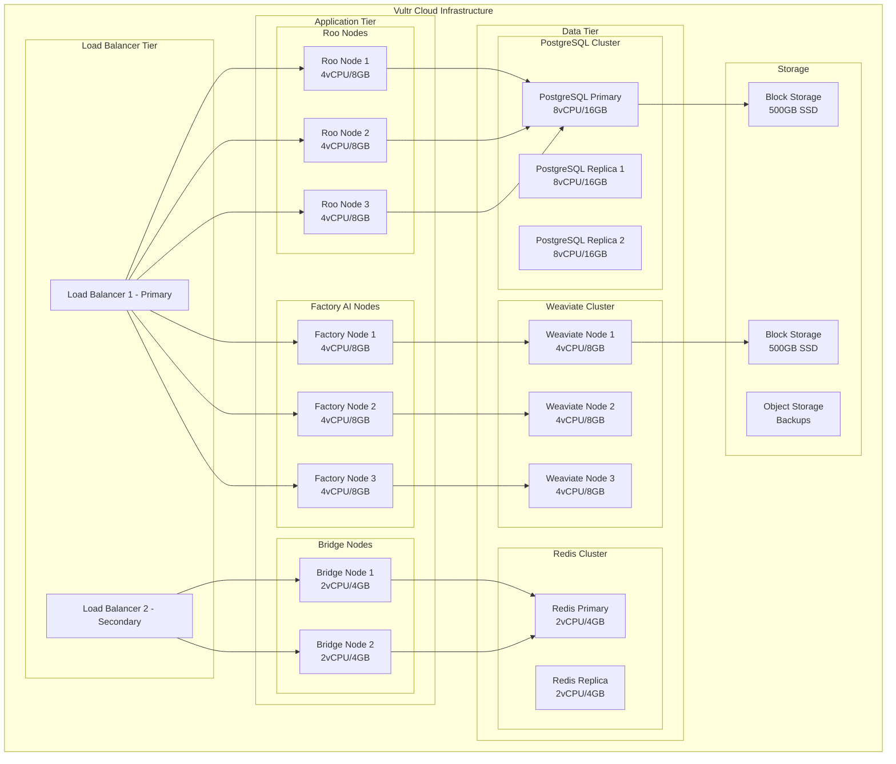

# Factory AI Integration - Deployment Architecture & Operations

## Deployment Architecture Overview

### Infrastructure Topology



## Pulumi Infrastructure as Code

### Complete Vultr Deployment Stack

```python
# infra/factory_ai_complete_stack.py
import pulumi
import pulumi_vultr as vultr
import pulumi_kubernetes as k8s
from pulumi import Config, Output, ResourceOptions
import json
from typing import List, Dict, Any

class FactoryAICompleteStack(pulumi.ComponentResource):
    """
    Complete infrastructure stack for Factory AI integration on Vultr
    """
    
    def __init__(self, name: str, opts: ResourceOptions = None):
        super().__init__('factory-ai:complete-stack', name, None, opts)
        
        self.config = Config()
        self.region = self.config.get("region") or "ewr"  # New Jersey
        
        # Create network infrastructure
        self.network = self._create_network()
        
        # Create compute instances
        self.instances = self._create_instances()
        
        # Create storage
        self.storage = self._create_storage()
        
        # Create load balancers
        self.load_balancers = self._create_load_balancers()
        
        # Create Kubernetes cluster (optional)
        self.k8s_cluster = self._create_k8s_cluster()
        
        # Create monitoring
        self.monitoring = self._create_monitoring()
        
        # Export outputs
        self._export_outputs()
    
    def _create_network(self) -> Dict[str, Any]:
        """Create VPC and networking components"""
        # Create VPC
        vpc = vultr.Vpc(
            "factory-ai-vpc",
            region=self.region,
            description="Factory AI VPC",
            v4_subnet="10.0.0.0",
            v4_subnet_mask=16,
            opts=ResourceOptions(parent=self)
        )
        
        # Create firewall rules
        firewall_group = vultr.FirewallGroup(
            "factory-ai-firewall",
            description="Factory AI Firewall Rules",
            opts=ResourceOptions(parent=self)
        )
        
        # Define firewall rules
        rules = [
            {"protocol": "tcp", "port": "22", "source": "0.0.0.0/0", "notes": "SSH"},
            {"protocol": "tcp", "port": "80", "source": "0.0.0.0/0", "notes": "HTTP"},
            {"protocol": "tcp", "port": "443", "source": "0.0.0.0/0", "notes": "HTTPS"},
            {"protocol": "tcp", "port": "5432", "source": "10.0.0.0/16", "notes": "PostgreSQL"},
            {"protocol": "tcp", "port": "8080", "source": "10.0.0.0/16", "notes": "Weaviate"},
            {"protocol": "tcp", "port": "6379", "source": "10.0.0.0/16", "notes": "Redis"},
            {"protocol": "tcp", "port": "9090", "source": "10.0.0.0/16", "notes": "Prometheus"},
            {"protocol": "tcp", "port": "3000", "source": "0.0.0.0/0", "notes": "Grafana"},
        ]
        
        for i, rule in enumerate(rules):
            vultr.FirewallRule(
                f"rule-{i}",
                firewall_group_id=firewall_group.id,
                protocol=rule["protocol"],
                port=rule["port"],
                source=rule["source"],
                notes=rule["notes"],
                opts=ResourceOptions(parent=firewall_group)
            )
        
        return {
            "vpc": vpc,
            "firewall_group": firewall_group
        }
    
    def _create_instances(self) -> Dict[str, List[vultr.Instance]]:
        """Create all compute instances"""
        instances = {}
        
        # Instance configurations
        configs = {
            "roo_nodes": {
                "count": 3,
                "plan": "vc2-4c-8gb",
                "label_prefix": "roo-node",
                "user_data": self._get_roo_user_data()
            },
            "factory_nodes": {
                "count": 3,
                "plan": "vc2-4c-8gb",
                "label_prefix": "factory-node",
                "user_data": self._get_factory_user_data()
            },
            "bridge_nodes": {
                "count": 2,
                "plan": "vc2-2c-4gb",
                "label_prefix": "bridge-node",
                "user_data": self._get_bridge_user_data()
            },
            "postgres_nodes": {
                "count": 3,
                "plan": "vc2-8c-16gb",
                "label_prefix": "postgres",
                "user_data": self._get_postgres_user_data()
            },
            "weaviate_nodes": {
                "count": 3,
                "plan": "vc2-4c-8gb",
                "label_prefix": "weaviate",
                "user_data": self._get_weaviate_user_data()
            },
            "redis_nodes": {
                "count": 2,
                "plan": "vc2-2c-4gb",
                "label_prefix": "redis",
                "user_data": self._get_redis_user_data()
            }
        }
        
        # Create instances for each type
        for instance_type, config in configs.items():
            instances[instance_type] = []
            for i in range(config["count"]):
                instance = vultr.Instance(
                    f"{config['label_prefix']}-{i}",
                    plan=config["plan"],
                    region=self.region,
                    os_id=387,  # Ubuntu 22.04
                    label=f"{config['label_prefix']}-{i}",
                    tags=[instance_type, "factory-ai", "production"],
                    vpc_ids=[self.network["vpc"].id],
                    firewall_group_id=self.network["firewall_group"].id,
                    user_data=config["user_data"],
                    enable_ipv6=True,
                    ddos_protection=True,
                    activation_email=False,
                    opts=ResourceOptions(parent=self)
                )
                instances[instance_type].append(instance)
        
        return instances
    
    def _create_storage(self) -> Dict[str, vultr.BlockStorage]:
        """Create block storage volumes"""
        storage = {}
        
        # PostgreSQL storage
        storage["postgres"] = vultr.BlockStorage(
            "postgres-storage",
            size_gb=500,
            region=self.region,
            label="PostgreSQL Data",
            block_type="high_perf",
            opts=ResourceOptions(parent=self)
        )
        
        # Weaviate storage
        storage["weaviate"] = vultr.BlockStorage(
            "weaviate-storage",
            size_gb=500,
            region=self.region,
            label="Weaviate Data",
            block_type="high_perf",
            opts=ResourceOptions(parent=self)
        )
        
        # Attach storage to primary nodes
        vultr.BlockStorageAttach(
            "postgres-storage-attach",
            block_storage_id=storage["postgres"].id,
            instance_id=self.instances["postgres_nodes"][0].id,
            opts=ResourceOptions(parent=self)
        )
        
        vultr.BlockStorageAttach(
            "weaviate-storage-attach",
            block_storage_id=storage["weaviate"].id,
            instance_id=self.instances["weaviate_nodes"][0].id,
            opts=ResourceOptions(parent=self)
        )
        
        return storage
    
    def _create_load_balancers(self) -> Dict[str, vultr.LoadBalancer]:
        """Create load balancers"""
        load_balancers = {}
        
        # Primary load balancer for application traffic
        load_balancers["primary"] = vultr.LoadBalancer(
            "factory-ai-lb-primary",
            region=self.region,
            label="Factory AI Primary LB",
            balancing_algorithm="roundrobin",
            proxy_protocol=False,
            ssl_redirect=True,
            http2=True,
            forwarding_rules=[
                {
                    "frontend_protocol": "https",
                    "frontend_port": 443,
                    "backend_protocol": "http",
                    "backend_port": 8080
                },
                {
                    "frontend_protocol": "http",
                    "frontend_port": 80,
                    "backend_protocol": "http",
                    "backend_port": 8080
                }
            ],
            health_check={
                "protocol": "http",
                "port": 8080,
                "path": "/health",
                "check_interval": 10,
                "response_timeout": 5,
                "unhealthy_threshold": 3,
                "healthy_threshold": 2
            },
            instances=[
                inst.id for inst in 
                self.instances["roo_nodes"] + self.instances["factory_nodes"]
            ],
            opts=ResourceOptions(parent=self)
        )
        
        # Secondary load balancer for bridge services
        load_balancers["bridge"] = vultr.LoadBalancer(
            "factory-ai-lb-bridge",
            region=self.region,
            label="Factory AI Bridge LB",
            balancing_algorithm="leastconn",
            forwarding_rules=[
                {
                    "frontend_protocol": "tcp",
                    "frontend_port": 8090,
                    "backend_protocol": "tcp",
                    "backend_port": 8090
                }
            ],
            health_check={
                "protocol": "tcp",
                "port": 8090,
                "check_interval": 5,
                "response_timeout": 3,
                "unhealthy_threshold": 2,
                "healthy_threshold": 2
            },
            instances=[inst.id for inst in self.instances["bridge_nodes"]],
            opts=ResourceOptions(parent=self)
        )
        
        return load_balancers
    
    def _create_monitoring(self) -> Dict[str, vultr.Instance]:
        """Create monitoring infrastructure"""
        monitoring = {}
        
        # Prometheus server
        monitoring["prometheus"] = vultr.Instance(
            "prometheus-server",
            plan="vc2-2c-4gb",
            region=self.region,
            os_id=387,
            label="Prometheus Server",
            tags=["monitoring", "factory-ai"],
            vpc_ids=[self.network["vpc"].id],
            firewall_group_id=self.network["firewall_group"].id,
            user_data=self._get_prometheus_user_data(),
            opts=ResourceOptions(parent=self)
        )
        
        # Grafana server
        monitoring["grafana"] = vultr.Instance(
            "grafana-server",
            plan="vc2-2c-4gb",
            region=self.region,
            os_id=387,
            label="Grafana Server",
            tags=["monitoring", "factory-ai"],
            vpc_ids=[self.network["vpc"].id],
            firewall_group_id=self.network["firewall_group"].id,
            user_data=self._get_grafana_user_data(),
            opts=ResourceOptions(parent=self)
        )
        
        return monitoring
    
    def _get_roo_user_data(self) -> str:
        """User data script for Roo nodes"""
        return """#!/bin/bash
# Update system
apt-get update && apt-get upgrade -y

# Install Docker
curl -fsSL https://get.docker.com -o get-docker.sh
sh get-docker.sh

# Install Docker Compose
curl -L "https://github.com/docker/compose/releases/download/v2.20.0/docker-compose-$(uname -s)-$(uname -m)" -o /usr/local/bin/docker-compose
chmod +x /usr/local/bin/docker-compose

# Install monitoring agents
apt-get install -y prometheus-node-exporter

# Clone cherry_ai repository
git clone https://github.com/your-org/cherry_ai-main.git /opt/cherry_ai
cd /opt/cherry_ai

# Set up environment
cp .envrc.example .envrc
# Configure environment variables

# Start services
docker-compose up -d roo-services

# Configure automatic updates
apt-get install -y unattended-upgrades
dpkg-reconfigure -plow unattended-upgrades
"""
    
    def _get_factory_user_data(self) -> str:
        """User data script for Factory AI nodes"""
        return """#!/bin/bash
# Update system
apt-get update && apt-get upgrade -y

# Install Docker
curl -fsSL https://get.docker.com -o get-docker.sh
sh get-docker.sh

# Install Factory AI Bridge
curl -sSL https://factory.ai/install-bridge | bash -s -- \
  --vultr-token=$VULTR_TOKEN \
  --config-path=/opt/factory/config.yaml

# Install monitoring agents
apt-get install -y prometheus-node-exporter

# Configure Factory AI
mkdir -p /opt/factory
cat > /opt/factory/config.yaml << EOF
version: "1.0"
integration_mode: "hybrid"
droids:
  enabled: ["architect", "code", "debug", "reliability", "knowledge"]
infrastructure:
  vultr:
    api_key: "${VULTR_API_KEY}"
EOF

# Start Factory AI services
systemctl enable factory-ai
systemctl start factory-ai
"""
    
    def _export_outputs(self):
        """Export stack outputs"""
        self.register_outputs({
            "load_balancer_ips": {
                "primary": self.load_balancers["primary"].ipv4,
                "bridge": self.load_balancers["bridge"].ipv4
            },
            "instance_ips": {
                instance_type: [inst.main_ip for inst in instances]
                for instance_type, instances in self.instances.items()
            },
            "monitoring_urls": {
                "prometheus": Output.concat("http://", self.monitoring["prometheus"].main_ip, ":9090"),
                "grafana": Output.concat("http://", self.monitoring["grafana"].main_ip, ":3000")
            },
            "vpc_id": self.network["vpc"].id,
            "firewall_group_id": self.network["firewall_group"].id
        })
```

## Deployment Procedures

### Phase 1: Infrastructure Deployment

```bash
#!/bin/bash
# deploy_infrastructure.sh

# Set up Pulumi
cd infra
python -m venv venv
source venv/bin/activate
pip install -r requirements.txt

# Configure Pulumi
pulumi config set vultr:api_key $VULTR_API_KEY
pulumi config set factory-ai:region ewr

# Preview deployment
pulumi preview

# Deploy infrastructure
pulumi up -y

# Export outputs
pulumi stack output --json > infrastructure_outputs.json
```

### Phase 2: Service Configuration

```bash
#!/bin/bash
# configure_services.sh

# Get infrastructure outputs
OUTPUTS=$(pulumi stack output --json)

# Configure PostgreSQL cluster
echo "Configuring PostgreSQL cluster..."
for ip in $(echo $OUTPUTS | jq -r '.instance_ips.postgres_nodes[]'); do
    ssh ubuntu@$ip 'bash -s' < scripts/configure_postgres.sh
done

# Configure Weaviate cluster
echo "Configuring Weaviate cluster..."
for ip in $(echo $OUTPUTS | jq -r '.instance_ips.weaviate_nodes[]'); do
    ssh ubuntu@$ip 'bash -s' < scripts/configure_weaviate.sh
done

# Configure Redis cluster
echo "Configuring Redis cluster..."
REDIS_PRIMARY=$(echo $OUTPUTS | jq -r '.instance_ips.redis_nodes[0]')
REDIS_REPLICA=$(echo $OUTPUTS | jq -r '.instance_ips.redis_nodes[1]')
ssh ubuntu@$REDIS_PRIMARY "redis-cli CONFIG SET protected-mode no"
ssh ubuntu@$REDIS_REPLICA "redis-cli SLAVEOF $REDIS_PRIMARY 6379"

# Deploy application services
echo "Deploying application services..."
ansible-playbook -i inventory/production deploy_services.yml
```

### Phase 3: Integration Testing

```python
# tests/integration_test.py
import asyncio
import aiohttp
import json
from typing import Dict, Any
import pytest

class FactoryAIIntegrationTest:
    """Integration tests for Factory AI deployment"""
    
    def __init__(self, config: Dict[str, Any]):
        self.config = config
        self.base_url = f"https://{config['load_balancer_ip']}"
        
    async def test_health_endpoints(self):
        """Test all health endpoints"""
        endpoints = [
            "/health",
            "/api/v1/health",
            "/bridge/health",
            "/mcp/health"
        ]
        
        async with aiohttp.ClientSession() as session:
            for endpoint in endpoints:
                async with session.get(f"{self.base_url}{endpoint}") as resp:
                    assert resp.status == 200
                    data = await resp.json()
                    assert data["status"] == "healthy"
    
    async def test_roo_compatibility(self):
        """Test Roo system compatibility"""
        # Test existing Roo endpoints
        roo_request = {
            "method": "cherry_aite",
            "params": {
                "task": "test_coordination",
                "context": {"test": True}
            }
        }
        
        async with aiohttp.ClientSession() as session:
            async with session.post(
                f"{self.base_url}/api/v1/roo/execute",
                json=roo_request
            ) as resp:
                assert resp.status == 200
                result = await resp.json()
                assert result["status"] == "completed"
    
    async def test_factory_integration(self):
        """Test Factory AI integration"""
        factory_request = {
            "task_type": "code",
            "context": {
                "project_id": "test",
                "code_context": "def test_function(): pass"
            },
            "priority": "normal"
        }
        
        async with aiohttp.ClientSession() as session:
            async with session.post(
                f"{self.base_url}/api/v1/droids/execute",
                json=factory_request
            ) as resp:
                assert resp.status in [200, 202]
                result = await resp.json()
                assert "task_id" in result
    
    async def test_context_sync(self):
        """Test context synchronization"""
        sync_request = {
            "source": "test",
            "force_sync": True
        }
        
        async with aiohttp.ClientSession() as session:
            async with session.post(
                f"{self.base_url}/api/v1/context/sync",
                json=sync_request
            ) as resp:
                assert resp.status == 200
                result = await resp.json()
                assert result["sync_status"] == "completed"
    
    async def test_performance_targets(self):
        """Test performance targets are met"""
        # Run 100 concurrent requests
        tasks = []
        for _ in range(100):
            task = self._make_performance_request()
            tasks.append(task)
        
        start_time = asyncio.get_event_loop().time()
        results = await asyncio.gather(*tasks)
        end_time = asyncio.get_event_loop().time()
        
        # Calculate metrics
        total_time = end_time - start_time
        avg_time = total_time / len(results) * 1000  # ms
        
        # Check performance targets
        assert avg_time < 100  # Sub-100ms average
        
        # Check success rate
        success_count = sum(1 for r in results if r["success"])
        success_rate = success_count / len(results)
        assert success_rate > 0.95  # 95%+ success rate
```

## Monitoring and Alerting Configuration

### Prometheus Configuration

```yaml
# monitoring/prometheus.yml
global:
  scrape_interval: 15s
  evaluation_interval: 15s

alerting:
  alertmanagers:
    - static_configs:
        - targets: ['alertmanager:9093']

rule_files:
  - 'alerts/*.yml'

scrape_configs:
  # Node exporters
  - job_name: 'node'
    static_configs:
      - targets:
        - 'roo-node-0:9100'
        - 'roo-node-1:9100'
        - 'roo-node-2:9100'
        - 'factory-node-0:9100'
        - 'factory-node-1:9100'
        - 'factory-node-2:9100'
        labels:
          group: 'application'
      
      - targets:
        - 'postgres-0:9100'
        - 'postgres-1:9100'
        - 'postgres-2:9100'
        labels:
          group: 'database'
  
  # Application metrics
  - job_name: 'factory-bridge'
    static_configs:
      - targets: ['bridge-node-0:8091', 'bridge-node-1:8091']
    metrics_path: '/metrics'
  
  # PostgreSQL exporter
  - job_name: 'postgres'
    static_configs:
      - targets: ['postgres-0:9187', 'postgres-1:9187', 'postgres-2:9187']
  
  # Weaviate metrics
  - job_name: 'weaviate'
    static_configs:
      - targets: ['weaviate-0:2112', 'weaviate-1:2112', 'weaviate-2:2112']
```

### Alert Rules

```yaml
# monitoring/alerts/factory_ai_alerts.yml
groups:
  - name: factory_ai_performance
    interval: 30s
    rules:
      - alert: HighLatency
        expr: histogram_quantile(0.95, rate(factory_bridge_request_duration_seconds_bucket[5m])) > 0.1
        for: 5m
        labels:
          severity: warning
        annotations:
          summary: "High latency detected"
          description: "95th percentile latency is {{ $value }}s (threshold: 0.1s)"
      
      - alert: LowCacheHitRate
        expr: rate(cache_hits_total[5m]) / rate(cache_requests_total[5m]) < 0.8
        for: 10m
        labels:
          severity: warning
        annotations:
          summary: "Low cache hit rate"
          description: "Cache hit rate is {{ $value }} (threshold: 0.8)"
      
      - alert: HighErrorRate
        expr: rate(factory_bridge_requests_total{status=~"5.."}[5m]) / rate(factory_bridge_requests_total[5m]) > 0.05
        for: 5m
        labels:
          severity: critical
        annotations:
          summary: "High error rate"
          description: "Error rate is {{ $value }} (threshold: 0.05)"
  
  - name: factory_ai_availability
    interval: 30s
    rules:
      - alert: ServiceDown
        expr: up{job=~"factory-bridge|roo-services"} == 0
        for: 2m
        labels:
          severity: critical
        annotations:
          summary: "Service is down"
          description: "{{ $labels.job }} on {{ $labels.instance }} is down"
      
      - alert: DatabaseConnectionPoolExhausted
        expr: pg_stat_database_numbackends / pg_settings_max_connections > 0.9
        for: 5m
        labels:
          severity: warning
        annotations:
          summary: "Database connection pool nearly exhausted"
          description: "Connection usage is {{ $value }} (threshold: 0.9)"
```

## Operational Runbooks

### Incident Response Procedures

```markdown
# Factory AI Incident Response Runbook

## High Latency Response

1. **Identify affected services**
   ```bash
   curl -s http://prometheus:9090/api/v1/query?query=histogram_quantile(0.95,rate(factory_bridge_request_duration_seconds_bucket[5m]))
   ```

2. **Check cache performance**
   ```bash
   redis-cli INFO stats | grep hit
   ```

3. **Review slow queries**
   ```sql
   SELECT query, mean_exec_time, calls 
   FROM pg_stat_statements 
   WHERE mean_exec_time > 100 
   ORDER BY mean_exec_time DESC 
   LIMIT 10;
   ```

4. **Scale if needed**
   ```bash
   pulumi config set factory-ai:roo_node_count 5
   pulumi up -y
   ```

## Failover Procedures

1. **PostgreSQL Primary Failure**
   ```bash
   # Promote replica
   ssh postgres-1 "sudo -u postgres pg_ctl promote"
   
   # Update connection strings
   ansible-playbook update_db_connections.yml -e "new_primary=postgres-1"
   ```

2. **Factory AI Service Failure**
   ```bash
   # Automatic fallback to Roo is enabled
   # Monitor fallback rate
   curl -s http://prometheus:9090/api/v1/query?query=rate(fallback_total[5m])
   ```

## Maintenance Procedures

### Rolling Updates

```bash
#!/bin/bash
# rolling_update.sh

SERVICE=$1
VERSION=$2

for node in $(pulumi stack output --json | jq -r ".instance_ips.${SERVICE}_nodes[]"); do
    echo "Updating $node to version $VERSION"
    
    # Drain traffic
    curl -X POST "http://load-balancer:8080/admin/drain/$node"
    sleep 30
    
    # Update service
    ssh ubuntu@$node "docker pull factory-ai/$SERVICE:$VERSION"
    ssh ubuntu@$node "docker-compose up -d $SERVICE"
    
    # Health check
    until curl -f "http://$node:8080/health"; do
        sleep 5
    done
    
    # Re-enable traffic
    curl -X POST "http://load-balancer:8080/admin/enable/$node"
    sleep 30
done
```

### Backup Procedures

```bash
#!/bin/bash
# backup.sh

# PostgreSQL backup
pg_dump -h postgres-0 -U postgres -d cherry_ai > backup_$(date +%Y%m%d_%H%M%S).sql

# Weaviate backup
curl -X POST http://weaviate-0:8080/v1/backups -H "Content-Type: application/json" -d '{
  "id": "backup-'$(date +%Y%m%d_%H%M%S)'",
  "include": ["FactoryContext", "RooContext"]
}'

# Upload to object storage
s3cmd put backup_* s3://factory-ai-backups/
```
```

## Performance Tuning Guide

### PostgreSQL Optimization

```sql
-- Optimized configuration for Factory AI workload
ALTER SYSTEM SET shared_buffers = '4GB';
ALTER SYSTEM SET effective_cache_size = '12GB';
ALTER SYSTEM SET maintenance_work_mem = '1GB';
ALTER SYSTEM SET checkpoint_completion_target = 0.9;
ALTER SYSTEM SET wal_buffers = '16MB';
ALTER SYSTEM SET default_statistics_target = 100;
ALTER SYSTEM SET random_page_cost = 1.1;
ALTER SYSTEM SET effective_io_concurrency = 200;
ALTER SYSTEM SET work_mem = '32MB';
ALTER SYSTEM SET min_wal_size = '2GB';
ALTER SYSTEM SET max_wal_size = '8GB';

-- Create optimized indexes
CREATE INDEX CONCURRENTLY idx_context_versions_lookup 
ON factory_ai.context_versions(source_system, created_at DESC) 
INCLUDE (version_number, checksum);

CREATE INDEX CONCURRENTLY idx_task_routes_performance 
ON factory_ai.task_routes(created_at DESC, selected_system) 
WHERE success = true;

-- Analyze query performance
EXPLAIN (ANALYZE, BUFFERS) 
SELECT * FROM factory_ai.context_versions 
WHERE source_system = 'unified' 
AND created_at > NOW() - INTERVAL '1 hour' 
ORDER BY created_at DESC 
LIMIT 10;
```

### Redis Optimization

```bash
# Redis configuration for optimal caching
cat > /