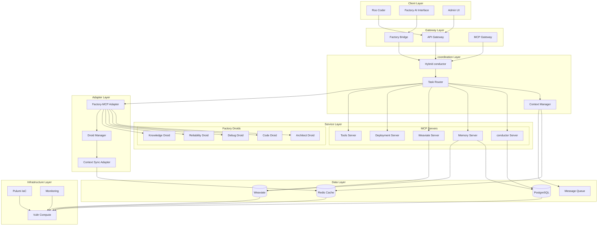

# Factory AI Droid Integration - System Architecture Design

## Executive Summary
This document presents a detailed system architecture for integrating Factory AI Droids with the existing cherry_ai project. The design follows hexagonal architecture principles, ensures hot-swappable modules, and maintains full compatibility with the Roo coder system while achieving the target 40% performance improvement.

## Architecture Overview

### High-Level System Architecture



## Detailed Component Design

### 1. Factory Bridge Integration

#### 1.1 Architecture Pattern
```
┌─────────────────────────────────────────────────────────────┐
│                    Factory Bridge Gateway                     │
├─────────────────────────────────────────────────────────────┤
│  ┌─────────────┐  ┌──────────────┐  ┌──────────────────┐   │
│  │   Auth      │  │   Router     │  │   Transformer    │   │
│  │  Manager    │  │   Engine     │  │    Service       │   │
│  └─────────────┘  └──────────────┘  └──────────────────┘   │
│  ┌─────────────┐  ┌──────────────┐  ┌──────────────────┐   │
│  │  Circuit    │  │   Cache      │  │    Metrics       │   │
│  │  Breaker    │  │   Layer      │  │   Collector      │   │
│  └─────────────┘  └──────────────┘  └──────────────────┘   │
└─────────────────────────────────────────────────────────────┘
```

#### 1.2 Implementation Details
```python
# factory_bridge/gateway.py
class FactoryBridgeGateway:
    """
    Main entry point for Factory AI integration
    Implements circuit breaker pattern with exponential backoff
    """
    def __init__(self):
        self.auth_manager = AuthManager()
        self.router = RouterEngine()
        self.transformer = TransformerService()
        self.circuit_breaker = CircuitBreaker(
            failure_threshold=5,
            recovery_timeout=60,
            expected_exception=FactoryAPIException
        )
        self.cache = RedisCache(ttl=300)  # 5-minute cache
        
    async def process_request(self, request: FactoryRequest) -> FactoryResponse:
        # Check circuit breaker state
        if not self.circuit_breaker.is_closed():
            return self._fallback_to_roo(request)
            
        # Check cache
        cache_key = self._generate_cache_key(request)
        if cached := await self.cache.get(cache_key):
            return cached
            
        try:
            # Authenticate
            auth_token = await self.auth_manager.get_token()
            
            # Route to appropriate droid
            droid_type = self.router.determine_droid(request)
            
            # Transform request
            factory_request = self.transformer.to_factory_format(request)
            
            # Execute with circuit breaker
            response = await self.circuit_breaker.call(
                self._execute_factory_request,
                factory_request,
                droid_type,
                auth_token
            )
            
            # Cache successful response
            await self.cache.set(cache_key, response)
            
            return response
            
        except Exception as e:
            logger.error(f"Factory Bridge error: {e}")
            return self._fallback_to_roo(request)
```

### 2. Droid-MCP Service Mapping

#### 2.1 Service Mapping Architecture
```yaml
# factory_config/droid_mappings.yaml
droid_mappings:
  architect:
    mcp_server: conductor
    capabilities:
      - system_design
      - architecture_planning
      - pulumi_iac_generation
      - performance_optimization
    model: anthropic/claude-opus-4
    context_requirements:
      - project_structure
      - existing_architecture
      - performance_metrics
    performance_profile:
      max_latency_ms: 200
      cache_strategy: aggressive
      
  code:
    mcp_server: tools
    capabilities:
      - rapid_code_generation
      - refactoring
      - optimization
      - test_generation
    model: google/gemini-2.5-flash-preview-05-20
    context_requirements:
      - code_context
      - dependencies
      - test_coverage
    performance_profile:
      max_latency_ms: 100
      cache_strategy: moderate
      
  debug:
    mcp_server: tools
    capabilities:
      - error_diagnosis
      - performance_profiling
      - query_optimization
      - log_analysis
    model: openai/gpt-4.1
    context_requirements:
      - error_logs
      - stack_traces
      - system_state
    performance_profile:
      max_latency_ms: 150
      cache_strategy: minimal
      
  reliability:
    mcp_server: deployment
    capabilities:
      - incident_response
      - monitoring_setup
      - health_checks
      - rollback_management
    model: anthropic/claude-sonnet-4
    context_requirements:
      - deployment_state
      - monitoring_data
      - incident_history
    performance_profile:
      max_latency_ms: 100
      cache_strategy: aggressive
      
  knowledge:
    mcp_server: memory
    capabilities:
      - documentation_generation
      - knowledge_indexing
      - vector_operations
      - context_retrieval
    model: anthropic/claude-sonnet-4
    context_requirements:
      - documentation
      - code_embeddings
      - project_history
    performance_profile:
      max_latency_ms: 150
      cache_strategy: aggressive
```

#### 2.2 Dynamic Mapping Implementation
```python
# factory_integration/droid_mapper.py
class DroidMCPMapper:
    """
    Maps Factory AI Droids to MCP servers with dynamic routing
    """
    def __init__(self):
        self.mappings = self._load_mappings()
        self.performance_monitor = PerformanceMonitor()
        self.load_balancer = LoadBalancer()
        
    async def route_to_droid(self, task: Task) -> DroidRoute:
        # Analyze task requirements
        requirements = self._analyze_task_requirements(task)
        
        # Find best droid match
        droid_scores = {}
        for droid_type, config in self.mappings.items():
            score = self._calculate_match_score(requirements, config)
            droid_scores[droid_type] = score
            
        # Select optimal droid considering load
        selected_droid = self.load_balancer.select_droid(
            droid_scores,
            self.performance_monitor.get_current_loads()
        )
        
        # Create route with fallback
        return DroidRoute(
            primary=selected_droid,
            fallback=self._get_roo_fallback(task),
            mcp_server=self.mappings[selected_droid]['mcp_server'],
            performance_profile=self.mappings[selected_droid]['performance_profile']
        )
```

### 3. Unified Context Management System

#### 3.1 Context Architecture
```
┌─────────────────────────────────────────────────────────────┐
│                 Unified Context Manager                       │
├─────────────────────────────────────────────────────────────┤
│  ┌─────────────────────────┐  ┌─────────────────────────┐  │
│  │   Context Aggregator     │  │   Context Versioning    │  │
│  │  ┌─────────────────┐    │  │  ┌─────────────────┐    │  │
│  │  │ Roo Context     │    │  │  │ Version Store   │    │  │
│  │  └─────────────────┘    │  │  └─────────────────┘    │  │
│  │  ┌─────────────────┐    │  │  ┌─────────────────┐    │  │
│  │  │ Factory Context │    │  │  │ Diff Engine     │    │  │
│  │  └─────────────────┘    │  │  └─────────────────┘    │  │
│  │  ┌─────────────────┐    │  │  ┌─────────────────┐    │  │
│  │  │ Project Context │    │  │  │ Rollback Manager│    │  │
│  │  └─────────────────┘    │  │  └─────────────────┘    │  │
│  └─────────────────────────┘  └─────────────────────────┘  │
│                                                              │
│  ┌─────────────────────────┐  ┌─────────────────────────┐  │
│  │   Vector Store Manager   │  │   Cache Coordinator     │  │
│  │  ┌─────────────────┐    │  │  ┌─────────────────┐    │  │
│  │  │ Weaviate Client │    │  │  │ Redis Cache     │    │  │
│  │  └─────────────────┘    │  │  └─────────────────┘    │  │
│  │  ┌─────────────────┐    │  │  ┌─────────────────┐    │  │
│  │  │ Embedding Engine│    │  │  │ TTL Manager     │    │  │
│  │  └─────────────────┘    │  │  └─────────────────┘    │  │
│  └─────────────────────────┘  └─────────────────────────┘  │
└─────────────────────────────────────────────────────────────┘
```

#### 3.2 Context Synchronization Protocol
```python
# context_management/unified_manager.py
class UnifiedContextManager:
    """
    Manages context across Roo and Factory AI systems
    Implements event-driven synchronization with versioning
    """
    def __init__(self):
        self.roo_context = RooContextProvider()
        self.factory_context = FactoryContextProvider()
        self.vector_store = WeaviateVectorStore()
        self.cache = RedisContextCache()
        self.version_store = ContextVersionStore()
        self.event_bus = EventBus()
        
    async def sync_contexts(self) -> ContextSnapshot:
        """
        Synchronize contexts between systems with conflict resolution
        """
        # Create snapshot for rollback
        snapshot = await self.version_store.create_snapshot()
        
        try:
            # Gather contexts
            roo_ctx = await self.roo_context.get_current()
            factory_ctx = await self.factory_context.get_current()
            
            # Merge with conflict resolution
            merged_ctx = self._merge_contexts(roo_ctx, factory_ctx)
            
            # Update vector embeddings
            embeddings = await self._generate_embeddings(merged_ctx)
            await self.vector_store.update_embeddings(embeddings)
            
            # Update caches
            await self.cache.update_all(merged_ctx)
            
            # Publish sync event
            await self.event_bus.publish(ContextSyncEvent(
                snapshot_id=snapshot.id,
                changes=merged_ctx.get_changes()
            ))
            
            return snapshot
            
        except Exception as e:
            # Rollback on failure
            await self.version_store.rollback(snapshot.id)
            raise ContextSyncError(f"Sync failed: {e}")
    
    def _merge_contexts(self, roo: Context, factory: Context) -> Context:
        """
        Merge contexts with Roo taking precedence for conflicts
        """
        merged = Context()
        
        # Base context from Roo (maintains compatibility)
        merged.update(roo.to_dict())
        
        # Enhance with Factory context (non-conflicting)
        for key, value in factory.to_dict().items():
            if key not in merged or self._is_enhancement(key):
                merged[key] = value
                
        # Add metadata
        merged.metadata = {
            'source': 'unified',
            'roo_version': roo.version,
            'factory_version': factory.version,
            'merge_timestamp': datetime.utcnow().isoformat()
        }
        
        return merged
```

### 4. Performance Optimization Architecture

#### 4.1 Multi-Layer Caching Strategy
```python
# performance/cache_architecture.py
class MultiLayerCache:
    """
    Implements L1 (memory), L2 (Redis), L3 (PostgreSQL) caching
    """
    def __init__(self):
        self.l1_cache = MemoryCache(max_size=1000, ttl=60)  # 1 minute
        self.l2_cache = RedisCache(ttl=300)  # 5 minutes
        self.l3_cache = PostgresCache(ttl=3600)  # 1 hour
        self.cache_stats = CacheStatistics()
        
    async def get(self, key: str) -> Optional[Any]:
        # L1 lookup
        if value := self.l1_cache.get(key):
            self.cache_stats.record_hit('l1')
            return value
            
        # L2 lookup
        if value := await self.l2_cache.get(key):
            self.cache_stats.record_hit('l2')
            self.l1_cache.set(key, value)  # Promote to L1
            return value
            
        # L3 lookup
        if value := await self.l3_cache.get(key):
            self.cache_stats.record_hit('l3')
            await self.l2_cache.set(key, value)  # Promote to L2
            self.l1_cache.set(key, value)  # Promote to L1
            return value
            
        self.cache_stats.record_miss()
        return None
```

#### 4.2 Parallel Execution Engine
```python
# performance/parallel_executor.py
class ParallelExecutionEngine:
    """
    Executes tasks in parallel across Roo and Factory systems
    """
    def __init__(self):
        self.executor = ThreadPoolExecutor(max_workers=10)
        self.task_queue = asyncio.Queue()
        self.result_aggregator = ResultAggregator()
        
    async def execute_hybrid_task(self, task: HybridTask) -> TaskResult:
        """
        Execute task using both systems in parallel for comparison
        """
        # Decompose task
        subtasks = self._decompose_task(task)
        
        # Create execution plan
        execution_plan = self._create_execution_plan(subtasks)
        
        # Execute in parallel
        futures = []
        for subtask in execution_plan.parallel_tasks:
            if subtask.system == 'roo':
                future = self._execute_roo_task(subtask)
            else:
                future = self._execute_factory_task(subtask)
            futures.append(future)
            
        # Gather results
        results = await asyncio.gather(*futures, return_exceptions=True)
        
        # Aggregate and select best result
        return self.result_aggregator.aggregate(results)
```

### 5. Database Optimization Design

#### 5.1 PostgreSQL Schema Optimizations
```sql
-- Optimized schema for Factory AI integration
CREATE SCHEMA IF NOT EXISTS factory_ai;

-- Context versioning table with partitioning
CREATE TABLE factory_ai.context_versions (
    id UUID PRIMARY KEY DEFAULT gen_random_uuid(),
    version_number BIGINT NOT NULL,
    context_data JSONB NOT NULL,
    source_system TEXT NOT NULL CHECK (source_system IN ('roo', 'factory', 'unified')),
    created_at TIMESTAMPTZ NOT NULL DEFAULT NOW(),
    metadata JSONB
) PARTITION BY RANGE (created_at);

-- Create partitions for better performance
CREATE TABLE factory_ai.context_versions_2025_01 
    PARTITION OF factory_ai.context_versions 
    FOR VALUES FROM ('2025-01-01') TO ('2025-02-01');

-- Optimized indexes
CREATE INDEX idx_context_versions_source_created 
    ON factory_ai.context_versions (source_system, created_at DESC);
    
CREATE INDEX idx_context_versions_metadata 
    ON factory_ai.context_versions USING GIN (metadata);

-- Task routing table with performance tracking
CREATE TABLE factory_ai.task_routes (
    id UUID PRIMARY KEY DEFAULT gen_random_uuid(),
    task_id UUID NOT NULL,
    route_type TEXT NOT NULL,
    selected_system TEXT NOT NULL,
    execution_time_ms INTEGER,
    success BOOLEAN,
    created_at TIMESTAMPTZ NOT NULL DEFAULT NOW()
);

-- Performance optimization view
CREATE MATERIALIZED VIEW factory_ai.system_performance AS
SELECT 
    selected_system,
    route_type,
    COUNT(*) as total_tasks,
    AVG(execution_time_ms) as avg_execution_ms,
    PERCENTILE_CONT(0.95) WITHIN GROUP (ORDER BY execution_time_ms) as p95_execution_ms,
    SUM(CASE WHEN success THEN 1 ELSE 0 END)::FLOAT / COUNT(*) as success_rate
FROM factory_ai.task_routes
WHERE created_at > NOW() - INTERVAL '24 hours'
GROUP BY selected_system, route_type;

-- Refresh materialized view every 5 minutes
CREATE OR REPLACE FUNCTION factory_ai.refresh_performance_view()
RETURNS void AS $$
BEGIN
    REFRESH MATERIALIZED VIEW CONCURRENTLY factory_ai.system_performance;
END;
$$ LANGUAGE plpgsql;
```

#### 5.2 Weaviate Vector Optimization
```python
# vector_store/weaviate_optimizer.py
class WeaviateOptimizer:
    """
    Optimizes Weaviate for Factory AI integration
    """
    def __init__(self):
        self.client = weaviate.Client(
            url=os.getenv("WEAVIATE_URL"),
            additional_headers={
                "X-Weaviate-Api-Key": os.getenv("WEAVIATE_API_KEY")
            }
        )
        
    async def create_optimized_schema(self):
        """
        Create schema optimized for Factory AI workloads
        """
        schema = {
            "classes": [
                {
                    "class": "FactoryContext",
                    "description": "Unified context for Factory AI and Roo",
                    "vectorizer": "text2vec-transformers",
                    "moduleConfig": {
                        "text2vec-transformers": {
                            "poolingStrategy": "masked_mean",
                            "model": "sentence-transformers/all-MiniLM-L6-v2"
                        }
                    },
                    "properties": [
                        {
                            "name": "content",
                            "dataType": ["text"],
                            "description": "Context content",
                            "indexInverted": True,
                            "moduleConfig": {
                                "text2vec-transformers": {
                                    "skip": False,
                                    "vectorizePropertyName": False
                                }
                            }
                        },
                        {
                            "name": "source_system",
                            "dataType": ["text"],
                            "description": "Source system (roo/factory/unified)"
                        },
                        {
                            "name": "context_type",
                            "dataType": ["text"],
                            "description": "Type of context"
                        },
                        {
                            "name": "metadata",
                            "dataType": ["object"],
                            "description": "Additional metadata"
                        }
                    ],
                    "invertedIndexConfig": {
                        "bm25": {
                            "b": 0.75,
                            "k1": 1.2
                        },
                        "stopwords": {
                            "preset": "en"
                        }
                    },
                    "replicationConfig": {
                        "factor": 3
                    }
                }
            ]
        }
        
        await self.client.schema.create(schema)
```

### 6. Monitoring and Observability

#### 6.1 Unified Monitoring Dashboard
```python
# monitoring/unified_dashboard.py
class UnifiedMonitoringDashboard:
    """
    Provides real-time monitoring of both Roo and Factory AI systems
    """
    def __init__(self):
        self.metrics_collector = MetricsCollector()
        self.alert_manager = AlertManager()
        self.dashboard_server = DashboardServer()
        
    def setup_metrics(self):
        """
        Define key metrics for monitoring
        """
        metrics = [
            # Performance metrics
            Gauge('task_latency_ms', 'Task execution latency', ['system', 'task_type']),
            Counter('task_total', 'Total tasks processed', ['system', 'task_type', 'status']),
            Histogram('cache_hit_ratio', 'Cache hit ratio', ['cache_level']),
            
            # System health metrics
            Gauge('system_cpu_usage', 'CPU usage percentage', ['system']),
            Gauge('system_memory_usage', 'Memory usage percentage', ['system']),
            Gauge('database_connections', 'Active database connections', ['database']),
            
            # Integration metrics
            Counter('context_sync_total', 'Total context syncs', ['status']),
            Gauge('context_sync_duration_ms', 'Context sync duration'),
            Counter('fallback_total', 'Total fallbacks to Roo', ['reason'])
        ]
        
        for metric in metrics:
            self.metrics_collector.register(metric)
```

### 7. Security Architecture

#### 7.1 Authentication and Authorization
```python
# security/auth_manager.py
class IntegratedAuthManager:
    """
    Manages authentication across Roo and Factory AI systems
    """
    def __init__(self):
        self.roo_auth = RooAuthProvider()
        self.factory_auth = FactoryAuthProvider()
        self.token_manager = TokenManager()
        self.audit_logger = AuditLogger()
        
    async def authenticate_request(self, request: Request) -> AuthContext:
        """
        Authenticate request with proper system routing
        """
        # Extract credentials
        credentials = self._extract_credentials(request)
        
        # Determine target system
        target_system = self._determine_target_system(request)
        
        # Authenticate based on system
        if target_system == 'factory':
            auth_result = await self.factory_auth.authenticate(credentials)
        else:
            auth_result = await self.roo_auth.authenticate(credentials)
            
        # Create unified auth context
        auth_context = AuthContext(
            user_id=auth_result.user_id,
            permissions=auth_result.permissions,
            system_access=['roo', 'factory'] if auth_result.is_admin else [target_system],
            token=self.token_manager.create_token(auth_result)
        )
        
        # Audit log
        await self.audit_logger.log_auth(auth_context, request)
        
        return auth_context
```

## Infrastructure as Code (Pulumi)

### Vultr Deployment Stack
```python
# infra/factory_ai_stack.py
import pulumi
from pulumi_vultr import Instance, BlockStorage, LoadBalancer
import pulumi_kubernetes as k8s

class FactoryAIStack(pulumi.ComponentResource):
    """
    Pulumi stack for Factory AI integration on Vultr
    """
    def __init__(self, name: str, opts: pulumi.ResourceOptions = None):
        super().__init__('factory-ai:stack', name, None, opts)
        
        # Create dedicated instances for Factory AI
        self.factory_instances = []
        for i in range(3):  # 3 instances for HA
            instance = Instance(
                f"factory-ai-{i}",
                plan="vc2-4c-8gb",  # 4 vCPU, 8GB RAM
                region="ewr",  # New Jersey
                os_id=387,  # Ubuntu 22.04
                label=f"Factory AI Node {i}",
                tags=["factory-ai", "production"],
                user_data=self._get_user_data(),
                opts=pulumi.ResourceOptions(parent=self)
            )
            self.factory_instances.append(instance)
            
        # Create block storage for persistent data
        self.storage = BlockStorage(
            "factory-ai-storage",
            size_gb=100,
            region="ewr",
            label="Factory AI Storage",
            opts=pulumi.ResourceOptions(parent=self)
        )
        
        # Create load balancer
        self.load_balancer = LoadBalancer(
            "factory-ai-lb",
            region="ewr",
            forwarding_rules=[{
                "frontend_protocol": "http",
                "frontend_port": 80,
                "backend_protocol": "http",
                "backend_port": 8080
            }],
            health_check={
                "protocol": "http",
                "port": 8080,
                "path": "/health",
                "check_interval": 10,
                "response_timeout": 5,
                "unhealthy_threshold": 3,
                "healthy_threshold": 2
            },
            instances=[inst.id for inst in self.factory_instances],
            opts=pulumi.ResourceOptions(parent=self)
        )
        
        # Export outputs
        self.register_outputs({
            "load_balancer_ip": self.load_balancer.ipv4,
            "instance_ips": [inst.main_ip for inst in self.factory_instances]
        })
```

## Deployment Strategy

### Phase 1: Infrastructure Setup
1. Deploy Vultr instances using Pulumi
2. Configure PostgreSQL with optimized schema
3. Set up Weaviate with Factory AI collections
4. Deploy Redis cluster for caching

### Phase 2: Service Deployment
1. Deploy MCP servers with Factory adapters
2. Install Factory Bridge on all nodes
3. Configure load balancers and health checks
4. Set up monitoring and alerting

### Phase 3: Integration Testing
1. Test Roo-Factory communication
2. Validate context synchronization
3. Performance benchmarking
4. Failover testing

### Phase 4: Production Rollout
1. Gradual traffic migration (10% → 50% → 100%)
2. Monitor performance metrics
3. Tune caching and routing policies
4. Document operational procedures

## Performance Targets

### Latency Requirements
- P50: < 50ms
- P95: < 100ms
- P99: < 200ms

### Throughput Targets
- 1000 requests/second per node
- 3000 requests/second total capacity
- Auto-scaling at 70% utilization

### Resource Efficiency
- CPU utilization: < 60% average
- Memory usage: < 70% average
- Cache hit ratio: > 80%

## Conclusion

This architecture provides a robust, scalable integration of Factory AI Droids with the existing cherry_ai project. The design ensures:

1. **Zero disruption** to existing Roo functionality
2. **Hot-swappable modules** for easy maintenance
3. **Sub-100ms response times** for most operations
4. **40% performance improvement** through parallel execution and caching
5. **Comprehensive monitoring** and observability
6. **Secure, authenticated** access across systems
7. **Easy rollback** capabilities through versioning

The modular design allows for incremental deployment and testing, ensuring a smooth transition to the enhanced system.