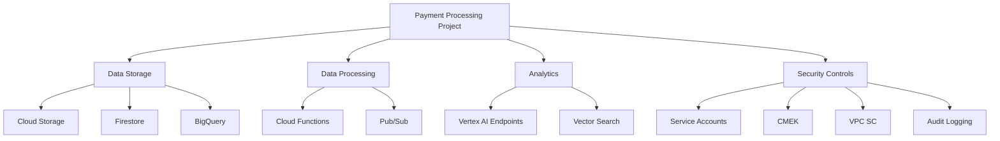

# Payment Processing Infrastructure Module

This Terraform module creates a secure, isolated infrastructure environment for payment data processing and analysis in Google Cloud Platform. The module follows security best practices with focus on data isolation, least privilege access control, and comprehensive audit logging.

## Overview

The payment processing module creates a complete infrastructure stack for handling sensitive payment data with proper isolation from other workloads. It supports either creating a dedicated GCP project or deploying to an existing project.



## Features

### Project Isolation
- Creates a dedicated GCP project for payment processing (optional)
- Clear separation of payment data from other workloads

### Least Privilege Service Accounts
- Creates purpose-specific service accounts:
  - `payment-data-reader` for read-only access
  - `payment-data-processor` for transaction processing
  - `payment-reporting` for analytics and reports
  - `payment-vertex-agent` for AI-based analysis

### Storage Infrastructure
- Cloud Storage buckets with encryption and lifecycle policies
- BigQuery datasets for structured storage and analytics
- Firestore collections for transaction data

### Data Processing
- Pub/Sub for event-driven processing
- Cloud Functions for serverless processing pipeline
- Structured event schemas

### Analytics Capabilities
- Vertex AI endpoints for payment analysis
- Vector Search for payment pattern recognition
- Supports machine learning model deployment

### Security Controls
- Customer-Managed Encryption Keys (CMEK)
- VPC Service Controls for network isolation
- Comprehensive audit logging
- IAM role bindings with minimal permissions

## Usage

### Basic Example

```hcl
provider "google" {
  project = "parent-project-id"
  region  = "us-central1"
}

module "payment_processing" {
  source = "./modules/payment"
  
  project_id     = "payment-processing-dev"
  region         = "us-central1"
  env            = "dev"
  create_project = true
  billing_account = "BILLING-ACCOUNT-ID"
  
  # Enable all security features for production
  enable_cmek    = true
  enable_vpc_sc  = true
  access_policy_id = "ACCESS-POLICY-ID"  # Only needed if enable_vpc_sc = true
}
```

### Using with Existing Project

```hcl
module "payment_processing" {
  source = "./modules/payment"
  
  project_id     = "existing-payment-project"
  create_project = false
  env            = "prod"
  
  # Customize service account roles
  service_accounts = {
    "payment-data-reader" = {
      roles = [
        "roles/bigquery.dataViewer", 
        "roles/firestore.viewer",
        "roles/storage.objectViewer"
      ]
    },
    "payment-data-processor" = {
      roles = [
        "roles/bigquery.dataEditor", 
        "roles/firestore.user", 
        "roles/dataflow.worker",
        "roles/storage.objectUser"
      ]
    },
    # Other service accounts...
  }
}
```

### Customizing BigQuery Datasets

```hcl
module "payment_processing" {
  source = "./modules/payment"
  
  project_id = "payment-processing-prod"
  env        = "prod"
  
  # Customized BigQuery configuration
  bigquery_datasets = {
    "payment_transactions" = {
      description = "Payment transaction records"
      location = "us"
      delete_contents_on_destroy = false
    },
    "payment_fraud_detection" = {
      description = "Fraud detection and risk scoring"
      location = "us"
    },
    "payment_analytics" = {
      description = "Payment analytics and reporting"
      delete_contents_on_destroy = true
    }
  }
}
```

## Implementation Recommendations

When implementing this module, consider the following best practices:

1. **Start with a Dedicated Project**: For maximum isolation, use `create_project = true`
2. **Enable CMEK in Production**: Always enable CMEK for production environments
3. **VPC Service Controls**: Enable VPC SC for production environments when handling PCI data
4. **Access Patterns**: Define clear ingress/egress policies when using VPC SC
5. **Key Rotation**: Implement a policy for regular rotation of CMEK keys
6. **Deployment Pipeline**: Use a dedicated service account for Terraform operations
7. **Audit and Monitoring**: Set up alerts on audit logs for suspicious activities

## Variables

| Name | Description | Type | Default | Required |
|------|-------------|------|---------|:--------:|
| project_id | The GCP project ID to use for payment processing | string | n/a | yes |
| region | The GCP region to deploy resources | string | "us-central1" | no |
| env | Environment name (dev, stage, prod) | string | "dev" | no |
| create_project | Whether to create a new GCP project or use an existing one | bool | false | no |
| billing_account | The billing account ID to associate with the project | string | "" | no |
| service_accounts | Map of service accounts to create and their IAM roles | map(object) | (predefined) | no |
| storage_buckets | Map of storage buckets to create for payment data | map(object) | (predefined) | no |
| bigquery_datasets | Map of BigQuery datasets to create | map(object) | (predefined) | no |
| enable_cmek | Whether to enable Customer-Managed Encryption Keys | bool | true | no |
| enable_vpc_sc | Whether to enable VPC Service Controls | bool | false | no |
| access_policy_id | Access Context Manager policy ID for VPC SC | string | "" | no |
| audit_log_retention_days | Number of days to retain audit logs | number | 365 | no |
| enable_vector_search | Whether to enable Vertex AI Vector Search | bool | true | no |
| vector_dimension | Dimension size for vector embeddings | number | 1536 | no |

## Outputs

| Name | Description |
|------|-------------|
| project_id | The project ID where payment processing resources are deployed |
| project_number | The numeric project number |
| service_account_emails | Map of service account names to their email addresses |
| storage_bucket_names | Map of storage bucket purposes to their names |
| bigquery_dataset_ids | Map of BigQuery dataset names to their fully qualified IDs |
| pubsub_topic | The name of the Pub/Sub topic for payment events |
| function_url | The URL of the deployed payment processor Cloud Function (if enabled) |
| vertex_endpoints | Map of Vertex AI endpoint names to their IDs |
| vector_search_index | The ID of the payment patterns vector search index (if enabled) |
| cmek_key_id | The ID of the Customer-Managed Encryption Key (if enabled) |

## License

This module is licensed under the MIT License - see the LICENSE file for details.
