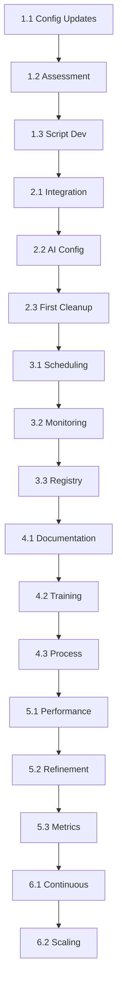

# AI Codebase Optimization Implementation Plan

## Executive Summary

This plan cherry_aites the implementation of the Comprehensive AI Codebase Optimization, Cleanup, and Automation Framework for Project Symphony. The implementation is divided into 6 phases with clear dependencies and checkpoints.

## Implementation Workflow

### Phase 1: Foundation & Assessment (Week 1)
**Goal**: Establish baseline and update configurations

#### 1.1 Configuration Updates
- [ ] Update `.cursorrules` to align with framework
- [ ] Create `.roo/config/performance_rules.json`
- [ ] Update mode-specific rules in `.roo/rules-*/`
- [ ] Create `.factory-ai-config.yaml` if using Factory AI

#### 1.2 Initial Assessment
- [ ] Run existing cleanup scripts to understand current state
- [ ] Document conflicting configurations
- [ ] Identify existing automation scripts
- [ ] Create baseline metrics

#### 1.3 Core Script Development
- [ ] Implement `scripts/comprehensive_inventory.sh`
- [ ] Implement `scripts/cleanup_engine.py`
- [ ] Create `scripts/automation_manager.py`
- [ ] Develop transient file decorator

### Phase 2: Integration & Testing (Week 2)
**Goal**: Integrate new tools with existing infrastructure

#### 2.1 Script Integration
- [ ] Test inventory script on project
- [ ] Validate cleanup engine rules
- [ ] Integrate with existing `scripts/cherry_ai.py`
- [ ] Add to version management system

#### 2.2 AI Assistant Configuration
- [ ] Deploy Roo configuration updates
- [ ] Update Cursor rules
- [ ] Test AI behavior with new rules
- [ ] Document changes for team

#### 2.3 Initial Cleanup Run
- [ ] Execute comprehensive inventory
- [ ] Review cleanup candidates
- [ ] Perform first cleanup (dry run)
- [ ] Document findings

### Phase 3: Automation Setup (Week 3)
**Goal**: Establish automated monitoring and cleanup

#### 3.1 Scheduling Infrastructure
- [ ] Configure daily maintenance cron jobs
- [ ] Set up weekly deep clean schedule
- [ ] Implement health monitoring
- [ ] Create systemd timers for frequent checks

#### 3.2 Monitoring Integration
- [ ] Set up GitHub Actions workflow
- [ ] Configure logging infrastructure
- [ ] Implement health check scripts
- [ ] Create notification system

#### 3.3 Registry Systems
- [ ] Deploy `.cleanup_registry.json`
- [ ] Implement automation registry
- [ ] Create script registration process
- [ ] Document registration workflow

### Phase 4: Team Enablement (Week 4)
**Goal**: Train team and establish processes

#### 4.1 Documentation
- [ ] Create developer guidelines
- [ ] Update contribution docs
- [ ] Write automation playbook
- [ ] Create troubleshooting guide

#### 4.2 Training
- [ ] Conduct team workshop
- [ ] Create example workflows
- [ ] Set up pair programming sessions
- [ ] Establish review process

#### 4.3 Process Integration
- [ ] Update PR templates
- [ ] Modify CI/CD pipelines
- [ ] Create code review checklist
- [ ] Establish metrics tracking

### Phase 5: Optimization & Refinement (Weeks 5-6)
**Goal**: Optimize based on initial results

#### 5.1 Performance Tuning
- [ ] Analyze cleanup effectiveness
- [ ] Optimize script performance
- [ ] Refine AI rules based on output
- [ ] Adjust scheduling based on load

#### 5.2 Rule Refinement
- [ ] Update cleanup patterns
- [ ] Refine file lifecycle rules
- [ ] Optimize AI prompts
- [ ] Enhance automation detection

#### 5.3 Metric Collection
- [ ] Implement dashboard data collection
- [ ] Create performance baselines
- [ ] Set up trend analysis
- [ ] Generate first reports

### Phase 6: Long-term Sustainability (Ongoing)
**Goal**: Ensure framework longevity

#### 6.1 Continuous Improvement
- [ ] Monthly framework reviews
- [ ] Quarterly rule updates
- [ ] Annual major assessment
- [ ] Ongoing team feedback

#### 6.2 Scaling Preparation
- [ ] Document scaling strategies
- [ ] Plan for increased automation
- [ ] Prepare for team growth
- [ ] Design extension mechanisms

## Dependency Graph

## Risk Mitigation

### Technical Risks
1. **Script Conflicts**: Test all scripts in isolated environment first
2. **Data Loss**: Implement comprehensive backup before cleanup
3. **Performance Impact**: Monitor system load during cleanup runs
4. **Integration Issues**: Gradual rollout with rollback plan

### Process Risks
1. **Team Resistance**: Early involvement and clear benefits communication
2. **Workflow Disruption**: Phased implementation with opt-in periods
3. **Documentation Lag**: Dedicated documentation sprints
4. **Metric Accuracy**: Multiple validation checkpoints

## Success Metrics

### Short-term (1 month)
- 50% reduction in flagged temporary files
- 100% of new scripts using automation manager
- Zero critical file deletions
- 90% team adoption rate

### Medium-term (3 months)
- 80% of AI-generated files with lifecycle management
- <1 standalone script created per month
- 99% automation script success rate
- 25% reduction in repository size

### Long-term (6 months)
- Stable technical debt ratio <5%
- P99 latency maintained or improved
- Zero incidents from obsolete scripts
- Full team proficiency in framework

## Checkpoint Schedule

- **Week 1**: Foundation complete, scripts tested
- **Week 2**: First cleanup run, AI configured
- **Week 3**: Automation running, monitoring active
- **Week 4**: Team trained, processes integrated
- **Week 6**: Initial optimization complete
- **Month 3**: First quarterly review
- **Month 6**: Major assessment and v2 planning

## Next Steps

1. Review and approve this plan
2. Assign implementation team members
3. Set up project tracking
4. Begin Phase 1 implementation
5. Schedule weekly sync meetings