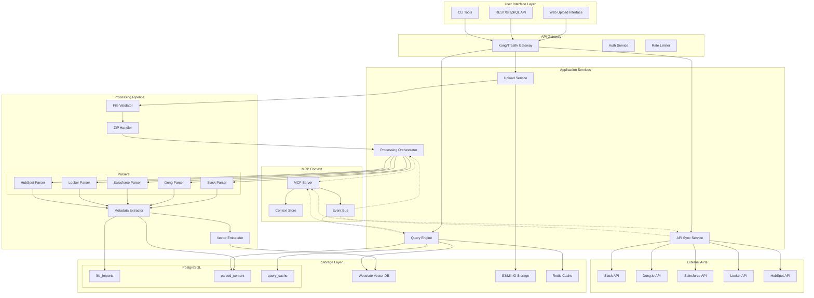

# Data Ingestion System - MCP Context Architecture

## MCP Context Sharing Design

### 1. Context Structure for Data Ingestion

```json
{
  "context_type": "data_ingestion",
  "version": "1.0.0",
  "workflow_state": {
    "current_phase": "upload|processing|indexing|completed",
    "active_files": [
      {
        "file_id": "uuid",
        "filename": "slack_export_2025.zip",
        "source_type": "slack",
        "status": "processing",
        "progress": 45,
        "started_at": "2025-01-02T10:00:00Z"
      }
    ],
    "processing_queue": {
      "pending": 12,
      "processing": 3,
      "completed": 145
    }
  },
  "source_mappings": {
    "slack": {
      "parser": "SlackParser",
      "supported_formats": ["json", "zip"],
      "content_types": ["message", "file", "user", "channel"]
    },
    "gong": {
      "parser": "GongParser",
      "supported_formats": ["json", "csv"],
      "content_types": ["transcript", "call_metadata", "insights"]
    },
    "salesforce": {
      "parser": "SalesforceParser",
      "supported_formats": ["csv", "json"],
      "content_types": ["account", "contact", "opportunity", "lead"]
    },
    "looker": {
      "parser": "LookerParser",
      "supported_formats": ["json", "csv", "pdf"],
      "content_types": ["dashboard", "query_result", "visualization"]
    },
    "hubspot": {
      "parser": "HubSpotParser",
      "supported_formats": ["csv", "json"],
      "content_types": ["contact", "company", "deal", "activity"]
    }
  },
  "query_context": {
    "recent_queries": [
      {
        "query": "customer feedback from last week",
        "sources": ["slack", "gong"],
        "result_count": 47,
        "response_time_ms": 89,
        "timestamp": "2025-01-02T09:45:00Z"
      }
    ],
    "popular_queries": [],
    "cache_stats": {
      "hit_rate": 0.73,
      "total_queries": 1234,
      "cache_size_mb": 256
    }
  },
  "storage_metrics": {
    "postgres": {
      "total_records": 1234567,
      "size_gb": 45.2,
      "index_size_gb": 12.3
    },
    "weaviate": {
      "total_vectors": 987654,
      "dimensions": 1536,
      "collections": ["DataContent"]
    },
    "s3": {
      "total_files": 3456,
      "size_gb": 234.5,
      "bucket": "orchestra-data-ingestion"
    }
  }
}
```

### 2. Complete System Architecture Diagram



### 3. Event-Driven Communication Patterns

```yaml
# Event definitions for MCP
events:
  # File upload events
  - name: file.uploaded
    schema:
      file_id: string
      filename: string
      source_type: enum[slack, gong, salesforce, looker, hubspot]
      size_bytes: integer
      user_id: string
    producers: [upload_service]
    consumers: [processing_orchestrator, mcp_context]

  - name: file.validation.completed
    schema:
      file_id: string
      valid: boolean
      errors: array[string]
    producers: [file_validator]
    consumers: [processing_orchestrator, mcp_context]

  # Processing events
  - name: processing.started
    schema:
      file_id: string
      parser_type: string
      estimated_duration_ms: integer
    producers: [processing_orchestrator]
    consumers: [mcp_context, monitoring]

  - name: processing.progress
    schema:
      file_id: string
      progress_percent: integer
      records_processed: integer
    producers: [parsers]
    consumers: [processing_orchestrator, mcp_context]

  - name: processing.completed
    schema:
      file_id: string
      total_records: integer
      processing_time_ms: integer
      vector_count: integer
    producers: [processing_orchestrator]
    consumers: [query_engine, mcp_context]

  # Query events
  - name: query.executed
    schema:
      query_id: string
      query_text: string
      sources: array[string]
      result_count: integer
      response_time_ms: integer
      cache_hit: boolean
    producers: [query_engine]
    consumers: [mcp_context, analytics]

  # API sync events
  - name: api.sync.scheduled
    schema:
      source_type: string
      sync_type: enum[full, incremental]
      scheduled_time: timestamp
    producers: [api_sync_service]
    consumers: [mcp_context]

  - name: api.sync.completed
    schema:
      source_type: string
      records_synced: integer
      duration_ms: integer
      next_sync: timestamp
    producers: [api_sync_service]
    consumers: [processing_orchestrator, mcp_context]
```

### 4. MCP Server Implementation

```python
# mcp_server/data_ingestion_context.py
from typing import Dict, Any, List
import asyncio
from datetime import datetime
from mcp import MCPServer, Context, Event

class DataIngestionMCPServer(MCPServer):
    """MCP server for data ingestion context management"""
    
    def __init__(self):
        super().__init__("data-ingestion")
        self.context = Context("data_ingestion", version="1.0.0")
        self.register_handlers()
    
    def register_handlers(self):
        """Register event handlers"""
        self.on("file.uploaded", self.handle_file_upload)
        self.on("processing.completed", self.handle_processing_complete)
        self.on("query.executed", self.handle_query_executed)
    
    async def handle_file_upload(self, event: Event):
        """Update context on file upload"""
        file_info = {
            "file_id": event.data["file_id"],
            "filename": event.data["filename"],
            "source_type": event.data["source_type"],
            "status": "pending",
            "progress": 0,
            "started_at": datetime.utcnow().isoformat()
        }
        
        # Update workflow state
        workflow_state = self.context.get("workflow_state", {})
        active_files = workflow_state.get("active_files", [])
        active_files.append(file_info)
        
        workflow_state["active_files"] = active_files
        workflow_state["current_phase"] = "upload"
        
        await self.context.update("workflow_state", workflow_state)
        await self.broadcast_context_update()
    
    async def handle_processing_complete(self, event: Event):
        """Update context when processing completes"""
        file_id = event.data["file_id"]
        
        # Update file status
        workflow_state = self.context.get("workflow_state", {})
        active_files = workflow_state.get("active_files", [])
        
        for file in active_files:
            if file["file_id"] == file_id:
                file["status"] = "completed"
                file["progress"] = 100
                break
        
        # Update metrics
        storage_metrics = self.context.get("storage_metrics", {})
        storage_metrics["postgres"]["total_records"] += event.data["total_records"]
        storage_metrics["weaviate"]["total_vectors"] += event.data["vector_count"]
        
        await self.context.update("workflow_state", workflow_state)
        await self.context.update("storage_metrics", storage_metrics)
        await self.broadcast_context_update()
    
    async def handle_query_executed(self, event: Event):
        """Track query execution in context"""
        query_context = self.context.get("query_context", {})
        recent_queries = query_context.get("recent_queries", [])
        
        # Add to recent queries (keep last 10)
        query_info = {
            "query": event.data["query_text"],
            "sources": event.data["sources"],
            "result_count": event.data["result_count"],
            "response_time_ms": event.data["response_time_ms"],
            "timestamp": datetime.utcnow().isoformat()
        }
        
        recent_queries.insert(0, query_info)
        recent_queries = recent_queries[:10]
        
        # Update cache stats
        cache_stats = query_context.get("cache_stats", {})
        cache_stats["total_queries"] += 1
        if event.data["cache_hit"]:
            hits = cache_stats.get("cache_hits", 0) + 1
            cache_stats["cache_hits"] = hits
            cache_stats["hit_rate"] = hits / cache_stats["total_queries"]
        
        query_context["recent_queries"] = recent_queries
        query_context["cache_stats"] = cache_stats
        
        await self.context.update("query_context", query_context)
        await self.broadcast_context_update()
    
    async def get_processing_status(self) -> Dict[str, Any]:
        """Get current processing status from context"""
        workflow_state = self.context.get("workflow_state", {})
        return {
            "active_files": workflow_state.get("active_files", []),
            "queue_status": workflow_state.get("processing_queue", {}),
            "current_phase": workflow_state.get("current_phase", "idle")
        }
    
    async def get_query_suggestions(self, partial_query: str) -> List[str]:
        """Get query suggestions based on context"""
        query_context = self.context.get("query_context", {})
        recent_queries = query_context.get("recent_queries", [])
        
        # Simple suggestion based on recent queries
        suggestions = []
        for query in recent_queries:
            if partial_query.lower() in query["query"].lower():
                suggestions.append(query["query"])
        
        return suggestions[:5]
```

### 5. Integration with Existing Orchestra System

```python
# Integration points with existing system
class DataIngestionOrchestrator:
    """Orchestrates data ingestion with existing Orchestra components"""
    
    def __init__(
        self,
        llm_router,  # Existing LLM router
        agent_orchestrator,  # Existing agent orchestrator
        memory_manager,  # Existing memory manager
        mcp_server  # Data ingestion MCP server
    ):
        self.llm_router = llm_router
        self.agent_orchestrator = agent_orchestrator
        self.memory_manager = memory_manager
        self.mcp_server = mcp_server
    
    async def process_query(self, query: str, sources: List[str] = None):
        """Process query using existing LLM router"""
        # Get context from MCP
        context = await self.mcp_server.get_context()
        
        # Route through LLM for query understanding
        query_intent = await self.llm_router.analyze_query(query, context)
        
        # Execute search
        if query_intent.requires_specialized_agent:
            # Use specialized agent for complex queries
            agent = await self.agent_orchestrator.get_agent("data_query_specialist")
            results = await agent.execute(query, sources, context)
        else:
            # Direct query execution
            results = await self.query_engine.query(query, sources)
        
        # Store in memory manager for context
        await self.memory_manager.store_query_context({
            "query": query,
            "results": results,
            "timestamp": datetime.utcnow()
        })
        
        # Emit event for MCP
        await self.mcp_server.emit("query.executed", {
            "query_text": query,
            "sources": sources or ["all"],
            "result_count": len(results),
            "response_time_ms": results.get("response_time_ms", 0),
            "cache_hit": results.get("from_cache", False)
        })
        
        return results
```

### 6. Performance Monitoring Dashboard

```typescript
// admin-ui/src/components/data-ingestion/PerformanceMonitor.tsx
import React from 'react';
import { useMCPContext } from '@/hooks/useMCPContext';
import { LineChart, BarChart } from '@/components/charts';

export const DataIngestionPerformanceMonitor: React.FC = () => {
    const { context } = useMCPContext('data_ingestion');
    
    const metrics = React.useMemo(() => {
        if (!context) return null;
        
        return {
            activeFiles: context.workflow_state?.active_files || [],
            queryMetrics: context.query_context?.cache_stats || {},
            storageMetrics: context.storage_metrics || {},
            recentQueries: context.query_context?.recent_queries || []
        };
    }, [context]);
    
    return (
        <div className="grid grid-cols-2 gap-4">
            {/* Processing Status */}
            <div className="bg-white rounded-lg shadow p-4">
                <h3 className="text-lg font-semibold mb-4">Active Processing</h3>
                {metrics?.activeFiles.map(file => (
                    <div key={file.file_id} className="mb-2">
                        <div className="flex justify-between">
                            <span className="text-sm">{file.filename}</span>
                            <span className="text-sm text-gray-500">{file.status}</span>
                        </div>
                        <div className="w-full bg-gray-200 rounded-full h-2">
                            <div 
                                className="bg-blue-600 h-2 rounded-full"
                                style={{ width: `${file.progress}%` }}
                            />
                        </div>
                    </div>
                ))}
            </div>
            
            {/* Query Performance */}
            <div className="bg-white rounded-lg shadow p-4">
                <h3 className="text-lg font-semibold mb-4">Query Performance</h3>
                <div className="space-y-2">
                    <div className="flex justify-between">
                        <span>Cache Hit Rate</span>
                        <span className="font-mono">
                            {(metrics?.queryMetrics.hit_rate * 100).toFixed(1)}%
                        </span>
                    </div>
                    <div className="flex justify-between">
                        <span>Total Queries</span>
                        <span className="font-mono">
                            {metrics?.queryMetrics.total_queries}
                        </span>
                    </div>
                </div>
            </div>
            
            {/* Storage Metrics */}
            <div className="bg-white rounded-lg shadow p-4 col-span-2">
                <h3 className="text-lg font-semibold mb-4">Storage Utilization</h3>
                <div className="grid grid-cols-3 gap-4">
                    <div>
                        <h4 className="text-sm font-medium text-gray-500">PostgreSQL</h4>
                        <p className="text-2xl font-bold">
                            {metrics?.storageMetrics.postgres?.size_gb} GB
                        </p>
                        <p className="text-sm text-gray-500">
                            {metrics?.storageMetrics.postgres?.total_records} records
                        </p>
                    </div>
                    <div>
                        <h4 className="text-sm font-medium text-gray-500">Weaviate</h4>
                        <p className="text-2xl font-bold">
                            {metrics?.storageMetrics.weaviate?.total_vectors}
                        </p>
                        <p className="text-sm text-gray-500">vectors</p>
                    </div>
                    <div>
                        <h4 className="text-sm font-medium text-gray-500">S3 Storage</h4>
                        <p className="text-2xl font-bold">
                            {metrics?.storageMetrics.s3?.size_gb} GB
                        </p>
                        <p className="text-sm text-gray-500">
                            {metrics?.storageMetrics.s3?.total_files} files
                        </p>
                    </div>
                </div>
            </div>
        </div>
    );
};
```

## Summary

This MCP context architecture provides:

1. **Complete Context Management**: All data ingestion state is tracked and shared via MCP
2. **Event-Driven Updates**: Real-time context updates through event system
3. **Integration Points**: Seamless integration with existing Orchestra components
4. **Performance Monitoring**: Real-time metrics and monitoring through MCP context
5. **Scalable Design**: Supports horizontal scaling with shared context

The system is designed to handle large-scale data ingestion while maintaining sub-100ms query response times through intelligent caching and vector search optimization.