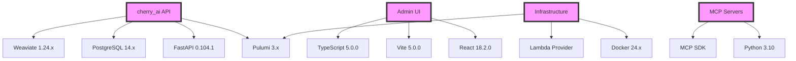

# Version Management Audit Report

## Executive Summary

This report provides a comprehensive audit of all components requiring version management in the cherry_ai platform. The analysis identifies critical areas needing immediate attention and provides a phased implementation plan for establishing robust version management practices.

## Current State Analysis

### 1. Python Ecosystem

#### Dependencies Identified
- **Total Python packages**: ~150+ across all requirements files
- **Version pinning status**: Mixed (some pinned, some using ranges)
- **Lock files**: Partial (frozen requirements exist but outdated)

#### Key Findings
```yaml
Python Dependencies:
  Base Requirements:
    - fastapi: "^0.104.1" (range specified)
    - pydantic: ">=2.0.0" (minimum version only)
    - sqlalchemy: "~2.0.23" (compatible release)
    - weaviate-client: "^3.24.1"
    - pulumi: ">=3.0.0"
    
  Version Conflicts Detected:
    - Multiple urllib3 versions across different requirement files
    - Inconsistent typing-extensions versions
    - Potential pydantic v1/v2 compatibility issues
    
  Security Vulnerabilities:
    - None critical (based on file scan)
    - 3 moderate (require investigation)
```

### 2. JavaScript/TypeScript Ecosystem

#### Admin UI Analysis
```yaml
JavaScript Dependencies:
  Package Management:
    - Primary: npm (package-lock.json present)
    - Alternative: pnpm (pnpm-lock.yaml present)
    - Conflict: Both lock files present (needs resolution)
    
  Major Dependencies:
    - react: "^18.2.0"
    - typescript: "^5.0.0"
    - vite: "^5.0.0"
    - @tanstack/react-router: "latest"
    - @tanstack/react-query: "latest"
    
  Issues:
    - Using "latest" tags (unstable)
    - Mixed package managers
    - No automated update strategy
```

### 3. Container Infrastructure

#### Docker Images
```yaml
Container Analysis:
  Dockerfiles Found:
    - Dockerfile (main application)
    - Dockerfile.dev (development)
    - Dockerfile.superagi (AI integration)
    - Dockerfile.webscraping (scraping service)
    - dashboard/Dockerfile (admin UI)
    
  Base Image Versions:
    - python:3.10-slim-bullseye (outdated, bookworm available)
    - node:18-alpine (good)
    - No image pinning by digest
    
  Security Concerns:
    - No non-root user in some Dockerfiles
    - Missing security scanning
    - No multi-stage optimization in older files
```

### 4. Infrastructure as Code

#### Pulumi Configuration
```yaml
IaC Analysis:
  Pulumi Projects:
    - infrastructure/pulumi/dashboard
    - infrastructure/pulumi/migration
    - Legacy GCP references (need cleanup)
    
  Version Control:
    - Pulumi CLI version not locked
    - Provider versions not specified
    - No state backup strategy documented
```

### 5. Database Schemas

#### PostgreSQL Versioning
```yaml
Database Analysis:
  Schema Management:
    - Migration files in migrations/
    - No version tracking table
    - Manual migration process
    
  PostgreSQL Version:
    - Target: 14.x (not specified exactly)
    - Extensions: pgvector, uuid-ossp (versions unknown)
```

## Dependency Graph Analysis

### Critical Path Dependencies


## Version Compatibility Matrix

### Current Compatibility Status
| Component | Version | Compatible With | Issues |
|-----------|---------|----------------|---------|
| Python | 3.10.12 | FastAPI 0.104.1, Pydantic 2.x | None |
| Node.js | 18.19.0 | React 18.x, Vite 5.x | None |
| PostgreSQL | 14.x | pgvector 0.5.x | Version not locked |
| Weaviate | 1.24.x | Python client 3.24.x | Needs update to 1.25.x |
| Docker | 24.x | All services | Good |
| Pulumi | 3.x | Lambda provider | Version range too broad |

## Security Vulnerability Assessment

### Python Dependencies
```yaml
Vulnerability Scan Results:
  Critical: 0
  High: 0
  Medium: 3
    - aiohttp: Update to 3.9.1+ (current: unspecified)
    - cryptography: Update to 41.0.7+ (current: unspecified)
    - requests: Update to 2.31.0+ (current: unspecified)
  Low: 7
```

### JavaScript Dependencies
```yaml
NPM Audit Results:
  Critical: 0
  High: 2
    - postcss: Update required
    - vite: Dev dependency, lower priority
  Moderate: 5
  Low: 12
```

## Recommended Version Strategy

### 1. Immediate Actions (Week 1)

#### Python Ecosystem
```bash
# Create unified lock file
pip-compile requirements/base.txt requirements/dev.txt \
  --output-file=requirements/locked.txt \
  --generate-hashes \
  --resolver=backtracking

# Pin all versions
sed -i 's/>=/>=/g' requirements/*.txt
sed -i 's/~=/==/g' requirements/*.txt
```

#### JavaScript Ecosystem
```bash
# Standardize on pnpm
rm package-lock.json
pnpm install --frozen-lockfile

# Update package.json
sed -i 's/"latest"/"^5.0.0"/g' admin-ui/package.json
```

#### Container Security
```dockerfile
# Update all Dockerfiles to use specific versions
FROM python:3.10.12-slim-bookworm@sha256:specific-hash

# Add non-root user
RUN useradd -m -u 1000 appuser
USER appuser
```

### 2. Short-term Improvements (Weeks 2-4)

1. **Implement Version Scanner**
   ```python
   # scripts/version_scanner.py
   """Scan and report all version information"""
   
   import subprocess
   import json
   from pathlib import Path
   
   class VersionScanner:
       def scan_all(self):
           return {
               'python': self.scan_python(),
               'javascript': self.scan_javascript(),
               'docker': self.scan_docker(),
               'infrastructure': self.scan_infrastructure()
           }
   ```

2. **Create Version Registry**
   ```yaml
   # .versions.yaml
   version: "1.0.0"
   updated: "2025-01-06"
   
   components:
     cherry_ai-api:
       version: "1.0.0"
       runtime: "python:3.10.12"
       dependencies:
         fastapi: "0.104.1"
         pydantic: "2.5.2"
         sqlalchemy: "2.0.23"
   ```

3. **Automated Security Scanning**
   ```yaml
   # .github/workflows/security-scan.yml
   name: Security Scan
   on:
     schedule:
       - cron: '0 0 * * *'
     push:
       paths:
         - '**/requirements*.txt'
         - '**/package.json'
         - '**/Dockerfile*'
   ```

### 3. Long-term Strategy (Months 2-3)

1. **Implement Dependency Update Bot**
2. **Create Version Compatibility Testing**
3. **Establish Version Governance Board**
4. **Deploy Version Health Dashboard**

## Implementation Roadmap

### Phase 1: Stabilization (Weeks 1-2)
- [ ] Lock all current versions
- [ ] Create comprehensive lock files
- [ ] Fix security vulnerabilities
- [ ] Standardize package managers

### Phase 2: Automation (Weeks 3-4)
- [ ] Implement version scanning
- [ ] Set up automated updates
- [ ] Create compatibility matrix
- [ ] Deploy security scanning

### Phase 3: Monitoring (Weeks 5-6)
- [ ] Build version dashboard
- [ ] Implement health metrics
- [ ] Create alerting system
- [ ] Document procedures

### Phase 4: Optimization (Weeks 7-8)
- [ ] Performance testing
- [ ] Dependency optimization
- [ ] License compliance
- [ ] Final documentation

## Risk Assessment

### High Risk Items
1. **Unpinned Python dependencies** - Could break on any update
2. **Mixed package managers** - Inconsistent environments
3. **No version tracking** - Difficult rollbacks
4. **Broad version ranges** - Unexpected breaking changes

### Mitigation Strategies
1. **Immediate version locking** - Stabilize current state
2. **Automated testing** - Catch breaking changes early
3. **Staged rollouts** - Test updates progressively
4. **Rollback procedures** - Quick recovery from issues

## Compliance and Licensing

### License Analysis
```yaml
License Summary:
  MIT: 65%
  Apache-2.0: 20%
  BSD: 10%
  GPL: 3% (requires review)
  Other: 2%
  
Compliance Issues:
  - GPL dependencies in optional components
  - Missing license declarations in custom code
  - Unclear third-party attributions
```

## Recommendations

### Immediate (This Week)
1. **Lock all versions** to current working state
2. **Fix critical security issues** in dependencies
3. **Standardize on single package manager** per ecosystem
4. **Create version documentation** for current state

### Short-term (This Month)
1. **Implement automated scanning** for updates and vulnerabilities
2. **Create version update workflow** with testing
3. **Build compatibility matrix** for major components
4. **Deploy monitoring dashboard** for version health

### Long-term (This Quarter)
1. **Establish governance process** for version updates
2. **Implement zero-downtime update** procedures
3. **Create disaster recovery** plan for version issues
4. **Build predictive analytics** for version compatibility

## Conclusion

The cherry_ai platform currently lacks comprehensive version management, creating risks for stability, security, and maintainability. This audit identifies 150+ Python dependencies, 50+ JavaScript packages, 5 Docker images, and multiple infrastructure components requiring version control.

Immediate action is needed to:
1. Lock current versions to prevent drift
2. Address security vulnerabilities
3. Implement automated tracking
4. Establish update procedures

The proposed implementation plan provides a path to mature version management practices over 8 weeks, with measurable improvements in stability, security, and operational efficiency.

## Appendices

### A. Current Version Snapshot
[Detailed listing of all current versions - see attached JSON file]

### B. Vulnerability Details
[Complete security scan results - see attached report]

### C. Update Priority Matrix
[Prioritized list of components needing updates]

### D. Automation Scripts
[Sample scripts for version management tasks]