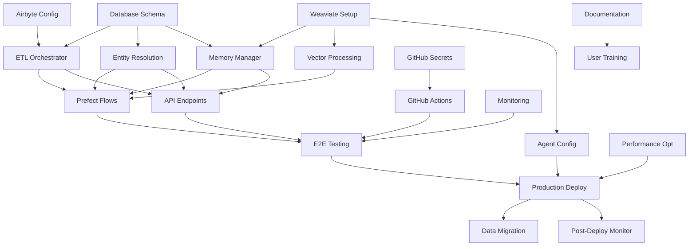

# Pay Ready ETL Implementation - Atomic Task Breakdown

## Phase 1: Foundation Setup (Week 1)

### Task 1.1: Database Schema Setup
**Owner**: Database Engineer
**Dependencies**: None
**Inputs**: 
- PostgreSQL connection credentials
- Schema design document
**Outputs**: 
- Created pay_ready schema
- Entity mapping tables
- Sync state tables
**Checkpoint**: Schema creation script executed successfully

### Task 1.2: Weaviate Collection Setup
**Owner**: Vector DB Engineer
**Dependencies**: Task 1.1
**Inputs**:
- Weaviate Cloud credentials
- Collection schema definitions
**Outputs**:
- PayReadySlackMessage collection
- PayReadyGongCallSegment collection
- PayReadyHubSpotNote collection
- PayReadySalesforceNote collection
**Checkpoint**: Collections created and verified via API

### Task 1.3: Airbyte Cloud Configuration
**Owner**: Data Engineer
**Dependencies**: None (can run parallel)
**Inputs**:
- API credentials for each source
- Destination PostgreSQL credentials
**Outputs**:
- 4 configured source connectors
- 1 PostgreSQL destination
- 4 active connections
**Checkpoint**: Test sync completed for each source

### Task 1.4: GitHub Secrets Setup
**Owner**: DevOps Engineer
**Dependencies**: Tasks 1.1, 1.2, 1.3
**Inputs**:
- All API keys and credentials
- Repository access
**Outputs**:
- Configured GitHub secrets
- Environment variables documented
**Checkpoint**: Secrets accessible in GitHub Actions

## Phase 2: Core Services Implementation (Week 2)

### Task 2.1: ETL Orchestrator Service
**Owner**: Backend Engineer
**Dependencies**: Phase 1 complete
**Inputs**:
- Service architecture design
- Database schemas
**Outputs**:
- PayReadyETLOrchestrator class
- Airbyte API integration
- Data processing methods
**Checkpoint**: Unit tests passing

### Task 2.2: Entity Resolution Service
**Owner**: Data Engineer
**Dependencies**: Task 1.1
**Inputs**:
- Entity matching rules
- Fuzzy matching thresholds
**Outputs**:
- PayReadyEntityResolver class
- Person resolution logic
- Company resolution logic
**Checkpoint**: Entity resolution accuracy > 90%

### Task 2.3: Memory Manager Service
**Owner**: Backend Engineer
**Dependencies**: Task 1.1, 1.2
**Inputs**:
- Memory tiering strategy
- Cache configuration
**Outputs**:
- PayReadyMemoryManager class
- Hot/warm/cold storage logic
- Context pruning implementation
**Checkpoint**: Memory operations benchmarked

### Task 2.4: Vector Processing Service
**Owner**: ML Engineer
**Dependencies**: Task 1.2
**Inputs**:
- Chunking strategies
- Embedding configuration
**Outputs**:
- Text chunking methods
- Batch embedding logic
- Vector storage methods
**Checkpoint**: Vectors successfully stored in Weaviate

## Phase 3: Workflow Implementation (Week 3)

### Task 3.1: Prefect Flow Development
**Owner**: Workflow Engineer
**Dependencies**: Phase 2 complete
**Inputs**:
- Flow design document
- Task dependencies
**Outputs**:
- Main ETL pipeline flow
- Individual source processing tasks
- Error handling logic
**Checkpoint**: Flow runs successfully locally

### Task 3.2: GitHub Actions Workflows
**Owner**: DevOps Engineer
**Dependencies**: Task 3.1
**Inputs**:
- Workflow requirements
- Schedule configuration
**Outputs**:
- Scheduled ETL workflow
- Manual trigger workflow
- Notification integration
**Checkpoint**: Workflow triggered successfully

### Task 3.3: Monitoring Implementation
**Owner**: SRE Engineer
**Dependencies**: Tasks 3.1, 3.2
**Inputs**:
- Metrics requirements
- Alert thresholds
**Outputs**:
- Prometheus metrics
- Health check endpoints
- Alert configurations
**Checkpoint**: Metrics visible in dashboard

### Task 3.4: API Endpoints
**Owner**: Backend Engineer
**Dependencies**: Phase 2 complete
**Inputs**:
- API specification
- Authentication requirements
**Outputs**:
- Timeline endpoint
- Query endpoint
- Health check endpoint
**Checkpoint**: API tests passing

## Phase 4: Integration & Testing (Week 4)

### Task 4.1: End-to-End Testing
**Owner**: QA Engineer
**Dependencies**: Phase 3 complete
**Inputs**:
- Test data sets
- Test scenarios
**Outputs**:
- E2E test suite
- Performance benchmarks
- Test reports
**Checkpoint**: All tests passing

### Task 4.2: Weaviate Agent Configuration
**Owner**: AI Engineer
**Dependencies**: Task 1.2, Phase 2
**Inputs**:
- Query patterns
- Transformation requirements
**Outputs**:
- Query Agent configured
- Transformation Agent configured
- Agent test results
**Checkpoint**: Agents responding correctly

### Task 4.3: Performance Optimization
**Owner**: Performance Engineer
**Dependencies**: Task 4.1
**Inputs**:
- Performance metrics
- Bottleneck analysis
**Outputs**:
- Optimized queries
- Batch size tuning
- Connection pool sizing
**Checkpoint**: Performance targets met

### Task 4.4: Documentation
**Owner**: Technical Writer
**Dependencies**: All previous tasks
**Inputs**:
- Code documentation
- Architecture diagrams
**Outputs**:
- API documentation
- Deployment guide
- Troubleshooting guide
**Checkpoint**: Documentation reviewed and approved

## Phase 5: Deployment & Monitoring (Week 5)

### Task 5.1: Production Deployment
**Owner**: DevOps Engineer
**Dependencies**: Phase 4 complete
**Inputs**:
- Deployment checklist
- Production credentials
**Outputs**:
- Services deployed
- Workflows scheduled
- Monitoring active
**Checkpoint**: Production health checks passing

### Task 5.2: Data Migration
**Owner**: Data Engineer
**Dependencies**: Task 5.1
**Inputs**:
- Historical data requirements
- Migration strategy
**Outputs**:
- Historical data loaded
- Vectors generated
- Entities resolved
**Checkpoint**: Data validation complete

### Task 5.3: User Training
**Owner**: Product Manager
**Dependencies**: Task 5.1
**Inputs**:
- Training materials
- Use case examples
**Outputs**:
- Training sessions completed
- User feedback collected
- FAQ documented
**Checkpoint**: Users successfully using system

### Task 5.4: Post-Deployment Monitoring
**Owner**: SRE Team
**Dependencies**: Task 5.1
**Inputs**:
- SLA requirements
- Incident response plan
**Outputs**:
- 24/7 monitoring active
- Alert escalation configured
- Runbooks created
**Checkpoint**: First week incident-free

## Dependency Graph

## Resource Allocation

### Team Composition
- 1 Database Engineer
- 1 Vector DB Engineer
- 2 Backend Engineers
- 1 Data Engineer
- 1 ML Engineer
- 1 Workflow Engineer
- 1 DevOps Engineer
- 1 SRE Engineer
- 1 QA Engineer
- 1 Performance Engineer
- 1 Technical Writer
- 1 Product Manager

### Parallel Execution Opportunities
1. Phase 1: Tasks 1.1, 1.2, and 1.3 can run in parallel
2. Phase 2: Tasks 2.1 and 2.2 can start once 1.1 is complete
3. Phase 3: Tasks 3.3 and 3.4 can run parallel to 3.1 and 3.2
4. Phase 4: Documentation can start early and run parallel

## Risk Mitigation

### Technical Risks
1. **API Rate Limits**: Implement exponential backoff and queuing
2. **Data Volume**: Start with subset, scale gradually
3. **Vector Accuracy**: A/B test different embedding strategies
4. **Entity Resolution Errors**: Manual review queue for low-confidence matches

### Operational Risks
1. **Credential Management**: Use rotation policies
2. **Service Dependencies**: Circuit breakers and fallbacks
3. **Data Consistency**: Implement reconciliation jobs
4. **Performance Degradation**: Auto-scaling and load balancing

## Success Metrics

### Phase 1
- All infrastructure provisioned
- Connections tested successfully
- Security audit passed

### Phase 2
- Unit test coverage > 80%
- Service integration tests passing
- Performance benchmarks met

### Phase 3
- Workflow success rate > 99%
- API response time < 200ms
- Monitoring coverage 100%

### Phase 4
- E2E test success rate 100%
- Query accuracy > 95%
- Documentation completeness 100%

### Phase 5
- Zero critical incidents in first week
- User satisfaction > 90%
- SLA compliance 99.9%

## Checkpoint Recovery Strategy

Each task includes checkpoint data that allows recovery:
1. Database operations: Transaction logs
2. API calls: Request/response logging
3. Data processing: Batch completion markers
4. Deployments: Rollback procedures

## Communication Plan

### Daily Standups
- Progress updates per task
- Blocker identification
- Resource needs

### Weekly Reviews
- Phase completion status
- Risk assessment
- Timeline adjustments

### Stakeholder Updates
- Executive summary weekly
- Technical deep-dives bi-weekly
- User feedback sessions post-deployment